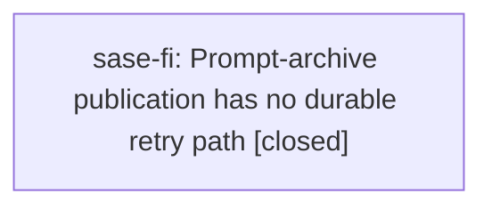

# Bead: sase-fi — Prompt-archive publication has no durable retry path

[Bead Pages](../README.md) / sase-fi

**Status:** ✓ closed · **Resolution:** done · **Type:** ◆ task
**Owner:** `bryanbugyi34@gmail.com` · **Created by:** [bbugyi200.athena.sase-fa.land](https://github.com/sase-org/sase--agents/blob/main/agents/bbugyi200.athena.sase-fa.land/README.md) · **Assignee:** `sase-fi` · **Size:** medium
**Created:** 2026-08-05 18:26:17 EDT · **Closed:** 2026-08-06 16:29:03 EDT

## Description

Proposed by phase bead sase-fa.5 (epic sase-fa) as PROPOSED FOLLOW-UP; verified independently by the sase-fa land agent and NOT caused by that epic - the gap predates sase-ej/sase-fa (the pre-epic docs/sdd.md text already said the commit workflow only 'attempts to publish' the prompt).

src/sase/workflows/commit/workflow_publication.py::run_agent_publication_step publishes the prompt archive as a one-shot best-effort call: on prompt_outcome.error or a raised exception it prints 'prompt archive publication was deferred: ...' at warning severity and appends 'publish_prompt_archive' to cp.completed_steps, so nothing retries it and even 'sase commit --resume' skips it. Agent-hood publication in the same function has a durable retry (the agent-publication outbox), and bead pages/plan header are re-derivable, but a dropped prompt archive is gone.

Reproduction observed live during sase-fa.5's end-to-end verification: commit 02dcea68b's prompt archive was deferred with 'agents sync lock is busy' and was never retried, including after a later successful 'sase agent sync -p sase'. Re-verified by the land agent against the agents sidecar at origin/main: prompts/202608/ contains bbugyi200.athena.sase-fa.1.md, .2.md and .3.md but neither sase-fa.4 nor sase-fa.5 - two of the five phases of a landed epic have no published prompt archive at all. Lock contention is routine (the gh_sase-org__sase outbox currently holds agent-hood requests deferred with the same 'agents sync lock is busy' error), so this is not a rare path.

Scope: give prompt-archive publication a retry that survives the commit. Note the design tension: epic sase-fa deliberately narrowed the durable publication outbox to agent-hood requests only (schema v5 drops bead_pages/plan_header/sidecar_push kinds), so re-adding a general 'prompt_archive' outbox kind would walk that decision back. Prefer either (a) publishing the prompt archive inside the same bounded agents-lock transaction that publishes the agent hood, so one lock acquisition covers both and one durable agent-hood retry carries both, or (b) a bounded in-commit retry around the lock. Whichever is chosen, make the failure visible on the commit rather than a warning that is dropped on the floor, and add a regression test that a lock-busy prompt archive still reaches the sidecar.

## Notes

[2026-08-06T20:29:03Z · sase-fi] Root cause: publish_prompt_archive already enqueued a durable agent-hood outbox request, and the commit-time drain rebuilt the deferred archive, but the full 'sase agent sync' path acknowledged that request purely on the agent page materializing while never rebuilding or committing the prompt - so a lock-busy archive was dropped with the request it rode on. Fix: extracted the drain's prompt-archive retry into sase/agents_sync/prompt_archive/deferred.py and called it from the full sync's export pass, staged prompts/artifacts in the sync commit, cleaned those paths with the payload at both transaction boundaries, and gated acknowledgement so a request whose archive could not be rebuilt stays queued and retryable (not retired). On the commit path, a prompt archive that could not even be queued now fails the step with a 'sase commit --resume' hint like agent-hood publication does, and a deferred one warns that it retries with agent publication. Verified: new tests/agents_sync/test_deferred_prompt_archive.py drives a real lock-busy defer over real git sidecars and asserts the archive reaches the remote on the next sync (both new tests fail without the fix), plus two new commit-workflow tests for the queued/unqueueable messaging; docs/agents_sidecar.md updated. 'just check-full' green apart from two pre-existing full-suite-load flakes that pass in isolation - the bead-lock one is already fixed upstream by 5a1980363, the ACE TUI one recorded as a +1 on sase-ct.

[2026-08-06T20:29:53Z · sase-fi] Verified full-sync path now rebuilds and publishes deferred prompt archives before acknowledging queued requests; new tests in tests/agents_sync/test_deferred_prompt_archive.py fail without the fix.

## Lineage

## Agents

| Agent | Bead | Commits |
|---|---|---:|
| [bbugyi200.athena.sase-fi](https://github.com/sase-org/sase--agents/blob/main/agents/bbugyi200.athena.sase-fi/README.md) | [sase-fi](README.md) | 1 |

## Commits

| Repo | Commit | Subject | Bead | Committed |
|---|---|---|---|---|
| sase | [`2ac967d`](https://github.com/sase-org/sase/commit/2ac967d781bb182891932ac680e8235bbc9f92b2) | fix(agents-sync): retry deferred prompt archives on the full sync path | [sase-fi](README.md) | 2026-08-06 16:30:35 EDT |
