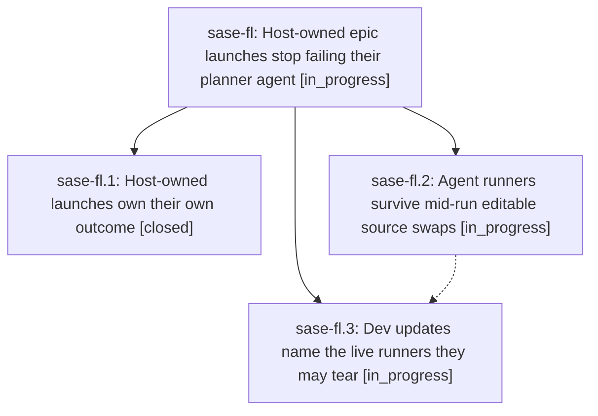

# Bead: sase-fl — Host-owned epic launches stop failing their planner agent

[Bead Pages](../README.md) / sase-fl

**Status:** ◐ in_progress · **Type:** ▸ plan · **Tier:** epic
**Owner:** `bryanbugyi34@gmail.com` · **Created by:** [bbugyi200.athena.tl](https://github.com/sase-org/sase--agents/blob/main/agents/bbugyi200.athena.tl/README.md) · **Assignee:** `sase-fl.land`
**Created:** 2026-08-05 18:31:20 EDT
**Plan:** [202608/epic\_launch\_false\_failure.md](https://github.com/sase-org/sase--plans/blob/main/202608/epic_launch_false_failure.md)

## Description

An approved epic whose host-owned `sase bead work` launch is still running (or already succeeded) never marks its planner agent FAILED, a planner-side SDD publication failure is reported as exactly that, and a `sase dev update` source swap under a live agent runner is prevented where it can be and named honestly where it cannot.

## Phases

| Bead | Title | Status | Size | Created | Agents | Commits |
|---|---|---|---|---|---:|---:|
| [sase-fl.1](sase-fl.1.md) | Host-owned launches own their own outcome | ✓ closed | medium | 2026-08-05 | 1 | 1 |
| [sase-fl.2](sase-fl.2.md) | Agent runners survive mid-run editable source swaps | ◐ in_progress | medium | 2026-08-05 | 1 | 0 |
| [sase-fl.3](sase-fl.3.md) | Dev updates name the live runners they may tear | ◐ in_progress | small | 2026-08-05 | 1 | 0 |

## Lineage

## Agents

| Agent | Bead | Commits |
|---|---|---:|
| [bbugyi200.athena.sase-fl.1](https://github.com/sase-org/sase--agents/blob/main/agents/bbugyi200.athena.sase-fl.1/README.md) | [sase-fl.1](sase-fl.1.md) | 1 |
| [bbugyi200.athena.sase-fl.2](https://github.com/sase-org/sase--agents/blob/main/agents/bbugyi200.athena.sase-fl.2/README.md) | [sase-fl.2](sase-fl.2.md) | 0 |
| [bbugyi200.athena.sase-fl.3](https://github.com/sase-org/sase--agents/blob/main/agents/bbugyi200.athena.sase-fl.3/README.md) | [sase-fl.3](sase-fl.3.md) | 0 |
| [bbugyi200.athena.sase-fl.land](https://github.com/sase-org/sase--agents/blob/main/agents/bbugyi200.athena.sase-fl.land/README.md) | [sase-fl](README.md) | 0 |

## Commits

| Repo | Commit | Subject | Bead | Committed |
|---|---|---|---|---|
| sase | [`75a1ffc`](https://github.com/sase-org/sase/commit/75a1ffc10692d24c8016ee6574ad901197d1752a) | fix(axe): keep host-owned epic launches alive after an SDD store failure | [sase-fl.1](sase-fl.1.md) | 2026-08-05 18:51:04 EDT |
