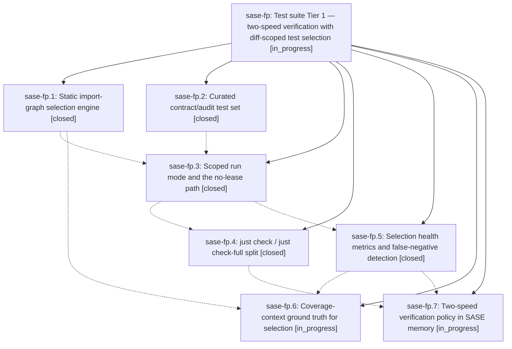

# Bead: sase-fp — Test suite Tier 1 — two-speed verification with diff-scoped test selection

[Bead Pages](../README.md) / sase-fp

**Status:** ◐ in_progress · **Type:** ▸ plan · **Tier:** epic
**Owner:** `bryanbugyi34@gmail.com` · **Created by:** [bbugyi200.athena.tn](https://github.com/sase-org/sase--agents/blob/main/agents/bbugyi200.athena.tn/README.md) · **Assignee:** `sase-fp.land`
**Created:** 2026-08-05 20:55:59 EDT
**Plan:** [202608/test\_suite\_tier1.md](https://github.com/sase-org/sase--plans/blob/main/202608/test_suite_tier1.md)

## Description

Agents verify a change with a diff-scoped, gate-free `just check` that costs ~1 core-minute instead of ~61 worker-minutes, `just check-full` preserves today's exhaustive contract for landing and CI, and selection health (what was skipped, and whether skipping it was ever wrong) is a measured, machine-readable metric rather than an assumption.

## Notes

[2026-08-06T03:20:38Z · sase-fq.land] DISCOVERED ISSUE (reported by epic sase-fq's land agent): tests/test_contract_manifest.py::test_contract_set_serial_runtime_stays_within_budget, added by sase-fp's commit ab955c9ca, fails in real CI under load — not only on contended dev hosts. Master CI run 31066038583 (commit 1da5a3e27) failed it on one of the three Python legs while the other two legs passed the same node in the same run. sase-fq.7 independently hit it during local just check runs while sibling workspaces were saturating the host, and it passed in isolation every time. The assertion is a wall-clock budget on a nested serial run, so it measures host load as much as the contract set's size; sase-fp.2, sase-fp.3, and sase-fp.4 each already proposed revisiting the margin. Routing this to sase-fp rather than filing a task because sase-fp introduced the test and is still in progress.

## Phases

| Bead | Title | Status | Size | Created | Agents | Commits |
|---|---|---|---|---|---:|---:|
| [sase-fp.1](sase-fp.1.md) | Static import-graph selection engine | ✓ closed | medium | 2026-08-05 | 1 | 1 |
| [sase-fp.2](sase-fp.2.md) | Curated contract/audit test set | ✓ closed | small | 2026-08-05 | 1 | 1 |
| [sase-fp.3](sase-fp.3.md) | Scoped run mode and the no-lease path | ✓ closed | medium | 2026-08-05 | 1 | 1 |
| [sase-fp.4](sase-fp.4.md) | just check / just check-full split | ✓ closed | small | 2026-08-05 | 1 | 1 |
| [sase-fp.5](sase-fp.5.md) | Selection health metrics and false-negative detection | ✓ closed | medium | 2026-08-05 | 1 | 1 |
| [sase-fp.6](sase-fp.6.md) | Coverage-context ground truth for selection | ◐ in_progress | medium | 2026-08-05 | 1 | 0 |
| [sase-fp.7](sase-fp.7.md) | Two-speed verification policy in SASE memory | ◐ in_progress | small | 2026-08-05 | 1 | 0 |

## Lineage

## Agents

| Agent | Bead | Commits |
|---|---|---:|
| [bbugyi200.athena.sase-fp.1](https://github.com/sase-org/sase--agents/blob/main/agents/bbugyi200.athena.sase-fp.1/README.md) | [sase-fp.1](sase-fp.1.md) | 1 |
| [bbugyi200.athena.sase-fp.2](https://github.com/sase-org/sase--agents/blob/main/agents/bbugyi200.athena.sase-fp.2/README.md) | [sase-fp.2](sase-fp.2.md) | 1 |
| [bbugyi200.athena.sase-fp.3](https://github.com/sase-org/sase--agents/blob/main/agents/bbugyi200.athena.sase-fp.3/README.md) | [sase-fp.3](sase-fp.3.md) | 1 |
| [bbugyi200.athena.sase-fp.4](https://github.com/sase-org/sase--agents/blob/main/agents/bbugyi200.athena.sase-fp.4/README.md) | [sase-fp.4](sase-fp.4.md) | 1 |
| [bbugyi200.athena.sase-fp.5](https://github.com/sase-org/sase--agents/blob/main/agents/bbugyi200.athena.sase-fp.5/README.md) | [sase-fp.5](sase-fp.5.md) | 1 |
| [bbugyi200.athena.sase-fp.6](https://github.com/sase-org/sase--agents/blob/main/agents/bbugyi200.athena.sase-fp.6/README.md) | [sase-fp.6](sase-fp.6.md) | 0 |
| [bbugyi200.athena.sase-fp.7](https://github.com/sase-org/sase--agents/blob/main/agents/bbugyi200.athena.sase-fp.7/README.md) | [sase-fp.7](sase-fp.7.md) | 0 |
| [bbugyi200.athena.sase-fp.land](https://github.com/sase-org/sase--agents/blob/main/agents/bbugyi200.athena.sase-fp.land/README.md) | [sase-fp](README.md) | 0 |

## Commits

| Repo | Commit | Subject | Bead | Committed |
|---|---|---|---|---|
| sase | [`8c8d197`](https://github.com/sase-org/sase/commit/8c8d1973d095c454fd39fd648738c0a86def34c1) | feat(tests): add the static import-graph test selection engine | [sase-fp.1](sase-fp.1.md) | 2026-08-05 21:34:14 EDT |
| sase | [`ab955c9`](https://github.com/sase-org/sase/commit/ab955c9cac1021c77c736ddeda9b499444c7d530) | test: curate repository-wide audit tests behind a \`contract\` pytest marker | [sase-fp.2](sase-fp.2.md) | 2026-08-05 22:01:52 EDT |
| sase | [`8c4e14a`](https://github.com/sase-org/sase/commit/8c4e14ab0f564eee9242e66ac21f2d82d53f0027) | feat(tests): add a scoped run mode to the pytest runner | [sase-fp.3](sase-fp.3.md) | 2026-08-05 22:30:51 EDT |
| sase | [`515ef3a`](https://github.com/sase-org/sase/commit/515ef3a48e6911a4c8eb9fe9499f09bceb14fa5b) | build(justfile): split \`just check\` into a scoped agent lane and \`just check-full\` | [sase-fp.4](sase-fp.4.md) | 2026-08-05 22:50:30 EDT |
| sase | [`96183d7`](https://github.com/sase-org/sase/commit/96183d71b3ef6edd427d8c388ba0f96644af6244) | feat(tests): track test-selection health and detect selection false negatives | [sase-fp.5](sase-fp.5.md) | 2026-08-05 23:41:36 EDT |
