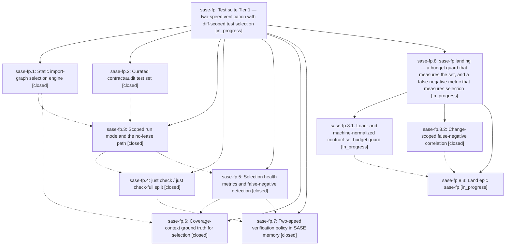

# Bead: sase-fp — Test suite Tier 1 — two-speed verification with diff-scoped test selection

[Bead Pages](../README.md) / sase-fp

**Status:** ◐ in_progress · **Type:** ▸ plan · **Tier:** epic
**Owner:** `bryanbugyi34@gmail.com` · **Created by:** [bbugyi200.athena.tn](https://github.com/sase-org/sase--agents/blob/main/agents/bbugyi200.athena.tn/README.md) · **Assignee:** `sase-fp.land`
**Created:** 2026-08-05 20:55:59 EDT
**Plan:** [202608/test\_suite\_tier1.md](https://github.com/sase-org/sase--plans/blob/main/202608/test_suite_tier1.md)

## Description

Agents verify a change with a diff-scoped, gate-free `just check` that costs ~1 core-minute instead of ~61 worker-minutes, `just check-full` preserves today's exhaustive contract for landing and CI, and selection health (what was skipped, and whether skipping it was ever wrong) is a measured, machine-readable metric rather than an assumption.

## Notes

[2026-08-06T03:20:38Z · sase-fq.land] DISCOVERED ISSUE (reported by epic sase-fq's land agent): tests/test_contract_manifest.py::test_contract_set_serial_runtime_stays_within_budget, added by sase-fp's commit ab955c9ca, fails in real CI under load — not only on contended dev hosts. Master CI run 31066038583 (commit 1da5a3e27) failed it on one of the three Python legs while the other two legs passed the same node in the same run. sase-fq.7 independently hit it during local just check runs while sibling workspaces were saturating the host, and it passed in isolation every time. The assertion is a wall-clock budget on a nested serial run, so it measures host load as much as the contract set's size; sase-fp.2, sase-fp.3, and sase-fp.4 each already proposed revisiting the margin. Routing this to sase-fp rather than filing a task because sase-fp introduced the test and is still in progress.

[2026-08-06T04:15:03Z · sase-fr.land] DISCOVERED ISSUE (corroboration from epic sase-fr's land agent): four more independent recurrences of tests/test_contract_manifest.py::test_contract_set_serial_runtime_stays_within_budget, the wall-clock budget test sase-fp.2 added in ab955c9ca. Phases sase-fr.3, sase-fr.4, sase-fr.5, and sase-fr.6 each hit it in the full parallel 'just check' run while sibling workspaces saturated the host, and each confirmed it passes standalone (sase-fr.3 measured 23.46s in isolation). None of those phases touched the contract manifest or the selection tooling — their diffs are bead close-history storage and presentation. This adds dev-host evidence to the CI evidence sase-fq.land already routed here (master run 31066038583); the assertion is measuring host load rather than the contract set's size.

[2026-08-06T04:17:30Z · toobig-1l.split_file.tests.test_run_pytest_tool.0] DISCOVERED ISSUE (measurement datapoint, not a new defect): tests/test_contract_manifest.py::test_contract_set_serial_runtime_stays_within_budget failed twice today at ~32.25s against the 30s budget during full 'just check' runs, and passed standalone at 24.11s in between — matching the host-load reading already recorded here. New information: splitting tests/test_run_pytest_tool.py (842 lines) into five contract-marked modules measurably grows the set. Timed A/B on this host, 44 identical tests, -p no:randomly: 3.64s/3.52s as one module vs 3.88s/3.90s as five, i.e. ~+0.35s (~1.4% of the 24s serial baseline) purely from extra module setup. That is small, but it means routine test-file hygiene inside the contract set silently erodes the margin, so whatever replaces the wall-clock assertion should be insensitive to module count as well as to host load.

## Phases

| Bead | Title | Status | Size | Created | Agents | Commits |
|---|---|---|---|---|---:|---:|
| [sase-fp.1](sase-fp.1.md) | Static import-graph selection engine | ✓ closed | medium | 2026-08-05 | 1 | 1 |
| [sase-fp.2](sase-fp.2.md) | Curated contract/audit test set | ✓ closed | small | 2026-08-05 | 1 | 1 |
| [sase-fp.3](sase-fp.3.md) | Scoped run mode and the no-lease path | ✓ closed | medium | 2026-08-05 | 1 | 1 |
| [sase-fp.4](sase-fp.4.md) | just check / just check-full split | ✓ closed | small | 2026-08-05 | 1 | 1 |
| [sase-fp.5](sase-fp.5.md) | Selection health metrics and false-negative detection | ✓ closed | medium | 2026-08-05 | 1 | 1 |
| [sase-fp.6](sase-fp.6.md) | Coverage-context ground truth for selection | ✓ closed | medium | 2026-08-05 | 1 | 1 |
| [sase-fp.7](sase-fp.7.md) | Two-speed verification policy in SASE memory | ✓ closed | small | 2026-08-05 | 1 | 1 |

## Lineage

## Agents

| Agent | Bead | Commits |
|---|---|---:|
| [bbugyi200.athena.sase-fp.1](https://github.com/sase-org/sase--agents/blob/main/agents/bbugyi200.athena.sase-fp.1/README.md) | [sase-fp.1](sase-fp.1.md) | 1 |
| [bbugyi200.athena.sase-fp.2](https://github.com/sase-org/sase--agents/blob/main/agents/bbugyi200.athena.sase-fp.2/README.md) | [sase-fp.2](sase-fp.2.md) | 1 |
| [bbugyi200.athena.sase-fp.3](https://github.com/sase-org/sase--agents/blob/main/agents/bbugyi200.athena.sase-fp.3/README.md) | [sase-fp.3](sase-fp.3.md) | 1 |
| [bbugyi200.athena.sase-fp.4](https://github.com/sase-org/sase--agents/blob/main/agents/bbugyi200.athena.sase-fp.4/README.md) | [sase-fp.4](sase-fp.4.md) | 1 |
| [bbugyi200.athena.sase-fp.5](https://github.com/sase-org/sase--agents/blob/main/agents/bbugyi200.athena.sase-fp.5/README.md) | [sase-fp.5](sase-fp.5.md) | 1 |
| [bbugyi200.athena.sase-fp.6](https://github.com/sase-org/sase--agents/blob/main/agents/bbugyi200.athena.sase-fp.6/README.md) | [sase-fp.6](sase-fp.6.md) | 1 |
| [bbugyi200.athena.sase-fp.7](https://github.com/sase-org/sase--agents/blob/main/families/bbugyi200.athena.sase-fp.7.md) | [sase-fp.7](sase-fp.7.md) | 1 |
| [bbugyi200.athena.sase-fp.8.1](https://github.com/sase-org/sase--agents/blob/main/agents/bbugyi200.athena.sase-fp.8.1/README.md) | [sase-fp.8.1](sase-fp.8.1.md) | 0 |
| [bbugyi200.athena.sase-fp.8.2](https://github.com/sase-org/sase--agents/blob/main/agents/bbugyi200.athena.sase-fp.8.2/README.md) | [sase-fp.8.2](sase-fp.8.2.md) | 1 |
| [bbugyi200.athena.sase-fp.8.3](https://github.com/sase-org/sase--agents/blob/main/agents/bbugyi200.athena.sase-fp.8.3/README.md) | [sase-fp.8.3](sase-fp.8.3.md) | 0 |
| [bbugyi200.athena.sase-fp.8.land](https://github.com/sase-org/sase--agents/blob/main/agents/bbugyi200.athena.sase-fp.8.land/README.md) | [sase-fp.8](sase-fp.8.md) | 0 |
| [bbugyi200.athena.sase-fp.land](https://github.com/sase-org/sase--agents/blob/main/agents/bbugyi200.athena.sase-fp.land/README.md) | [sase-fp](README.md) | 0 |

## Commits

| Repo | Commit | Subject | Bead | Committed |
|---|---|---|---|---|
| sase | [`8c8d197`](https://github.com/sase-org/sase/commit/8c8d1973d095c454fd39fd648738c0a86def34c1) | feat(tests): add the static import-graph test selection engine | [sase-fp.1](sase-fp.1.md) | 2026-08-05 21:34:14 EDT |
| sase | [`ab955c9`](https://github.com/sase-org/sase/commit/ab955c9cac1021c77c736ddeda9b499444c7d530) | test: curate repository-wide audit tests behind a \`contract\` pytest marker | [sase-fp.2](sase-fp.2.md) | 2026-08-05 22:01:52 EDT |
| sase | [`8c4e14a`](https://github.com/sase-org/sase/commit/8c4e14ab0f564eee9242e66ac21f2d82d53f0027) | feat(tests): add a scoped run mode to the pytest runner | [sase-fp.3](sase-fp.3.md) | 2026-08-05 22:30:51 EDT |
| sase | [`515ef3a`](https://github.com/sase-org/sase/commit/515ef3a48e6911a4c8eb9fe9499f09bceb14fa5b) | build(justfile): split \`just check\` into a scoped agent lane and \`just check-full\` | [sase-fp.4](sase-fp.4.md) | 2026-08-05 22:50:30 EDT |
| sase | [`96183d7`](https://github.com/sase-org/sase/commit/96183d71b3ef6edd427d8c388ba0f96644af6244) | feat(tests): track test-selection health and detect selection false negatives | [sase-fp.5](sase-fp.5.md) | 2026-08-05 23:41:36 EDT |
| sase | [`6f1a071`](https://github.com/sase-org/sase/commit/6f1a0717f1af3ee11f757a4820822427f5489670) | docs(memory): document two-speed verification contract, fix stale visual-snapshot claim | [sase-fp.7](sase-fp.7.md) | 2026-08-06 00:03:12 EDT |
| sase | [`d66101e`](https://github.com/sase-org/sase/commit/d66101e8f292cb53b48ae2287f0f5f723b3c3ff9) | feat(tests): union per-test coverage contexts into diff-scoped selection | [sase-fp.6](sase-fp.6.md) | 2026-08-06 01:13:51 EDT |
| sase | [`e7917a2`](https://github.com/sase-org/sase/commit/e7917a2682e81c2119509e75bbdf19e7c4da0796) | fix(tests): restrict selection-health false-negative correlation to matching changes | [sase-fp.8.2](sase-fp.8.2.md) | 2026-08-06 02:12:42 EDT |
