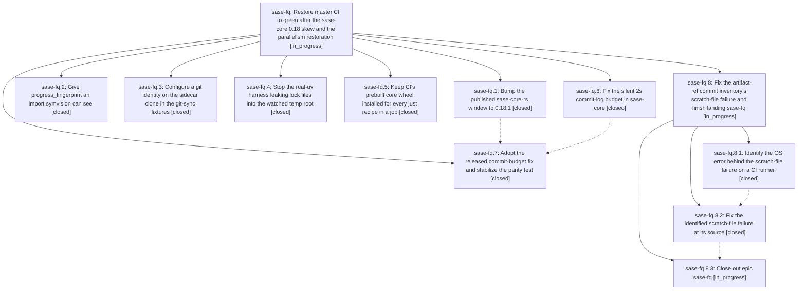

# Bead: sase-fq — Restore master CI to green after the sase-core 0.18 skew and the parallelism restoration

[Bead Pages](../README.md) / sase-fq

**Status:** ◐ in_progress · **Type:** ▸ plan · **Tier:** epic
**Owner:** `bryanbugyi34@gmail.com` · **Created by:** [bbugyi200.athena.tq](https://github.com/sase-org/sase--agents/blob/main/agents/bbugyi200.athena.tq/README.md) · **Assignee:** `sase-fq.land`
**Created:** 2026-08-05 21:05:31 EDT
**Plan:** [202608/ci\_master\_red\_recovery.md](https://github.com/sase-org/sase--plans/blob/main/202608/ci_master_red_recovery.md)

## Description

Every job in the sase CI workflow passes on master again, each of the six independent root causes behind the current failure is fixed at its source rather than suppressed, and CI regains the guarantee that source lanes actually test the sase-core wheel built from sase-core master.

## Notes

[2026-08-06T03:33:55Z · sase-fq.land] LAND VERIFICATION (sase-fq.land, 2026-08-05): the epic is NOT complete — its goal (every CI job green on master) is not met, and R6's root cause turned out to be different from the plan's hypothesis. Epic NOT closed; remaining work is being planned as a follow-up.

WHAT IS VERIFIED DONE (5 of 6 root causes, confirmed in source and in real CI runs):
- R1 (sase-fq.1/.7, commits 6488d4a49 + 7ffd5471a): pyproject floor is >=0.18.2,<0.19.0 with uv.lock in sync; sase-core-rs 0.18.2 is live on PyPI with 5 files. CI job published-core-minimum-smoke is green at the epic tip 7ffd5471a, having failed on every run before the bump.
- R2 (sase-fq.5, commit 245d7c44f): setup-sase exports SASE_CORE_WHEEL to $GITHUB_ENV after its exactly-one-wheel guard. Confirmed from a real CI run (31066038583, test 3.13): the 'Run tests' step shows SASE_CORE_WHEEL set and '[setup] Installing prebuilt sase_core_rs wheel ...0.18.2...whl', with no '+ sase-core-rs==<published>' downgrade line. This closes sase-fq.5's open 'CI log confirmation must happen after this lands' item. Three CI-shape tests lock it in.
- R3 (sase-fq.2, commit a4a2c1a60): progress_fingerprint is in the explicit import block (commit_finalizer.py:29) and called directly at :259 and :301. CI lint job green at 1da5a3e27 and 7ffd5471a.
- R4 (sase-fq.4, commit 6ee11e5e9): uv_env gives the child its own TMPDIR under tmp_path; tests/_tmp_leak_guard.py FOREIGN_ENTRY_PATTERNS is untouched, so the guard is still honest. CI perf-floors green at 1da5a3e27 and 7ffd5471a.
- R5 (sase-fq.3, commit 260ea5a0d): setup_repo sets user.name/user.email on the sidecar clone (lines 52-53). Confirmed the module creates only remote/seed/sidecar, and the bare remote is never committed to directly.

WHAT IS NOT DONE:
- R6: tests/ace/tui/widgets/test_artifact_ref_completion_catalog.py::test_commit_completion_rows_match_shared_inventory_and_resolve STILL FAILS on master at the epic tip 7ffd5471a — run 31067580370, jobs 'test (3.13)' and 'test (3.14)', same 'assert () == (...)' empty-inventory shape as before, with sase-core-rs 0.18.2 installed and the test's own SASE_ARTIFACT_REF_COMMIT_TIMEOUT=30 in effect.
- The commit-log budget was NOT the cause. sase-fq.6's new stderr diagnostic paid off immediately and names the actual branch: 'could not open a scratch file for `git log` output; check that TMPDIR exists and is writable' — CommitLogFailure::Scratch, i.e. tempfile::tempfile() or the stdout try_clone() dup failing, not Budget. Both non-sidecar repositories are skipped, on two different xdist workers (gw1 on 3.13, gw2 on 3.14) and two Python versions. TMPDIR at that moment is the managed scratch root /var/tmp/sase-d1260045, which demonstrably exists and is writable (pytest's own tmp dirs for the same test live inside it); TMPDIR is not in run_pytest's PYTEST_ENV_UNSET_KEYS and no conftest fixture rewrites it. The errno is collapsed by the current message, so the remaining question is which OS error it is (EMFILE, ENOSPC/inode exhaustion, and O_TMPFILE-related failure are the live candidates). This is exactly the gap sase-fq.6 flagged in its PROPOSED FOLLOW-UP.

INTEGRATION DONE: reviewed the six non-epic commits that landed since 260ea5a0d (8c8d1973d, ab955c9ca, 8c4e14ab0, 1da5a3e27, 515ef3a48, 9d0422fda). Only 515ef3a48 and ab955c9ca touch a file the epic touched (tests/test_github_actions_ci.py) and both are purely additive. The new diff-scoped lane cannot skip the epic's coverage: tests/test_github_actions_ci.py is in tests/contract_manifest.txt (always selected) and pyproject.toml/uv.lock are in the selector's PACKAGING_CONFIG_PATHS broadening set. No stale 0.17.x/0.18.0/0.18.1 version strings remain outside uv.lock/CHANGELOG. One real integration change made: src/sase/core/bead_conflict_facade.py's 'except AttributeError' fallback to the legacy plain merge existed only to tolerate wheels older than the relocation binding — the exact shim whose silent degrade masked R1 as a duplicate-creation error. With the floor at >=0.18.2 and published-core-minimum-smoke proving the declared minimum exports every binding, it was unreachable dead code with no test coverage, so it is removed; require_rust_binding now raises its named, actionable AttributeError instead.

FOLLOW-UP DISPOSITION: sase-fj (symvision progress_fingerprint) and sase-fo (test-slow temp leak) were open ready tasks describing R3 and R4 — both closed as done against this epic's commits. The flake proposals from sase-fq.1/.2/.5/.7 were corroborated onto the existing umbrella beads rather than refiled: +1 sase-ct (ACE TUI full-parallel flakes, now with new evidence that the class reproduces on GitHub runners) and +1 sase-e2 (concurrent bead-mutation lock timeout). test_contract_set_serial_runtime_stays_within_budget was routed to in-progress epic sase-fp as a DISCOVERED ISSUE because sase-fp's commit ab955c9ca introduced it. sase-fq.6's 'confirm R6 from a real CI run' proposal is not a separate task: it is now answered, and the answer is the remaining epic work above.

[2026-08-06T05:39:20Z · ci_fix.sase.8] DISCOVERED ISSUE (root cause of the epic's open R6, found while repairing master CI at HEAD d66101e8f): the artifact-ref commit parity failure is a TMPDIR leak from the tools/run_pytest test modules, not an errno/resource problem in sase-core.

tools/run_pytest's _prepare_pytest_tmpdir() redirects scratch with a raw 'os.environ["TMPDIR"] = str(scratch_root)' (tools/run_pytest:405). Four test modules reach that write - tests/test_run_pytest_tmpdir.py (directly), plus tests/test_run_pytest_main.py, tests/test_run_pytest_scoped.py, and tests/test_run_pytest_health.py (via runner.main()). monkeypatch never saw the assignment, so it is never rolled back: after any of those tests, the whole xdist worker has TMPDIR pointing at that test's tmp_path, which pytest later deletes. Python's tempfile caches gettempdir() on first use and never notices; Rust re-reads TMPDIR on every call, so sase_core's tempfile::tempfile() in commit_log_output() gets ENOENT and reports CommitLogFailure::Scratch. Both non-sidecar repos are skipped and the inventory comes back empty - the exact 'assert () == (...)' shape.

This also explains the timing the land note found puzzling. Before 9672c5602 the 4-vCPU runner collapsed to one worker, so collection order put tests/ace/... before tests/test_run_pytest_*, and the poison always landed after the parity test. Restoring real parallelism let a worker run test_run_pytest_* first, which is why the failure appears from 01398f5af onward and on every leg since. TMPDIR at session start is indeed the healthy /var/tmp/sase-<key> root - it is only poisoned mid-session, which is why inspecting the environment statically found nothing wrong.

Reproduced deterministically on master with two nodes in one process:
  pytest tests/test_run_pytest_tmpdir.py::test_prepare_pytest_tmpdir_honors_override tests/ace/tui/widgets/test_artifact_ref_completion_catalog.py::test_commit_completion_rows_match_shared_inventory_and_resolve -p no:randomly
which yields the identical stderr ('could not open a scratch file for `git log` output') and the empty-tuple assertion. Either node alone passes.

FIX (uncommitted in a workspace, pending owner review): tests/_run_pytest_fixtures.py gains pin_process_env(monkeypatch), which registers TMPDIR and SASE_PYTEST_TMP_REDIRECTED with monkeypatch before the runner writes them so teardown restores the pre-test values; the four affected modules install it as an autouse fixture; tests/test_run_pytest_tmpdir.py gains test_prepare_pytest_tmpdir_redirect_does_not_outlive_the_test, which fails without the pin. No production code changes. just check is green and the 87 tests across the six run_pytest modules, the tmp-leak guard, the suite-gate integration tests, and the artifact-ref catalog pass together.

Note for whoever closes R6: sase-fq.6's stderr diagnostic is what made this findable, but it collapses the errno. Surfacing the io::Error in CommitLogFailure::Scratch would have named ENOENT immediately.

[2026-08-06T07:11:24Z · ci_fix.sase.9] DISCOVERED ISSUE (independent second reproduction of the epic's open R6, at master HEAD 531138373 on 2026-08-06): I reached the same root cause as ci_fix.sase.8's 2026-08-06T05:39:20Z note without having seen it, which raises confidence in the diagnosis. Recording the divergence so the owner does not land two overlapping fixes.

AGREEMENT: tools/run_pytest's _prepare_pytest_tmpdir() writes os.environ['TMPDIR'] directly (tools/run_pytest:408), monkeypatch never recorded it, and pyproject's tmp_path_retention_policy = 'failed' deletes the tmp_path of a PASSING test, so the poisoned TMPDIR points at a directory that no longer exists. Rust re-reads TMPDIR per call, so sase_core's tempfile::tempfile() in commit_log_output() fails and yields CommitLogFailure::Scratch and an empty inventory. Reproduced deterministically with 'run_pytest fast tests/test_run_pytest_tmpdir.py tests/ace/tui/widgets/test_artifact_ref_completion_catalog.py -p no:randomly' under one worker.

REFINEMENT: an env-diff probe over all six run_pytest modules names 11 leaking nodes, not 4 modules' worth of unspecified tests: test_run_pytest_health (4 nodes), test_run_pytest_main (3), test_run_pytest_scoped (3), test_run_pytest_tmpdir (1). test_run_pytest_command and test_run_pytest_workers never reach the write.

FIX-SHAPE DIVERGENCE: ci_fix.sase.8 pins TMPDIR/SASE_PYTEST_TMP_REDIRECTED through monkeypatch via a new pin_process_env() helper installed as an autouse fixture in the four affected modules, plus a regression test. My workspace instead adds one autouse fixture, _restore_scratch_environment, to tests/conftest.py, directly beside the existing _restore_working_directory guard that already handles the identical class of process-state leak (cwd) in the same file. Trade-off for the owner: the per-module pin is narrower and comes with an explicit regression test, but only defe

… and 780 more characters

## Phases

| Bead | Title | Status | Size | Created | Agents | Commits |
|---|---|---|---|---|---:|---:|
| [sase-fq.1](sase-fq.1.md) | Bump the published sase-core-rs window to 0.18.1 | ✓ closed | small | 2026-08-05 | 1 | 1 |
| [sase-fq.2](sase-fq.2.md) | Give progress\_fingerprint an import symvision can see | ✓ closed | small | 2026-08-05 | 1 | 1 |
| [sase-fq.3](sase-fq.3.md) | Configure a git identity on the sidecar clone in the git-sync fixtures | ✓ closed | small | 2026-08-05 | 1 | 1 |
| [sase-fq.4](sase-fq.4.md) | Stop the real-uv harness leaking lock files into the watched temp root | ✓ closed | small | 2026-08-05 | 1 | 1 |
| [sase-fq.5](sase-fq.5.md) | Keep CI's prebuilt core wheel installed for every just recipe in a job | ✓ closed | medium | 2026-08-05 | 1 | 1 |
| [sase-fq.6](sase-fq.6.md) | Fix the silent 2s commit-log budget in sase-core | ✓ closed | medium | 2026-08-05 | 1 | 2 |
| [sase-fq.7](sase-fq.7.md) | Adopt the released commit-budget fix and stabilize the parity test | ✓ closed | small | 2026-08-05 | 1 | 1 |

## Lineage

## Agents

| Agent | Bead | Commits |
|---|---|---:|
| [bbugyi200.athena.sase-fq.1](https://github.com/sase-org/sase--agents/blob/main/agents/bbugyi200.athena.sase-fq.1/README.md) | [sase-fq.1](sase-fq.1.md) | 1 |
| [bbugyi200.athena.sase-fq.2](https://github.com/sase-org/sase--agents/blob/main/agents/bbugyi200.athena.sase-fq.2/README.md) | [sase-fq.2](sase-fq.2.md) | 1 |
| [bbugyi200.athena.sase-fq.3](https://github.com/sase-org/sase--agents/blob/main/agents/bbugyi200.athena.sase-fq.3/README.md) | [sase-fq.3](sase-fq.3.md) | 1 |
| [bbugyi200.athena.sase-fq.4](https://github.com/sase-org/sase--agents/blob/main/agents/bbugyi200.athena.sase-fq.4/README.md) | [sase-fq.4](sase-fq.4.md) | 1 |
| [bbugyi200.athena.sase-fq.5](https://github.com/sase-org/sase--agents/blob/main/agents/bbugyi200.athena.sase-fq.5/README.md) | [sase-fq.5](sase-fq.5.md) | 1 |
| [bbugyi200.athena.sase-fq.6](https://github.com/sase-org/sase--agents/blob/main/agents/bbugyi200.athena.sase-fq.6/README.md) | [sase-fq.6](sase-fq.6.md) | 2 |
| [bbugyi200.athena.sase-fq.7](https://github.com/sase-org/sase--agents/blob/main/agents/bbugyi200.athena.sase-fq.7/README.md) | [sase-fq.7](sase-fq.7.md) | 1 |
| [bbugyi200.athena.sase-fq.8.1](https://github.com/sase-org/sase--agents/blob/main/families/bbugyi200.athena.sase-fq.8.1.md) | [sase-fq.8.1](sase-fq.8.1.md) | 0 |
| [bbugyi200.athena.sase-fq.8.2](https://github.com/sase-org/sase--agents/blob/main/agents/bbugyi200.athena.sase-fq.8.2/README.md) | [sase-fq.8.2](sase-fq.8.2.md) | 1 |
| [bbugyi200.athena.sase-fq.8.3](https://github.com/sase-org/sase--agents/blob/main/agents/bbugyi200.athena.sase-fq.8.3/README.md) | [sase-fq.8.3](sase-fq.8.3.md) | 0 |
| [bbugyi200.athena.sase-fq.8.land](https://github.com/sase-org/sase--agents/blob/main/agents/bbugyi200.athena.sase-fq.8.land/README.md) | [sase-fq.8](sase-fq.8.md) | 0 |

## Commits

| Repo | Commit | Subject | Bead | Committed |
|---|---|---|---|---|
| sase | [`260ea5a`](https://github.com/sase-org/sase/commit/260ea5a0d99d536fcb38d30ea51270c5b775bfa7) | fix(tests): give the git-sync sidecar clone a committer identity | [sase-fq.3](sase-fq.3.md) | 2026-08-05 21:19:11 EDT |
| sase | [`6ee11e5`](https://github.com/sase-org/sase/commit/6ee11e5e9df5f47b1233ca34ed49f0a1989c323e) | fix(tests): stop real-uv harness leaking lock files into watched temp root | [sase-fq.4](sase-fq.4.md) | 2026-08-05 21:32:42 EDT |
| sase-core | [`sase-core@0aba3c7`](https://github.com/sase-org/sase-core/commit/0aba3c76add2e5a92e8d60d175394e88af9cdd1a) | fix(editor): stop a slow git log from silently emptying the commit inventory | [sase-fq.6](sase-fq.6.md) | 2026-08-05 21:35:24 EDT |
| sase | [`245d7c4`](https://github.com/sase-org/sase/commit/245d7c44fc12635f37b0d797c661ba6d1dd5b3ee) | ci: keep the prebuilt core wheel installed for every just recipe | [sase-fq.5](sase-fq.5.md) | 2026-08-05 21:39:05 EDT |
| sase | [`a4a2c1a`](https://github.com/sase-org/sase/commit/a4a2c1a6004016667c71b50522be8807bb8368da) | fix(commit-finalizer): import progress\_fingerprint directly so symvision can see it | [sase-fq.2](sase-fq.2.md) | 2026-08-05 21:42:46 EDT |
| sase | [`6488d4a`](https://github.com/sase-org/sase/commit/6488d4a49286f029c1ae7a641b438fce7d043d9c) | build(deps): raise sase-core-rs floor to 0.18.1 | [sase-fq.1](sase-fq.1.md) | 2026-08-05 21:43:43 EDT |
| sase-core | [`sase-core@8785320`](https://github.com/sase-org/sase-core/commit/8785320e186a7115ea003ae2eef70fa26365aedd) | test(host-bridge): stop exec-ing freshly written helper scripts | [sase-fq.6](sase-fq.6.md) | 2026-08-05 21:58:49 EDT |
| sase | [`7ffd547`](https://github.com/sase-org/sase/commit/7ffd5471ae0ad436a3607ea1a60dc144621ec263) | build(deps): raise sase-core-rs floor to 0.18.2 and pin the parity test's commit budget | [sase-fq.7](sase-fq.7.md) | 2026-08-05 23:08:00 EDT |
| sase-core | [`sase-core@7b28c3e`](https://github.com/sase-org/sase-core/commit/7b28c3e16f865cfead2b8265ecd69fd30b01c772) | fix(editor): report the OS error behind a dropped commit-log repository | [sase-fq.8.2](sase-fq.8.2.md) | 2026-08-06 07:46:55 EDT |
