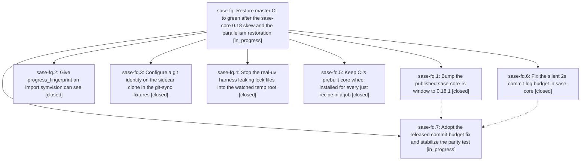

# Bead: sase-fq — Restore master CI to green after the sase-core 0.18 skew and the parallelism restoration

[Bead Pages](../README.md) / sase-fq

**Status:** ◐ in_progress · **Type:** ▸ plan · **Tier:** epic
**Owner:** `bryanbugyi34@gmail.com` · **Created by:** [bbugyi200.athena.tq](https://github.com/sase-org/sase--agents/blob/main/agents/bbugyi200.athena.tq/README.md) · **Assignee:** `sase-fq.land`
**Created:** 2026-08-05 21:05:31 EDT
**Plan:** [202608/ci\_master\_red\_recovery.md](https://github.com/sase-org/sase--plans/blob/main/202608/ci_master_red_recovery.md)

## Description

Every job in the sase CI workflow passes on master again, each of the six independent root causes behind the current failure is fixed at its source rather than suppressed, and CI regains the guarantee that source lanes actually test the sase-core wheel built from sase-core master.

## Phases

| Bead | Title | Status | Size | Created | Agents | Commits |
|---|---|---|---|---|---:|---:|
| [sase-fq.1](sase-fq.1.md) | Bump the published sase-core-rs window to 0.18.1 | ✓ closed | small | 2026-08-05 | 1 | 1 |
| [sase-fq.2](sase-fq.2.md) | Give progress\_fingerprint an import symvision can see | ✓ closed | small | 2026-08-05 | 1 | 1 |
| [sase-fq.3](sase-fq.3.md) | Configure a git identity on the sidecar clone in the git-sync fixtures | ✓ closed | small | 2026-08-05 | 1 | 1 |
| [sase-fq.4](sase-fq.4.md) | Stop the real-uv harness leaking lock files into the watched temp root | ✓ closed | small | 2026-08-05 | 1 | 1 |
| [sase-fq.5](sase-fq.5.md) | Keep CI's prebuilt core wheel installed for every just recipe in a job | ✓ closed | medium | 2026-08-05 | 1 | 1 |
| [sase-fq.6](sase-fq.6.md) | Fix the silent 2s commit-log budget in sase-core | ✓ closed | medium | 2026-08-05 | 1 | 0 |
| [sase-fq.7](sase-fq.7.md) | Adopt the released commit-budget fix and stabilize the parity test | ◐ in_progress | small | 2026-08-05 | 1 | 0 |

## Lineage

## Agents

| Agent | Bead | Commits |
|---|---|---:|
| [bbugyi200.athena.sase-fq.1](https://github.com/sase-org/sase--agents/blob/main/agents/bbugyi200.athena.sase-fq.1/README.md) | [sase-fq.1](sase-fq.1.md) | 1 |
| [bbugyi200.athena.sase-fq.2](https://github.com/sase-org/sase--agents/blob/main/agents/bbugyi200.athena.sase-fq.2/README.md) | [sase-fq.2](sase-fq.2.md) | 1 |
| [bbugyi200.athena.sase-fq.3](https://github.com/sase-org/sase--agents/blob/main/agents/bbugyi200.athena.sase-fq.3/README.md) | [sase-fq.3](sase-fq.3.md) | 1 |
| [bbugyi200.athena.sase-fq.4](https://github.com/sase-org/sase--agents/blob/main/agents/bbugyi200.athena.sase-fq.4/README.md) | [sase-fq.4](sase-fq.4.md) | 1 |
| [bbugyi200.athena.sase-fq.5](https://github.com/sase-org/sase--agents/blob/main/agents/bbugyi200.athena.sase-fq.5/README.md) | [sase-fq.5](sase-fq.5.md) | 1 |
| [bbugyi200.athena.sase-fq.6](https://github.com/sase-org/sase--agents/blob/main/agents/bbugyi200.athena.sase-fq.6/README.md) | [sase-fq.6](sase-fq.6.md) | 0 |
| [bbugyi200.athena.sase-fq.7](https://github.com/sase-org/sase--agents/blob/main/agents/bbugyi200.athena.sase-fq.7/README.md) | [sase-fq.7](sase-fq.7.md) | 0 |
| [bbugyi200.athena.sase-fq.land](https://github.com/sase-org/sase--agents/blob/main/agents/bbugyi200.athena.sase-fq.land/README.md) | [sase-fq](README.md) | 0 |

## Commits

| Repo | Commit | Subject | Bead | Committed |
|---|---|---|---|---|
| sase | [`260ea5a`](https://github.com/sase-org/sase/commit/260ea5a0d99d536fcb38d30ea51270c5b775bfa7) | fix(tests): give the git-sync sidecar clone a committer identity | [sase-fq.3](sase-fq.3.md) | 2026-08-05 21:19:11 EDT |
| sase | [`6ee11e5`](https://github.com/sase-org/sase/commit/6ee11e5e9df5f47b1233ca34ed49f0a1989c323e) | fix(tests): stop real-uv harness leaking lock files into watched temp root | [sase-fq.4](sase-fq.4.md) | 2026-08-05 21:32:42 EDT |
| sase | [`245d7c4`](https://github.com/sase-org/sase/commit/245d7c44fc12635f37b0d797c661ba6d1dd5b3ee) | ci: keep the prebuilt core wheel installed for every just recipe | [sase-fq.5](sase-fq.5.md) | 2026-08-05 21:39:05 EDT |
| sase | [`a4a2c1a`](https://github.com/sase-org/sase/commit/a4a2c1a6004016667c71b50522be8807bb8368da) | fix(commit-finalizer): import progress\_fingerprint directly so symvision can see it | [sase-fq.2](sase-fq.2.md) | 2026-08-05 21:42:46 EDT |
| sase | [`6488d4a`](https://github.com/sase-org/sase/commit/6488d4a49286f029c1ae7a641b438fce7d043d9c) | build(deps): raise sase-core-rs floor to 0.18.1 | [sase-fq.1](sase-fq.1.md) | 2026-08-05 21:43:43 EDT |
