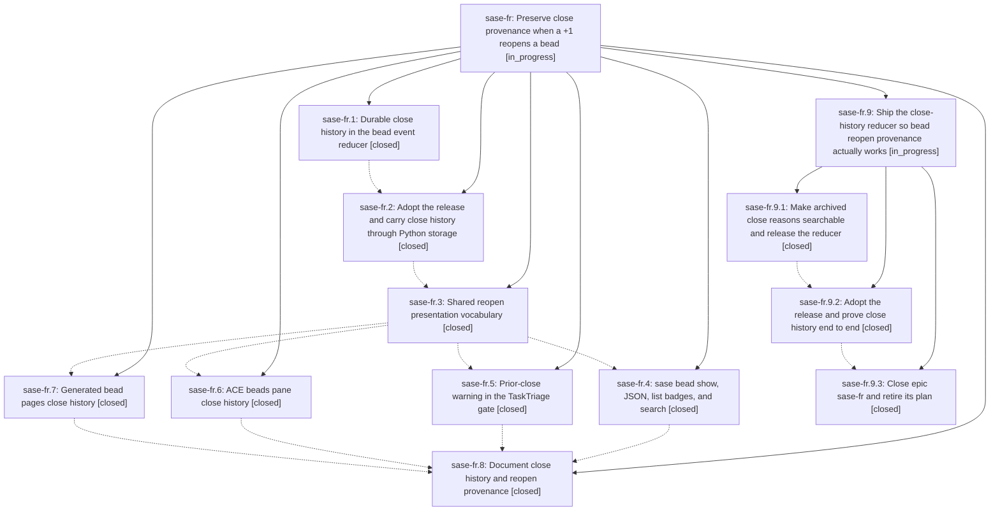

# Bead: sase-fr — Preserve close provenance when a +1 reopens a bead

[Bead Pages](../README.md) / sase-fr

**Status:** ◐ in_progress · **Type:** ▸ plan · **Tier:** epic
**Owner:** `bryanbugyi34@gmail.com` · **Created by:** [bbugyi200.athena.tr](https://github.com/sase-org/sase--agents/blob/main/agents/bbugyi200.athena.tr/README.md) · **Assignee:** `sase-fr.land`
**Created:** 2026-08-05 21:17:46 EDT
**Plan:** [202608/bead\_close\_history.md](https://github.com/sase-org/sase--plans/blob/main/202608/bead_close_history.md)

## Description

A bead that was closed and later reopened keeps the reason it was closed, and every surface that shows the bead says plainly that it was previously closed, why, and what reopened it — including which +1 did it.

## Notes

[2026-08-06T04:19:01Z · sase-fr.land] LAND VERIFICATION (sase-fr.land, 2026-08-06): all eight phases were checked against the source and the epic's seven commits (1da5a3e27, 9d0422fda, d0e59dfdd, 413072167, 81d6191e3, bf448ef99, d7ac0dab5). The Python half is real and complete — close_history threads through model.py, close_history_codec.py, core/bead_wire.py, jsonl.py, db.py (column + _migrate_add_close_history), work.py, and cli_admin.py's projection-repair allowlist; reopen_presentation.py exports exactly the vocabulary the plan specified; cli_detail.py, cli_detail_json.py, cli_query.py, filter_query.py, task_gate.py, sase_chop_bead_task_triage.py, the three ACE beads-pane modules, bead_pages/, and docs/beads.md all consume it; ~161 targeted tests pass, including the rich-ANSI golden and the reopened-detail PNG snapshot. No sase-fr --epic-symbol entries remain in the Justfile.

BUT THE EPIC IS NOT LANDABLE YET. Two gaps block it, both already flagged by phase workers:

(1) The reducer was never released. sase-core PR #86 is still OPEN and unmerged (verified via gh: state OPEN, mergedAt null; latest release v0.18.2; no close_history anywhere in sase-core master's crates/). All four of its CI checks are green and it is the repo's only open PR. Because the released reducer still calls clear_close_metadata, close_history is empty for every bead in every store: no badge, no PREVIOUSLY CLOSED section, and no prior-close callout in the TaskTriage gate the epic called its highest-value surface. tests/test_bead/test_close_history_end_to_end.py confirms this by skipping ('installed sase-core-rs still clears close metadata on reopen'). The window is still >=0.18.2,<0.19.0.

(2) Archived close reasons are still not findable. cli_query.py's _search_field_value gained a close_history entry, but match selection happens in Rust and crates/sase_core/src/bead/search.rs has neither close_history in BEAD_SEARCH_FIELD_NAMES nor an arm in searchable_fields, so the field name can never reach matched_fields and the Python entry is unreachable. PR #86 touches search.rs by one line (a test-fixture close_history: Vec::new()), so merging it does not close this gap. sase-fr.4's test only exercises _search_field_value directly, which is why nothing caught it.

INTEGRATION (step 2): the eleven non-epic commits since this epic started belong to sase-fp (test selection, contract marker, just check/check-full split) and sase-fq (CI recovery, core wheel, floor bumps). None duplicates or conflicts with close history; the import-graph selector and the contract marker both pick up this epic's new modules generically. 7ffd5471a raised the sase-core-rs floor to 0.18.2 after sase-fr.2 ran — exactly the Sequencing interaction the plan predicted, and the pending 0.19.0 adoption is a superset of it because release-plz cuts from master.

FOLLOW-UP TRIAGE: sase-fr.1's second proposal (sase bead history not surfacing close_history) is DECLINED as a false alarm — history.rs::issue_fields serializes the whole IssueWire with serde_json::to_value rather than enumerating fields, and is_default_field already treats an empty array as absent, so the field is tracked for free. Contended-host flakes proposed by sase-fr.3 through sase-fr.8 were corroborated on existing beads rather than filed as new tasks: +1 on sase-e2 (test_concurrent_bead_mutations_wait_past_the_old_lock_timeout, now +24), +1 on sase-ct (test_on_mount_refines_title_to_resolved_version, test_watchdog_keeps_hitch_and_stall_state_machines_independent, test_artifact_file_modal_copy_anchors_pdf_markdown_source_path, now +10), and a DISCOVERED ISSUE note on in-progress epic sase-fp, which introduced test_contract_set_serial_runtime_stays_within_budget in ab955c9ca.

Remaining work is epic work, so this bead stays open. Proposing an epic plan (core-search / adopt / land) whose final phase closes sase-fr, runs symvision, and marks 202608/bead_close_history.md done.

## Phases

| Bead | Title | Status | Size | Created | Agents | Commits |
|---|---|---|---|---|---:|---:|
| [sase-fr.1](sase-fr.1.md) | Durable close history in the bead event reducer | ✓ closed | medium | 2026-08-05 | 0 | 0 |
| [sase-fr.2](sase-fr.2.md) | Adopt the release and carry close history through Python storage | ✓ closed | medium | 2026-08-05 | 1 | 1 |
| [sase-fr.3](sase-fr.3.md) | Shared reopen presentation vocabulary | ✓ closed | small | 2026-08-05 | 1 | 1 |
| [sase-fr.4](sase-fr.4.md) | sase bead show, JSON, list badges, and search | ✓ closed | medium | 2026-08-05 | 1 | 1 |
| [sase-fr.5](sase-fr.5.md) | Prior-close warning in the TaskTriage gate | ✓ closed | small | 2026-08-05 | 1 | 1 |
| [sase-fr.6](sase-fr.6.md) | ACE beads pane close history | ✓ closed | small | 2026-08-05 | 1 | 1 |
| [sase-fr.7](sase-fr.7.md) | Generated bead pages close history | ✓ closed | small | 2026-08-05 | 1 | 1 |
| [sase-fr.8](sase-fr.8.md) | Document close history and reopen provenance | ✓ closed | small | 2026-08-05 | 1 | 1 |

## Lineage

## Agents

| Agent | Bead | Commits |
|---|---|---:|
| [bbugyi200.athena.sase-fr.2](https://github.com/sase-org/sase--agents/blob/main/agents/bbugyi200.athena.sase-fr.2/README.md) | [sase-fr.2](sase-fr.2.md) | 1 |
| [bbugyi200.athena.sase-fr.3](https://github.com/sase-org/sase--agents/blob/main/agents/bbugyi200.athena.sase-fr.3/README.md) | [sase-fr.3](sase-fr.3.md) | 1 |
| [bbugyi200.athena.sase-fr.4](https://github.com/sase-org/sase--agents/blob/main/agents/bbugyi200.athena.sase-fr.4/README.md) | [sase-fr.4](sase-fr.4.md) | 1 |
| [bbugyi200.athena.sase-fr.5](https://github.com/sase-org/sase--agents/blob/main/agents/bbugyi200.athena.sase-fr.5/README.md) | [sase-fr.5](sase-fr.5.md) | 1 |
| [bbugyi200.athena.sase-fr.6](https://github.com/sase-org/sase--agents/blob/main/agents/bbugyi200.athena.sase-fr.6/README.md) | [sase-fr.6](sase-fr.6.md) | 1 |
| [bbugyi200.athena.sase-fr.7](https://github.com/sase-org/sase--agents/blob/main/agents/bbugyi200.athena.sase-fr.7/README.md) | [sase-fr.7](sase-fr.7.md) | 1 |
| [bbugyi200.athena.sase-fr.8](https://github.com/sase-org/sase--agents/blob/main/agents/bbugyi200.athena.sase-fr.8/README.md) | [sase-fr.8](sase-fr.8.md) | 1 |
| [bbugyi200.athena.sase-fr.9.1](https://github.com/sase-org/sase--agents/blob/main/families/bbugyi200.athena.sase-fr.9.1.md) | [sase-fr.9.1](sase-fr.9.1.md) | 1 |
| [bbugyi200.athena.sase-fr.9.2](https://github.com/sase-org/sase--agents/blob/main/families/bbugyi200.athena.sase-fr.9.2.md) | [sase-fr.9.2](sase-fr.9.2.md) | 0 |
| [bbugyi200.athena.sase-fr.9.3](https://github.com/sase-org/sase--agents/blob/main/agents/bbugyi200.athena.sase-fr.9.3/README.md) | [sase-fr.9.3](sase-fr.9.3.md) | 1 |
| [bbugyi200.athena.sase-fr.9.land](https://github.com/sase-org/sase--agents/blob/main/agents/bbugyi200.athena.sase-fr.9.land/README.md) | [sase-fr.9](sase-fr.9.md) | 0 |

## Commits

| Repo | Commit | Subject | Bead | Committed |
|---|---|---|---|---|
| sase | [`1da5a3e`](https://github.com/sase-org/sase/commit/1da5a3e277326bf52cf79c72c1ec824cbdc2e02b) | feat(bead): carry close history through Python bead storage | [sase-fr.2](sase-fr.2.md) | 2026-08-05 22:35:14 EDT |
| sase | [`9d0422f`](https://github.com/sase-org/sase/commit/9d0422fdacd5d64144885212bbbe5515b7c62a03) | feat(bead): add shared reopen presentation vocabulary | [sase-fr.3](sase-fr.3.md) | 2026-08-05 22:54:54 EDT |
| sase | [`d0e59df`](https://github.com/sase-org/sase/commit/d0e59dfdd4d37de450f997bbc1d418ba4fa8af35) | feat(bead): surface reopen history in bead show, JSON, list rows, and search | [sase-fr.4](sase-fr.4.md) | 2026-08-05 23:29:12 EDT |
| sase | [`4130721`](https://github.com/sase-org/sase/commit/413072167f8069fb0b6714075897358cb9920e78) | feat(ace): show bead close history in the beads pane | [sase-fr.6](sase-fr.6.md) | 2026-08-05 23:32:32 EDT |
| sase | [`81d6191`](https://github.com/sase-org/sase/commit/81d6191e3326265822b36b7040339fba7ce1eabd) | feat(bead): warn on prior close in the TaskTriage gate | [sase-fr.5](sase-fr.5.md) | 2026-08-05 23:37:20 EDT |
| sase | [`bf448ef`](https://github.com/sase-org/sase/commit/bf448ef99c12a28702cc1f38eaae03634a4dc089) | feat(bead-pages): render close history and reopen badge on generated pages | [sase-fr.7](sase-fr.7.md) | 2026-08-05 23:40:02 EDT |
| sase | [`d7ac0da`](https://github.com/sase-org/sase/commit/d7ac0dab5cdfc4c2b00f102e588d5d8506b6196f) | docs(beads): document close history and reopen provenance | [sase-fr.8](sase-fr.8.md) | 2026-08-06 00:00:09 EDT |
| sase-core | [`sase-core@60f96d1`](https://github.com/sase-org/sase-core/commit/60f96d1fdb33789a5a4fa3c9e541a7c0da9b30a6) | feat(bead): archive close metadata instead of destroying it on reopen (#86) | [sase-fr.9.1](sase-fr.9.1.md) | 2026-08-06 00:32:39 EDT |
| sase | [`6b0976b`](https://github.com/sase-org/sase/commit/6b0976bcb6e534d871ee1e653ab3e0c0f8b8f6c6) | build(deps): raise sase-core-rs floor to 0.18.3 and adopt the close-history reducer | [sase-fr.9.3](sase-fr.9.3.md) | 2026-08-06 07:19:40 EDT |
