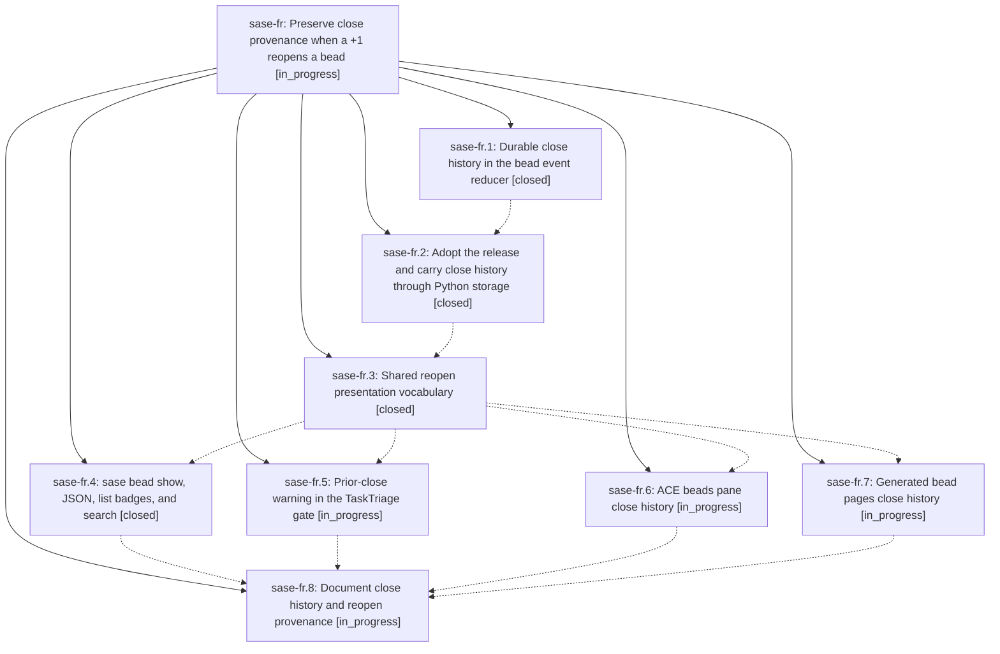

# Bead: sase-fr — Preserve close provenance when a +1 reopens a bead

[Bead Pages](../README.md) / sase-fr

**Status:** ◐ in_progress · **Type:** ▸ plan · **Tier:** epic
**Owner:** `bryanbugyi34@gmail.com` · **Created by:** [bbugyi200.athena.tr](https://github.com/sase-org/sase--agents/blob/main/agents/bbugyi200.athena.tr/README.md) · **Assignee:** `sase-fr.land`
**Created:** 2026-08-05 21:17:46 EDT
**Plan:** [202608/bead\_close\_history.md](https://github.com/sase-org/sase--plans/blob/main/202608/bead_close_history.md)

## Description

A bead that was closed and later reopened keeps the reason it was closed, and every surface that shows the bead says plainly that it was previously closed, why, and what reopened it — including which +1 did it.

## Phases

| Bead | Title | Status | Size | Created | Agents | Commits |
|---|---|---|---|---|---:|---:|
| [sase-fr.1](sase-fr.1.md) | Durable close history in the bead event reducer | ✓ closed | medium | 2026-08-05 | 1 | 0 |
| [sase-fr.2](sase-fr.2.md) | Adopt the release and carry close history through Python storage | ✓ closed | medium | 2026-08-05 | 1 | 1 |
| [sase-fr.3](sase-fr.3.md) | Shared reopen presentation vocabulary | ✓ closed | small | 2026-08-05 | 1 | 1 |
| [sase-fr.4](sase-fr.4.md) | sase bead show, JSON, list badges, and search | ✓ closed | medium | 2026-08-05 | 1 | 1 |
| [sase-fr.5](sase-fr.5.md) | Prior-close warning in the TaskTriage gate | ◐ in_progress | small | 2026-08-05 | 1 | 0 |
| [sase-fr.6](sase-fr.6.md) | ACE beads pane close history | ◐ in_progress | small | 2026-08-05 | 1 | 0 |
| [sase-fr.7](sase-fr.7.md) | Generated bead pages close history | ◐ in_progress | small | 2026-08-05 | 1 | 0 |
| [sase-fr.8](sase-fr.8.md) | Document close history and reopen provenance | ◐ in_progress | small | 2026-08-05 | 1 | 0 |

## Lineage

## Agents

| Agent | Bead | Commits |
|---|---|---:|
| [bbugyi200.athena.sase-fr.1](https://github.com/sase-org/sase--agents/blob/main/agents/bbugyi200.athena.sase-fr.1/README.md) | [sase-fr.1](sase-fr.1.md) | 0 |
| [bbugyi200.athena.sase-fr.2](https://github.com/sase-org/sase--agents/blob/main/agents/bbugyi200.athena.sase-fr.2/README.md) | [sase-fr.2](sase-fr.2.md) | 1 |
| [bbugyi200.athena.sase-fr.3](https://github.com/sase-org/sase--agents/blob/main/agents/bbugyi200.athena.sase-fr.3/README.md) | [sase-fr.3](sase-fr.3.md) | 1 |
| [bbugyi200.athena.sase-fr.4](https://github.com/sase-org/sase--agents/blob/main/agents/bbugyi200.athena.sase-fr.4/README.md) | [sase-fr.4](sase-fr.4.md) | 1 |
| [bbugyi200.athena.sase-fr.5](https://github.com/sase-org/sase--agents/blob/main/agents/bbugyi200.athena.sase-fr.5/README.md) | [sase-fr.5](sase-fr.5.md) | 0 |
| [bbugyi200.athena.sase-fr.6](https://github.com/sase-org/sase--agents/blob/main/agents/bbugyi200.athena.sase-fr.6/README.md) | [sase-fr.6](sase-fr.6.md) | 0 |
| [bbugyi200.athena.sase-fr.7](https://github.com/sase-org/sase--agents/blob/main/agents/bbugyi200.athena.sase-fr.7/README.md) | [sase-fr.7](sase-fr.7.md) | 0 |
| [bbugyi200.athena.sase-fr.8](https://github.com/sase-org/sase--agents/blob/main/agents/bbugyi200.athena.sase-fr.8/README.md) | [sase-fr.8](sase-fr.8.md) | 0 |
| [bbugyi200.athena.sase-fr.land](https://github.com/sase-org/sase--agents/blob/main/agents/bbugyi200.athena.sase-fr.land/README.md) | [sase-fr](README.md) | 0 |

## Commits

| Repo | Commit | Subject | Bead | Committed |
|---|---|---|---|---|
| sase | [`1da5a3e`](https://github.com/sase-org/sase/commit/1da5a3e277326bf52cf79c72c1ec824cbdc2e02b) | feat(bead): carry close history through Python bead storage | [sase-fr.2](sase-fr.2.md) | 2026-08-05 22:35:14 EDT |
| sase | [`9d0422f`](https://github.com/sase-org/sase/commit/9d0422fdacd5d64144885212bbbe5515b7c62a03) | feat(bead): add shared reopen presentation vocabulary | [sase-fr.3](sase-fr.3.md) | 2026-08-05 22:54:54 EDT |
| sase | [`d0e59df`](https://github.com/sase-org/sase/commit/d0e59dfdd4d37de450f997bbc1d418ba4fa8af35) | feat(bead): surface reopen history in bead show, JSON, list rows, and search | [sase-fr.4](sase-fr.4.md) | 2026-08-05 23:29:12 EDT |
