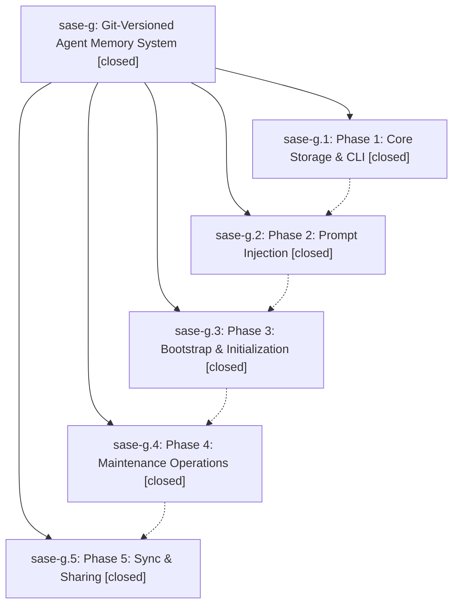

# Bead: sase-g — Git-Versioned Agent Memory System

[Bead Pages](../README.md) / sase-g

**Status:** ✓ closed · **Resolution:** (unrecorded) · **Type:** plan · **Tier:** epic
**Owner:** `bryanbugyi34@gmail.com`
**Created:** 2026-04-11 22:49:40 UTC · **Closed:** 2026-04-18 01:32:36 UTC
**Plan:** /home/bryan/projects/github/sase-org/sase/plans/202604/git\_versioned\_memory.md

## Phases

| Bead | Title | Status | Size | Agents | Commits |
|---|---|---|---|---:|---:|
| [sase-g.1](sase-g.1.md) | Phase 1: Core Storage & CLI | ✓ closed | small | 0 | 1 |
| [sase-g.2](sase-g.2.md) | Phase 2: Prompt Injection | ✓ closed | small | 0 | 1 |
| [sase-g.3](sase-g.3.md) | Phase 3: Bootstrap & Initialization | ✓ closed | small | 0 | 1 |
| [sase-g.4](sase-g.4.md) | Phase 4: Maintenance Operations | ✓ closed | small | 0 | 1 |
| [sase-g.5](sase-g.5.md) | Phase 5: Sync & Sharing | ✓ closed | small | 0 | 1 |

## Lineage

## Commits

| Commit | Subject | Bead | Committed (UTC) |
|---|---|---|---|
| [`71cb882`](https://github.com/sase-org/sase/commit/71cb882f99e44f24b97802ef423484e11a0fe72c) | feat(memory): add sase memory subcommand with git-versioned storage (sase-g.1) | [sase-g.1](sase-g.1.md) | 2026-04-11 23:03:26 |
| [`98b866b`](https://github.com/sase-org/sase/commit/98b866b05e0053a6da66944ad8e422ab6623387b) | feat(memory): add prompt injection via #memory xprompt and auto-inject config (sase-g.2) | [sase-g.2](sase-g.2.md) | 2026-04-11 23:17:48 |
| [`8fe2fbd`](https://github.com/sase-org/sase/commit/8fe2fbd0deecc79ebdc816b74dc9f3e69063324b) | feat(memory): add bootstrap command to seed initial memory from codebase (sase-g.3) | [sase-g.3](sase-g.3.md) | 2026-04-11 23:35:44 |
| [`da475ec`](https://github.com/sase-org/sase/commit/da475ece6db25e043385888a11a7f0434d282e25) | feat(memory): add reflect and defrag maintenance commands (sase-g.4) | [sase-g.4](sase-g.4.md) | 2026-04-11 23:53:31 |
| [`8faba14`](https://github.com/sase-org/sase/commit/8faba145baa8de3b258029d46ff07584a738c873) | feat(memory): add sync & sharing via git remotes (sase-g.5) | [sase-g.5](sase-g.5.md) | 2026-04-12 00:06:39 |
