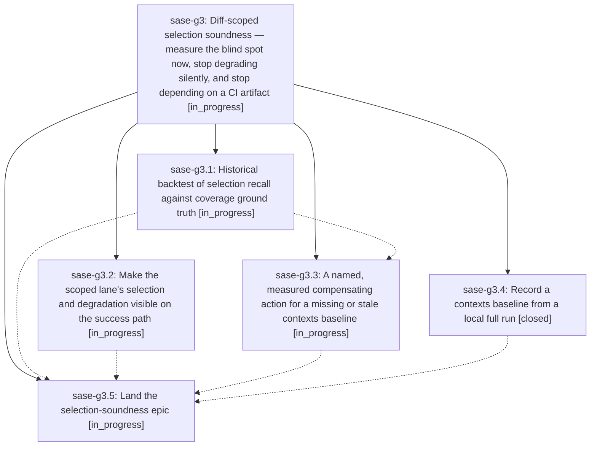

# Bead: sase-g3 — Diff-scoped selection soundness — measure the blind spot now, stop degrading silently, and stop depending on a CI artifact

[Bead Pages](../README.md) / sase-g3

**Status:** ◐ in_progress · **Type:** ▸ plan · **Tier:** epic
**Owner:** `bryanbugyi34@gmail.com` · **Created by:** [bbugyi200.athena.tx](https://github.com/sase-org/sase--agents/blob/main/agents/bbugyi200.athena.tx/README.md) · **Assignee:** `sase-g3.land`
**Created:** 2026-08-06 08:55:14 EDT
**Plan:** [202608/selection\_soundness.md](https://github.com/sase-org/sase--plans/blob/main/202608/selection_soundness.md)

## Description

The reliability of `just check`'s diff-scoped test lane becomes a measured property rather than an assumed one: a backtest over real historical commits reports selection recall against per-test coverage ground truth today instead of waiting weeks for organic samples, a missing or stale coverage-contexts baseline provokes a named and measured compensating action instead of silently narrowing the selection, an agent can see what the scoped lane actually did on the success path, and a workspace can obtain a baseline from a local full run instead of depending solely on a 14-day CI artifact.

## Phases

| Bead | Title | Status | Size | Created | Agents | Commits |
|---|---|---|---|---|---:|---:|
| [sase-g3.1](sase-g3.1.md) | Historical backtest of selection recall against coverage ground truth | ◐ in_progress | medium | 2026-08-06 | 1 | 0 |
| [sase-g3.2](sase-g3.2.md) | Make the scoped lane's selection and degradation visible on the success path | ◐ in_progress | small | 2026-08-06 | 1 | 0 |
| [sase-g3.3](sase-g3.3.md) | A named, measured compensating action for a missing or stale contexts baseline | ◐ in_progress | medium | 2026-08-06 | 1 | 0 |
| [sase-g3.4](sase-g3.4.md) | Record a contexts baseline from a local full run | ✓ closed | medium | 2026-08-06 | 1 | 1 |
| [sase-g3.5](sase-g3.5.md) | Land the selection-soundness epic | ◐ in_progress | small | 2026-08-06 | 1 | 0 |

## Lineage

## Agents

| Agent | Bead | Commits |
|---|---|---:|
| [bbugyi200.athena.sase-g3.1](https://github.com/sase-org/sase--agents/blob/main/agents/bbugyi200.athena.sase-g3.1/README.md) | [sase-g3.1](sase-g3.1.md) | 0 |
| [bbugyi200.athena.sase-g3.2](https://github.com/sase-org/sase--agents/blob/main/agents/bbugyi200.athena.sase-g3.2/README.md) | [sase-g3.2](sase-g3.2.md) | 0 |
| [bbugyi200.athena.sase-g3.3](https://github.com/sase-org/sase--agents/blob/main/agents/bbugyi200.athena.sase-g3.3/README.md) | [sase-g3.3](sase-g3.3.md) | 0 |
| [bbugyi200.athena.sase-g3.4](https://github.com/sase-org/sase--agents/blob/main/agents/bbugyi200.athena.sase-g3.4/README.md) | [sase-g3.4](sase-g3.4.md) | 1 |
| [bbugyi200.athena.sase-g3.5](https://github.com/sase-org/sase--agents/blob/main/agents/bbugyi200.athena.sase-g3.5/README.md) | [sase-g3.5](sase-g3.5.md) | 0 |
| [bbugyi200.athena.sase-g3.land](https://github.com/sase-org/sase--agents/blob/main/agents/bbugyi200.athena.sase-g3.land/README.md) | [sase-g3](README.md) | 0 |

## Commits

| Repo | Commit | Subject | Bead | Committed |
|---|---|---|---|---|
| sase | [`2ef98cb`](https://github.com/sase-org/sase/commit/2ef98cb3e646ca6e6f5298398b5a8c4855273774) | feat(test-selection): record a contexts baseline from a local full run | [sase-g3.4](sase-g3.4.md) | 2026-08-06 09:39:50 EDT |
