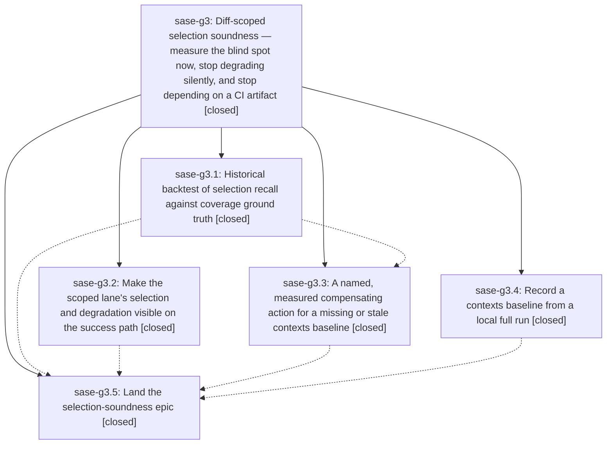

# Bead: sase-g3 — Diff-scoped selection soundness — measure the blind spot now, stop degrading silently, and stop depending on a CI artifact

[Bead Pages](../README.md) / sase-g3

**Status:** ✓ closed · **Resolution:** done · **Type:** ▸ plan · **Tier:** epic
**Owner:** `bryanbugyi34@gmail.com` · **Created by:** [bbugyi200.athena.tx](https://github.com/sase-org/sase--agents/blob/main/agents/bbugyi200.athena.tx/README.md) · **Assignee:** `sase-g3.land`
**Created:** 2026-08-06 08:55:14 EDT · **Closed:** 2026-08-06 11:30:32 EDT
**Plan:** [202608/selection\_soundness.md](https://github.com/sase-org/sase--plans/blob/main/202608/selection_soundness.md)

## Description

The reliability of `just check`'s diff-scoped test lane becomes a measured property rather than an assumed one: a backtest over real historical commits reports selection recall against per-test coverage ground truth today instead of waiting weeks for organic samples, a missing or stale coverage-contexts baseline provokes a named and measured compensating action instead of silently narrowing the selection, an agent can see what the scoped lane actually did on the success path, and a workspace can obtain a baseline from a local full run instead of depending solely on a 14-day CI artifact.

## Notes

[2026-08-06T14:38:05Z · sase-g3.5] LAND READING (sase-g3.5, combined tree at 8b8acb433588): selection-health — 42 scoped runs, 70 full-lane runs recorded in the durable host-local store; correlatable sample (post-schema-2) is 79 of 112 total records, 33 excluded for predating schema 2 (10 scoped, 23 full-lane). escalation 47.6%, median selected 37 files (1.6% of 2331), 76,691 worker-seconds avoided. 1 false negative surfaced (tests/ace/tui/widgets/test_prompt_codeblock_highlight.py::test_codeblock_band_replaces_cursor_line_fill_but_not_cursor, full-run head fa8fc69e46c4, workspace sase_11) but its triggering diff only touched src/sase/agents_sync/** — unrelated to prompt-codeblock rendering — matching the ACE-TUI load-sensitive flake family already tracked on sase-ct/sase-e2, not a genuine selection miss.

selection-backtest — default mode (baseline must be an ancestor, faithful replay) over the last 50 commits: only 5 have usable ground truth against the current cached baseline (6b0976bcb6e5), because that baseline is itself only 10 commits old; nowhere near 30. With --include-descendant-baseline (accepts the reverse, pessimistically-widened direction) and --limit 100: 32 of 100 commits have usable ground truth (5 faithful + 27 widened/approximate). closure-only recall: median 100%, mean 98.2%, perfect on 30/32 (11 by escalation); 2 blind-spot commits (9a366e0d6c5a 57.1% missed 9/21, 840cdff10664 85.7% missed 1/7). closure+contexts recall: perfect 100% on all 32, 0 blind spots.

Honest reading: the >=30-varied-changes exit criterion IS now met by backtest evidence, but only in the widened/approximate --include-descendant-baseline mode (27 of the 32 usable commits are pessimistic reads, not faithful replay — the faithful-only reading is still just 5). It is NOT met by live correlation: the correlatable sample is 79 records and only 1 true scoped-to-full-run pair has been found, so live correlation alone remains far short of 30 and should not be blurred with the backtest reading. The backtest also confirms the contexts baseline is still what makes recall airtight — even after phase compensate (depth+1 when no baseline), closure-only still blind-spots on 2/32 backtested commits, while closure+contexts is 0/32.

[2026-08-06T14:50:27Z · sase-g3.5] LAND READING RECONFIRMED (sase-g3.5) at the true final combined tree 625b5cac40fb, two commits past the earlier reading at 8b8acb433588; the honest reading is unchanged. selection-health: 42 scoped runs / 70 full-lane runs, escalation 47.6%, median selected 37 files (1.6% of 2331), p90 180 (7.7%), median duration 49.7s, 76,691 worker-seconds avoided; 33 pre-schema-2 records excluded from correlation, leaving a correlatable sample of 79; contexts baseline present in 20 of 42 scoped runs. selection-backtest against the newest cached baseline 6b0976bcb6e5: strict ancestor-only --limit 50 yields just 6 usable commits (38 skipped baseline-not-ancestor because that baseline is itself only ~10 commits old), closure-only mean recall 92.9% / worst 57.1%, 1 blind-spot commit. With --include-descendant-baseline --limit 100: 31 usable commits (6 faithful + 25 pessimistically widened), closure-only median 100% / mean 98.2% / worst 57.1%, perfect on 29/31 (11 by escalation), 2 blind-spot commits (9a366e0d6c5a 57.1% missed 9/21; 840cdff10664 85.7% missed 1/7), 10 missed files total; closure+contexts 100% on all 31 with 0 blind spots. HONEST READING: the >=30-varied-changes exit criterion is met by BACKTEST evidence only, and only in the widened/approximate mode (25 of the 31 usable commits are pessimistic reads; the faithful-ancestor-only reading is 6). It is NOT met by live correlation — 79 correlatable records have produced exactly 1 scoped/full pair, and that one pair is the ACE-TUI flake already tracked on sase-ct/sase-e2, not a selection miss. The two readings must not be blurred. The backtest also confirms the contexts baseline, not the closure, is what makes recall airtight: even with phase compensate active (no-baseline-depth-boost), closure-only still blind-spots on 2/31 commits while closure+contexts blind-spots on 0/31. VERIFICATION: just check-full green on 625b5cac40fb (all 12 gates incl. the full suite, no flakes this run) and just symvision clean. The plan is marked status: done. Six PROPOSED FOLLOW-UP entries are collected on sase-g3.5 awaiting /sase_new_task triage; this land agent was instructed not to create beads and not to close this epic.

[2026-08-06T15:18:53Z · sase-g3.land] LAND INTEGRATION (sase-g3.land): reviewed the six non-epic commits landed since the epic's first commit 2ef98cb3e — 9a366e0d6 (ace artifacts project scope), 48a34b4a1 and 8b8acb433 (agents-sync), d9c13549f and b08862001 (sdd plan-header validation), 625b5cac4 (axe workspace lock). None touches tests/_test_selection*, tools/, or the Justfile, and none duplicates or conflicts with what this epic added; nothing among them should now consume the epic's backtest, scoped summary line, no-baseline-depth-boost rule, or local baseline producer. Two integration facts are worth recording: d9c13549f resolved phase compensate's PROPOSED FOLLOW-UP about tests/test_plan_display.py::test_malformed_header_block_leaves_authored_metadata_visible failing on a clean tree (that test now asserts validation_ok is False deliberately), and 9a366e0d6 is one of the two commits the backtest still blind-spots on at 57.1% closure-only recall, which was corroborated onto sase-fy rather than treated as an epic defect.

[2026-08-06T15:19:20Z · sase-g3.land] LAND DEFECT FOUND AND FIXED (sase-g3.land): verifying phase visible's summary line against a real escalated run surfaced a defect this epic introduced, plus a pre-existing miscount it turned into a decision input. select_tests consults contexts only inside the 'not forces_full_suite' branch, so a rule-forced escalation left the manifest's default-shaped contexts block (baseline: null) — which phase visible's new success-path line rendered as 'contexts baseline missing' and tools/select_tests --explain rendered as 'no baseline cached (run just refresh-contexts-baseline)'. Both are false: an escalated run executed every test and never looked at the cache. Escalations are 21 of 44 recorded scoped runs (47.7%), so nearly half of all just check runs showed an agent a false claim and a remedy it did not need. The same conflation drove just selection-health's 'runs without one: 23 of 44 (static closure alone)'. Measured against the real host store: escalated with null baseline 21, genuinely scoped with a baseline 21, genuinely scoped without one 2. The lane's true closure-only exposure is 2 of 23 consulted runs (8.7%), not ~52% — an order of magnitude, and it is the number phase compensate cited ('a baseline is absent in 20 of 39 recorded scoped runs, so escalating would send half the lane to the full suite') to justify keeping no-baseline-depth-boost out of FULL_SUITE_RULES. FIX: ContextSelection gained an explicit 'consulted' flag (manifest schema 3 -> 4) set False on the forced-full-suite path; context_line, manifest_summary_line, and selection-health now report 'not consulted' distinctly and count baseline availability over consulted runs only, with a shared contexts_consulted() helper inferring the flag for pre-schema-4 records so the 30-day store reads correctly. DECISION NOT REVISITED: depth+1 stays the compensating action. The corrected frequency does make escalation affordable, but absence is persistent rather than occasional exactly where it matters — an offline workspace, or one idle past the artifact's 14-day retention — so escalating would hand those a permanently full lane, and depth+1 recovers a measured 91% of the closure blind spot for roughly double the selected files against 3,650 worker-seconds. The rationale in docs/development.md, tests/_test_selection_rules.py, and the rule's own test docstring was rewritten to state the corrected numbers rather than the inflated ones.

## Phases

| Bead | Title | Status | Size | Created | Agents | Commits |
|---|---|---|---|---|---:|---:|
| [sase-g3.1](sase-g3.1.md) | Historical backtest of selection recall against coverage ground truth | ✓ closed | medium | 2026-08-06 | 1 | 1 |
| [sase-g3.2](sase-g3.2.md) | Make the scoped lane's selection and degradation visible on the success path | ✓ closed | small | 2026-08-06 | 1 | 1 |
| [sase-g3.3](sase-g3.3.md) | A named, measured compensating action for a missing or stale contexts baseline | ✓ closed | medium | 2026-08-06 | 1 | 1 |
| [sase-g3.4](sase-g3.4.md) | Record a contexts baseline from a local full run | ✓ closed | medium | 2026-08-06 | 1 | 1 |
| [sase-g3.5](sase-g3.5.md) | Land the selection-soundness epic | ✓ closed | small | 2026-08-06 | 1 | 0 |

## Lineage

## Agents

| Agent | Bead | Commits |
|---|---|---:|
| [bbugyi200.athena.sase-g3.1](https://github.com/sase-org/sase--agents/blob/main/agents/bbugyi200.athena.sase-g3.1/README.md) | [sase-g3.1](sase-g3.1.md) | 1 |
| [bbugyi200.athena.sase-g3.2](https://github.com/sase-org/sase--agents/blob/main/agents/bbugyi200.athena.sase-g3.2/README.md) | [sase-g3.2](sase-g3.2.md) | 1 |
| [bbugyi200.athena.sase-g3.3](https://github.com/sase-org/sase--agents/blob/main/agents/bbugyi200.athena.sase-g3.3/README.md) | [sase-g3.3](sase-g3.3.md) | 1 |
| [bbugyi200.athena.sase-g3.4](https://github.com/sase-org/sase--agents/blob/main/agents/bbugyi200.athena.sase-g3.4/README.md) | [sase-g3.4](sase-g3.4.md) | 1 |
| [bbugyi200.athena.sase-g3.5](https://github.com/sase-org/sase--agents/blob/main/agents/bbugyi200.athena.sase-g3.5/README.md) | [sase-g3.5](sase-g3.5.md) | 0 |
| [bbugyi200.athena.sase-g3.land](https://github.com/sase-org/sase--agents/blob/main/agents/bbugyi200.athena.sase-g3.land/README.md) | [sase-g3](README.md) | 1 |

## Commits

| Repo | Commit | Subject | Bead | Committed |
|---|---|---|---|---|
| sase | [`2ef98cb`](https://github.com/sase-org/sase/commit/2ef98cb3e646ca6e6f5298398b5a8c4855273774) | feat(test-selection): record a contexts baseline from a local full run | [sase-g3.4](sase-g3.4.md) | 2026-08-06 09:39:50 EDT |
| sase | [`da6105b`](https://github.com/sase-org/sase/commit/da6105b51edf8141b979478882ba6c0aa4b0a81a) | feat(test-selection): surface the scoped lane's summary on the success path | [sase-g3.2](sase-g3.2.md) | 2026-08-06 09:39:55 EDT |
| sase | [`4651ed1`](https://github.com/sase-org/sase/commit/4651ed1991a3dbd9284f21e7651b486f409c3539) | test(selection): add a historical backtest for diff-scoped selection recall | [sase-g3.1](sase-g3.1.md) | 2026-08-06 09:42:56 EDT |
| sase | [`b4c4c18`](https://github.com/sase-org/sase/commit/b4c4c182e1a68037fed639215c4d35ebbeab7e15) | feat(test-selection): walk one hop deeper when no contexts baseline is usable | [sase-g3.3](sase-g3.3.md) | 2026-08-06 10:26:47 EDT |
| sase | [`559d4c2`](https://github.com/sase-org/sase/commit/559d4c2443b78ae495f25842bd94a42ad05ceb78) | fix(test-selection): stop reporting an escalated run as one with no baseline | [sase-g3](README.md) | 2026-08-06 11:30:50 EDT |
