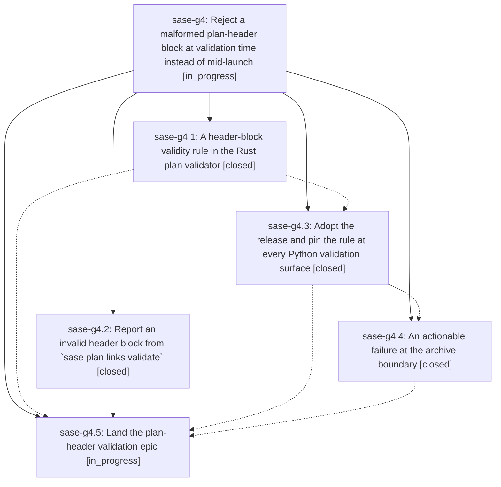

# Bead: sase-g4 — Reject a malformed plan-header block at validation time instead of mid-launch

[Bead Pages](../README.md) / sase-g4

**Status:** ◐ in_progress · **Type:** ▸ plan · **Tier:** epic
**Owner:** `bryanbugyi34@gmail.com` · **Created by:** [bbugyi200.athena.ty](https://github.com/sase-org/sase--agents/blob/main/agents/bbugyi200.athena.ty/README.md) · **Assignee:** `sase-g4.land`
**Created:** 2026-08-06 09:05:13 EDT
**Plan:** [202608/plan\_header\_validation.md](https://github.com/sase-org/sase--plans/blob/main/202608/plan_header_validation.md)

## Description

A plan whose provenance header block is malformed is rejected the first time anything validates it — `sase plan validate`, `sase plan propose`, and the tale/epic approval gate — with a diagnostic that names the offending section and its line, so an approved epic can never reach `sase bead work` and abort at its archive step; and if the archive boundary is ever reached with a malformed document anyway, it fails with that same actionable diagnostic instead of a bare `validation:` exception from the Rust binding.

## Phases

| Bead | Title | Status | Size | Created | Agents | Commits |
|---|---|---|---|---|---:|---:|
| [sase-g4.1](sase-g4.1.md) | A header-block validity rule in the Rust plan validator | ✓ closed | medium | 2026-08-06 | 1 | 1 |
| [sase-g4.2](sase-g4.2.md) | Report an invalid header block from \`sase plan links validate\` | ✓ closed | small | 2026-08-06 | 1 | 1 |
| [sase-g4.3](sase-g4.3.md) | Adopt the release and pin the rule at every Python validation surface | ✓ closed | small | 2026-08-06 | 1 | 1 |
| [sase-g4.4](sase-g4.4.md) | An actionable failure at the archive boundary | ✓ closed | small | 2026-08-06 | 1 | 1 |
| [sase-g4.5](sase-g4.5.md) | Land the plan-header validation epic | ◐ in_progress | small | 2026-08-06 | 1 | 0 |

## Lineage

## Agents

| Agent | Bead | Commits |
|---|---|---:|
| [bbugyi200.athena.sase-g4.1](https://github.com/sase-org/sase--agents/blob/main/agents/bbugyi200.athena.sase-g4.1/README.md) | [sase-g4.1](sase-g4.1.md) | 1 |
| [bbugyi200.athena.sase-g4.2](https://github.com/sase-org/sase--agents/blob/main/agents/bbugyi200.athena.sase-g4.2/README.md) | [sase-g4.2](sase-g4.2.md) | 1 |
| [bbugyi200.athena.sase-g4.3](https://github.com/sase-org/sase--agents/blob/main/agents/bbugyi200.athena.sase-g4.3/README.md) | [sase-g4.3](sase-g4.3.md) | 1 |
| [bbugyi200.athena.sase-g4.4](https://github.com/sase-org/sase--agents/blob/main/agents/bbugyi200.athena.sase-g4.4/README.md) | [sase-g4.4](sase-g4.4.md) | 1 |
| [bbugyi200.athena.sase-g4.5](https://github.com/sase-org/sase--agents/blob/main/agents/bbugyi200.athena.sase-g4.5/README.md) | [sase-g4.5](sase-g4.5.md) | 0 |
| [bbugyi200.athena.sase-g4.land](https://github.com/sase-org/sase--agents/blob/main/agents/bbugyi200.athena.sase-g4.land/README.md) | [sase-g4](README.md) | 0 |

## Commits

| Repo | Commit | Subject | Bead | Committed |
|---|---|---|---|---|
| sase-core | [`sase-core@508d5d9`](https://github.com/sase-org/sase-core/commit/508d5d99f4ba81ef405a2421662fef6ad9d4a9e1) | feat(plan): reject a malformed plan header block during validation | [sase-g4.1](sase-g4.1.md) | 2026-08-06 09:23:14 EDT |
| sase | [`fa8fc69`](https://github.com/sase-org/sase/commit/fa8fc69e46c49bc3367ea274584d7fa928aa1dc9) | fix(sdd): report header-invalid from plan links validate | [sase-g4.2](sase-g4.2.md) | 2026-08-06 09:27:10 EDT |
| sase | [`d9c1354`](https://github.com/sase-org/sase/commit/d9c13549f9809f2ba8d695027dc7bf76440e7844) | feat(sdd): adopt header-invalid diagnostic and pin it at every validation surface | [sase-g4.3](sase-g4.3.md) | 2026-08-06 10:31:32 EDT |
| sase | [`b088620`](https://github.com/sase-org/sase/commit/b08862001860814452c89553f10cc6a52c88d87e) | fix(sdd): validate plan header before projection at the archive boundary | [sase-g4.4](sase-g4.4.md) | 2026-08-06 10:50:01 EDT |
