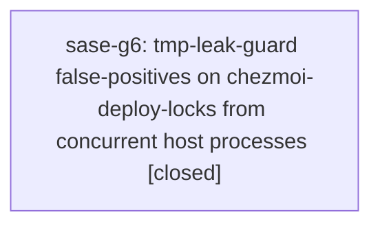

# Bead: sase-g6 — tmp-leak-guard false-positives on chezmoi-deploy-locks from concurrent host processes

[Bead Pages](../README.md) / sase-g6

**Status:** ✓ closed · **Resolution:** done · **Type:** ◆ task
**Owner:** `bryanbugyi34@gmail.com` · **Created by:** [bbugyi200.athena.u1](https://github.com/sase-org/sase--agents/blob/main/families/bbugyi200.athena.u1.md) · **Assignee:** `sase-g6` · **Size:** xsmall
**Created:** 2026-08-06 10:28:42 EDT · **Closed:** 2026-08-06 16:06:26 EDT

## Description

tests/_tmp_leak_guard.py's FOREIGN_ENTRY_PATTERNS allowlist tolerates scratch dirs written by other live sase processes on a shared host during a test run (its docstring: other live sase processes elsewhere on this host launch agents and profile the TUI while the suite runs, and they write straight into the same managed tmp root; existing examples: ace-profiles, launch-prompts, ace_profile_*, sase_ace_prompt_*). chezmoi-deploy-locks (written for real by src/sase/main/_init_chezmoi_deploy.py:361 via get_sase_managed_tmpdir("chezmoi-deploy-locks")) is the same class of artifact but is missing from that allowlist.

Observed on host athena: 'just check' failed its test-scoped recipe with a 'system temp leakage' report flagging a newly created /home/bryan/Sync/home/tmp/sase/chezmoi-deploy-locks directory. stat confirmed the directory's birth time fell exactly inside the just-check run window, and it was created outside pytest's sandboxed tmp root, meaning a real concurrent chezmoi deploy ran on the shared host during the test run -- not the test suite itself. No file touched in the triggering change (src/sase/agents_sync/*, src/sase/agents/cli_sync.py, src/sase/main/parser_agent.py) references chezmoi or _init_chezmoi_deploy.py, so the suite itself did not cause this.

Proposed fix: add "chezmoi-deploy-locks" to tests/_tmp_leak_guard.py's FOREIGN_ENTRY_PATTERNS, matching the treatment already given to ace-profiles/launch-prompts/etc.

## Notes

[2026-08-06T20:06:26Z · sase-g6] Verified fix: added chezmoi-deploy-locks to tests/_tmp_leak_guard.py FOREIGN_ENTRY_PATTERNS allowlist. Ran just install + just check: all lint gates passed and the scoped test lane (escalated to full suite via root-conftest rule) passed cleanly, confirming the leak-guard no longer flags this foreign artifact.

## Lineage

## Agents

| Agent | Bead | Commits |
|---|---|---:|
| [bbugyi200.athena.sase-g6](https://github.com/sase-org/sase--agents/blob/main/agents/bbugyi200.athena.sase-g6/README.md) | [sase-g6](README.md) | 1 |

## Commits

| Repo | Commit | Subject | Bead | Committed |
|---|---|---|---|---|
| sase | [`48bd000`](https://github.com/sase-org/sase/commit/48bd0009ebdcf7ae883abfd548e1a02967c3e318) | fix(tests): allow chezmoi-deploy-locks in tmp-leak-guard allowlist | [sase-g6](README.md) | 2026-08-06 16:07:06 EDT |
