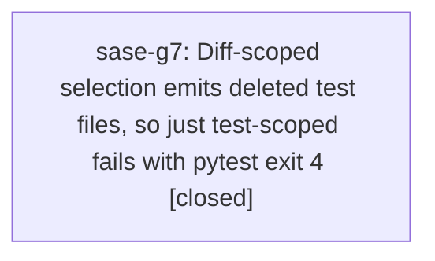

# Bead: sase-g7 — Diff-scoped selection emits deleted test files, so just test-scoped fails with pytest exit 4

[Bead Pages](../README.md) / sase-g7

**Status:** ✓ closed · **Resolution:** done · **Type:** ◆ task
**Owner:** `bryanbugyi34@gmail.com` · **Created by:** [bbugyi200.athena.toobig-1o.split\_file.tests.test\_commit\_artifacts.0](https://github.com/sase-org/sase--agents/blob/main/agents/bbugyi200.athena.toobig-1o.split_file.tests.test_commit_artifacts.0/README.md) · **Assignee:** `sase-g7` · **Size:** small
**Created:** 2026-08-06 11:12:36 EDT · **Closed:** 2026-08-06 15:32:51 EDT

## Description

Discovered on 2026-08-06 while splitting tests/test_commit_artifacts.py into focused modules (the original file was git rm'd and replaced by tests/test_commit_result_marker.py, tests/test_commit_marker_repo_metadata.py, tests/test_commit_sdd_result_marker.py, tests/test_commit_pr_body.py).

REPRODUCTION: delete or rename any tests/test_*.py file, then run 'just check' (or 'just test-scoped'). Every whole-repo lint gate passes, then the scoped lane fails:

  selected 40 of 2337 test files (rules: contract-set-always, rename-or-delete)
  ERROR: file or directory not found: tests/test_commit_artifacts.py
  collected 0 items / no tests ran
  error: recipe `test-scoped` failed on line 346 with exit code 4

'.venv/bin/python tools/select_tests --explain' confirms the cause: the deleted path is seeded from the change set and emitted verbatim ('tests/test_commit_artifacts.py  <- seed tests/test_commit_artifacts.py at hop 0'). Nothing filters selected test paths down to those that still exist in the working tree, so pytest aborts on the missing path before running anything. Because pytest exits 4 with zero tests collected, the whole scoped lane is skipped, not just the deleted file — an agent who deletes a test file gets no scoped test signal at all.

IMPACT: 'just check' cannot pass for any change that deletes or renames a test file, which is exactly the shape of the module-split refactors this repo does often. Workaround today is to hand-filter the selection ('tools/select_tests | grep -v <deleted path>') and run pytest directly, or to fall back to 'just check-full'.

SCOPE: filter selected test files to paths that exist on disk before handing them to pytest (or drop deleted paths at the seed/emission boundary), keeping the rename-or-delete rule's escalation behavior intact so the tests that imported the removed module are still selected. Add regression coverage for a change set that deletes a test file. Note that touching tests/_test_selection*.py or tools/select_tests trips RULE_SELECTION_TOOLING, so verify with 'just check-full'.

## Notes

[2026-08-06T19:32:51Z · sase-g7] Fixed: tests/_test_selection.py now filters the selected test set to paths still present in graph.paths (built from the current working tree via discover_python_files), so a deleted/renamed-away test path from change_set.paths is dropped before reaching pytest instead of being emitted verbatim. The closure and rename-or-delete depth-boost were already unaffected since importers only ever resolve to on-disk modules. Added regression test test_deleted_test_file_is_not_selected in tests/test_test_selection.py (git rm a test file, assert it's excluded from selection.selected while RULE_RENAME_OR_DELETE still fires). Verified with the targeted test_test_selection.py suite (63 passed) and just check-full (all lint gates + full test suite green).

[2026-08-06T19:33:25Z · sase-g7] Filtered selected test paths against graph.paths (current working tree) in tests/_test_selection.py to drop deleted/renamed-away test files before handing selection to pytest, preventing exit-4 collection failures. Added regression test test_deleted_test_file_is_not_selected. Verified via targeted suite (63 passed) and just check-full (all lint gates + full suite green).

## Lineage

## Agents

| Agent | Bead | Commits |
|---|---|---:|
| [bbugyi200.athena.sase-g7](https://github.com/sase-org/sase--agents/blob/main/agents/bbugyi200.athena.sase-g7/README.md) | [sase-g7](README.md) | 1 |

## Commits

| Repo | Commit | Subject | Bead | Committed |
|---|---|---|---|---|
| sase | [`cf130a2`](https://github.com/sase-org/sase/commit/cf130a278505f0cf9921acb016011b8fb9789a60) | fix(test-selection): drop deleted test paths from scoped selection | [sase-g7](README.md) | 2026-08-06 15:34:00 EDT |
