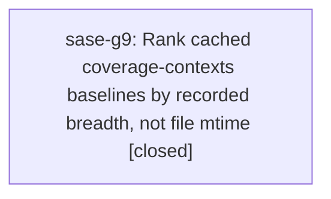

# Bead: sase-g9 — Rank cached coverage-contexts baselines by recorded breadth, not file mtime

[Bead Pages](../README.md) / sase-g9

**Status:** ✓ closed · **Resolution:** done · **Type:** ◆ task
**Owner:** `bryanbugyi34@gmail.com` · **Created by:** [bbugyi200.athena.sase-g3.land](https://github.com/sase-org/sase--agents/blob/main/agents/bbugyi200.athena.sase-g3.land/README.md) · **Assignee:** `sase-g9` · **Size:** medium
**Created:** 2026-08-06 11:16:24 EDT · **Closed:** 2026-08-06 16:29:50 EDT

## Description

resolve_baseline (tests/_test_selection_contexts.py) sorts cached baselines by file mtime and then takes the first ancestor of HEAD, so the most recently *written* database wins regardless of how much ground truth it actually holds. Its own docstring says it picks 'the most recent ancestor of HEAD', which mtime only approximates -- that held while every baseline arrived the same way, as a CI artifact, and stopped holding when epic sase-g3 phase 'baseline' (commit 2ef98cb3e) added tools/install_coverage_contexts as a second, local supply route.

OBSERVED on athena at b08862001, both baselines ancestors of HEAD:
  6b0976bcb.sqlite  7.3 MB  14,349 contexts   46,364 line_bits  (local, mtime 09:10, distance 12)
  96183d71b.sqlite   49 MB  58,770 contexts  597,959 line_bits  (CI,    mtime 00:32, distance 27)
resolve_baseline returns the 7.3 MB one. It holds 4x fewer contexts and 13x fewer (file, test) attribution pairs over a near-identical file count (2,643 vs 2,638), so selections resolving it get materially less ground truth while reporting a healthy 'context-selection' rule.

IMPACT, measured at land time: with the thin baseline preferred, a strict 'just selection-backtest --limit 50' found only 6 of 50 commits with usable ground truth (38 skipped baseline-not-ancestor), where the same harness measuring against 96183d71b at --limit 150 got 63.

WHY THE THIN DATABASE EXISTS: it was recorded at 09:10, about 30 minutes before sase-g3.4 pinned COVERAGE_CORE=ctrace for the cov-contexts lane (2ef98cb3e, 09:39). On Python 3.14 coverage's default sysmon core stops monitoring a location once seen, so only the first test to execute a line is credited. Later local runs will be ctrace-recorded and comparable to CI's. That fix removes the mechanism that produced this particular artifact but not the ranking weakness itself: any thin or truncated database that lands with a fresh mtime still displaces a fuller one, and the installer's existing dirty-src and partial-run guards did not catch this one because the run was complete, just thinly attributed.

SCOPE: give resolve_baseline a quality signal instead of trusting mtime -- e.g. record context/line_bits counts in a sidecar at install and fetch time and rank on (breadth, then commit distance), and/or have tools/install_coverage_contexts refuse a database whose attribution density is far below an already-cached one. Picking the threshold needs measurement, which is why this is not a mechanical change. While fixing, also reconcile resolve_baseline's docstring with its behaviour: ranking ancestors by commit distance rather than file mtime is what it already claims to do. An immediate host-local mitigation is to delete or re-record the thin ~/.sase/test-selection/contexts/6b0976bcb*.sqlite; it is a regenerable cache entry, but it degrades every scoped run on athena until it ages out.

Proposed by sase-g3.3 and re-raised by sase-g3.5; evidence above re-measured at land time by sase-g3.land.

## Notes

[2026-08-06T20:29:50Z · sase-g9] resolve_baseline now ranks cached baselines by recorded breadth then commit distance instead of file mtime, and its docstring says so. Breadth = (contexts, line_bits attribution pairs, measured files) counted straight from SQLite (read-only URI, ~17ms warm on the 49MB CI database) and memoized in a <sha>.sqlite.breadth.json sidecar keyed on the database's size+mtime_ns, so a re-recorded SHA is re-measured; both producers (tools/install_coverage_contexts, tools/fetch_coverage_contexts) write it at install/fetch time, prune_baselines removes it with its database, and cached_baselines re-measures lazily for databases already on disk. Ranking: ancestors of HEAD sorted by commit distance, then the nearest one holding >= 75% (BREADTH_TOLERANCE) of the best candidate's attribution pairs wins; unmeasurable databases count 0 and never displace a readable one; with nothing measurable the old distance ordering stands unchanged. tools/install_coverage_contexts gained a third guard refusing a database whose density (pairs per measured file) is under 50% (MIN_DENSITY_RATIO) of the densest already cached, overridable with --allow-thin, never firing when the cache holds no measurable reference. VERIFIED on athena's real cache at HEAD 5da193482: the two baselines measure 6b0976bcb = 14,349/46,364/2,643 (density 17.5, distance 28) and 96183d71b = 58,770/597,959/2,638 (density 226.7, distance 43), and resolve_baseline now returns 96183d71b -- the 13x-better-attributed CI artifact -- where it previously returned the newer, nearer, thin local one. The thin database was left in place rather than deleted: it is now correctly deprioritized, and the installer would refuse to re-cache one like it (17.5/226.7 = 8%, well under the 50% floor). 12 new tests across tests/test_test_selection_contexts.py and tests/test_install_coverage_contexts_tool.py cover measurement, unreadable databases, sidecar reuse and invalidation, prune cleanup, thin-vs-broad and comparable-breadth ranking, the density refusal and its override, and the empty-cache exemption. docs/development.md's coverage-context section updated with the new ranking, the sidecar, the third guard, and the measured evidence. just check passed clean (exit 0; the selection-tooling rule escalated it to the full suite: 26,054 tests), plus bare mypy across 2,762 files.

[2026-08-06T20:30:33Z · sase-g9] Breadth-aware baseline ranking verified: just check green (full 26,054-test suite via selection-tooling escalation), 12 new tests, real athena cache now resolves 96183d71b (597,959 pairs) over the thin local 6b0976bcb (46,364).

## Lineage

## Agents

| Agent | Bead | Commits |
|---|---|---:|
| [bbugyi200.athena.sase-g9](https://github.com/sase-org/sase--agents/blob/main/agents/bbugyi200.athena.sase-g9/README.md) | [sase-g9](README.md) | 1 |

## Commits

| Repo | Commit | Subject | Bead | Committed |
|---|---|---|---|---|
| sase | [`368cf15`](https://github.com/sase-org/sase/commit/368cf151a445f9e0cb96a7e2c958decb91c031b3) | fix(test-selection): rank coverage-contexts baselines by breadth, not mtime | [sase-g9](README.md) | 2026-08-06 16:31:15 EDT |
