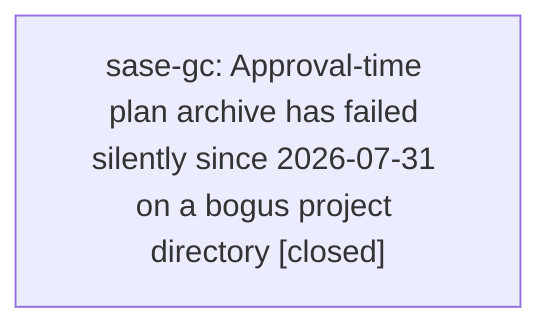

# Bead: sase-gc — Approval-time plan archive has failed silently since 2026-07-31 on a bogus project directory

[Bead Pages](../README.md) / sase-gc

**Status:** ✓ closed · **Resolution:** done · **Type:** ◆ task · **+1 reports:** +1
**Owner:** `bryanbugyi34@gmail.com` · **Created by:** [bbugyi200.athena.sase-g4.land](https://github.com/sase-org/sase--agents/blob/main/agents/bbugyi200.athena.sase-g4.land/README.md) · **Assignee:** `sase-gc` · **Size:** medium
**Created:** 2026-08-06 11:17:41 EDT · **Closed:** 2026-08-06 16:09:03 EDT

## Description

Proposed by phase bead sase-g4.5 and named in epic sase-g4's plan as an explicit out-of-scope follow-up. Not caused by sase-g4: separate root cause, and it did not cause the launch failure that produced that epic (the launch's own archive would have raised regardless).

Every approval-time plan archive raises and is swallowed into a warning. Re-confirmed at master be25ef5b4 on 2026-08-06: ~/.sase/logs/tui.log now holds 62 'Failed to archive approved plan' warnings and 124 lines of the underlying error, most recently 2026-08-06 09:45:22. The error is always:

  ValueError: No workspace plugin detected a workflow type for '/home/bryan/.sase/projects/.sase'. Install the appropriate workspace plugin.

raised from get_workspace_directory. Note the path: '/home/bryan/.sase/projects/.sase' is not a project directory -- the ProjectSpec key is missing from it, so something is resolving a project directory from an empty or unset key and handing the result to the workspace-plugin lookup. That resolution bug is the thing to fix; the plugin message is a symptom.

Both call sites swallow it:
  - src/sase/plan_approval_actions.py:462
  - src/sase/_notification_plan_background.py:54

Consequence: approved plans have not been archived at approval time since 2026-07-31. Plans that reach the archive by another route (a subsequent 'sase bead work <plan>' launch) are still archived, which is why this stayed invisible for a week.

Scope: find why the project directory resolves without its key, fix it at the source, and decide whether these two call sites should keep swallowing the failure -- a silent warning is what let this run for a week. Pin the fix with a test that exercises the approval archive path with a real project key. Sizing is medium because the root cause is not yet identified and the swallow-vs-surface decision touches two approval surfaces.

Do NOT fold this into sase-g4's error-quality work: sase-g4 made the header-invalid failure actionable, but the exception here is a different failure at a different layer.

## Notes

[2026-08-06T15:23:34Z · sase-g4.land] CONCRETE INSTANCE, recorded while landing epic sase-g4: this defect swallowed epic sase-g4's OWN plan.

~/.sase/logs/tui.log:19760 records 'Failed to archive approved plan /home/bryan/.sase/interaction_requests/plan/680cb0bf-d691-412a-b36f-fa9f192f24f7/plan.md' at 2026-08-06 09:04:48 -- 25 seconds before bead sase-g4 was created at 09:05:13 -- with the same 'No workspace plugin detected a workflow type for /home/bryan/.sase/projects/.sase' ValueError.

The observable consequence: /home/bryan/.sase/plans/202608/plan_header_validation.md exists only machine-locally. There is no 202608/plan_header_validation.md in the committed plans store and no 'Archive approved plan plan_header_validation' commit in its git log, while every other recent epic's plan resolves into sase/repos/plans/202608/ (checked sase-fp, sase-fq, sase-fr, sase-g3). The file also carries no create_time or bead_id frontmatter, which archive_plan_file stamps -- independent confirmation it never went through the archive.

This gives the fix a precise, reproducible target and shows the real cost: an epic's plan of record can be silently absent from the committed store while the epic itself completes and closes normally. It also shows the failure is intermittent rather than total -- the same log window contains successful 'Archive approved plan selection_soundness' and 'Archive approved plan artifact_ref_scratch_failure' commits -- so whatever makes the project directory resolve to '/home/bryan/.sase/projects/.sase' is state- or timing-dependent, not unconditional. Worth reproducing both outcomes before fixing.

The sase-g4 land agent did NOT hand-archive the plan: doing so would mean committing to the plans sidecar without being asked, and would destroy this evidence. It marked status: done on the machine-local copy only.

[2026-08-06T20:09:03Z · sase-gc] Root cause found and fixed: approval-time archiving resolved the project by calling os.path.basename() on action_data['project_dir'], which is the agent WORKSPACE dir written by plan gates with a trailing slash. Confirmed against real data: all 208 plan interaction_requests on this machine that carry project_dir have a trailing slash, so basename returned '' and get_project_file_path('') produced '/home/bryan/.sase/projects/.sase' -- exactly the path in the 62 swallowed warnings. Even without the slash the basename ('sase_10') is a workspace name, never a ProjectSpec key, so this path could never have worked for gh_ projects. The other 362 requests carry no project_dir at all and hit an early 'return None' with no log: that is the second, fully silent signature recorded in the +1 evidence.

Fix: new src/sase/_plan_archive_approval.py holds one shared archive implementation used by both approval surfaces (plan_approval_actions.py and ace/tui/.../_notification_plan_background.py, which had drifted duplicates). It resolves the project through resolve_plan_action_project_name (renamed from the private _plan_action_project_name in _plan_approval_artifacts.py), which prefers agent_project_file and resolves project_dir through the workspace provider with the numbered suffix stripped. Verified against the real action_data of a failed request: it resolves 'gh_sase-org__sase' both with and without agent_project_file, and get_workspace_directory on that name returns /home/bryan/projects/github/sase-org/sase/ instead of raising.

Swallow-vs-surface decision: archiving stays best-effort (an approval must never fail because its plan could not be filed), but failure is no longer log-only. report_plan_archive_failure logs at ERROR and posts a plan-archive notification naming the plan, the exception, and the consequence. The silent 'no project_dir' early return is gone -- that path now reports too.

Tests: new tests/test_plan_approval_archive_project_resolution.py pins both surfaces (parametrized gate/tui) on a real project key, on a trailing-slash workspace dir, on unresolvable action data being reported rather than silent, on lower-level failures being reported, and on the notification's contents. Four existing tests whose synthetic fixtures name no project were updated to patch the failure report, since their assertions count notifications.

Verification: just check green (all lint gates + scoped tests). just check-full: 26050 passed, 1 failed -- tests/test_bead/test_cli_work_contention_regressions.py::test_concurrent_bead_mutations_wait_past_the_old_lock_timeout, which passes in isolation (6s vs 38s under load) and is the already-fixed sase-e2 flake; this workspace predates that fix (still has the 12s SASE_BEAD_MUTATION_LOCK_TIMEOUT), so no new bead was filed. Files are changed but not committed, per the launch instructions.

Not done deliberately: the 27 plans in ~/.sase/plans/202608/ that exist only machine-locally were left alone -- backfilling them would mean committing to the plans sidecar unasked, which the two prior notes explicitly preserved as evidence. That backfill is a separate owner decision.

[2026-08-06T20:10:39Z · sase-gc] Verified: shared archive helper resolves project via resolve_plan_action_project_name (agent_project_file, then workspace-provider lookup of project_dir with numbered suffix stripped); confirmed against real failing action data that it resolves gh_sase-org__sase instead of raising. Archive failures now log at ERROR and post a plan-archive notification instead of being swallowed. just check green; just check-full 26050 passed with only the known sase-e2 lock-timeout flake.

## +1 Evidence

> **+1** by `sase-gg.land` · 2026-08-06 15:02:46 EDT
>
> SECOND CONCRETE INSTANCE PLUS A SCALE MEASUREMENT AND A SECOND FAILURE SIGNATURE (sase-gg.land, 2026-08-06). This defect also swallowed epic sase-gg's own plan, and the blast radius is much wider than one plan.
>
> SCALE: 27 of the plan files in ~/.sase/plans/202608/ are absent from the sase--plans sidecar remote. Measured by diffing 'git ls-tree -r origin/main --name-only 202608/' (excluding prompts/) against 'ls ~/.sase/plans/202608/*.md', with origin/main confirmed current at eb0985fca3f8a63b4d33fab47d79385d5801b120 via git ls-remote. 7 of the 27 are epic-tier plans: agents_sync_owner_manifest_forward_compat, ci_green_restore, family_model_lanes, modernize_quote_and_podcasts, plan_header_validation (the instance already recorded here), pr_branch_commit_laundering, priority_property. So this is not a rare intermittent miss — a quarter of this month's plan-of-record corpus exists only machine-locally.
>
> SECOND SIGNATURE — SILENT, WITH NO WARNING AT ALL: the existing note's mechanism (a 'Failed to archive approved plan' warning at approval, then rescue by the 'sase bead work' launch route) is confirmed by the logs but does NOT explain this case. Correlating ~/.sase/logs/tui.log against the sidecar log, every archive-failure warning today has a matching launch-route rescue commit minutes later: 09:30:11 -> 'Add SDD files for agent_page_bead_links' 09:30, 09:42:10 -> run_pytest_main_env_leaks 09:42, 09:45:22 -> unknown_user_legacy_hood_ownership 09:45, 13:08:09 -> sdd_store_agents_sidecar_degradation 13:08, 13:28:29 -> family_member_roster 13:28. Epic sase-gg's plan was approved and its bead created at 12:26:13, inside the 09:45:22-to-13:08:09 gap where tui.log records NO archive warning at all, and grepping the 12:20-12:49 window for plan/archive/approve returns nothing. Yet 202608/ci_green_restore.md never reached the sidecar and, like plan_header_validation.md, carries no create_time or bead_id frontmatter — so archive_plan_file never ran on it. There is therefore a second path that loses a plan without logging anything, which the current 62-warning count understates. Whoever fixes this should account for both: the logged ValueError and this silent one. The second swallow site named in the description, src/sase/_notification_plan_background.py:54, is the natural first suspect since this plan was approved from an agent-proposed notification gate.
>
> ALSO NOTE: the rescue route is real but incomplete. It fires on 'sase bead work <plan>' launch, and epic sase-gg WAS launched — five phase agents ran off this plan — so a launch alone is not sufficient to get an epic plan into the sidecar.
>
> Following the precedent set in the existing note, I did NOT hand-archive the plan: committing to the plans sidecar unasked would destroy the evidence. I marked status: done on the machine-local ~/.sase/plans/202608/ci_green_restore.md only, as the land instructions require.
>
> NOT caused by epic sase-gg: sase-gg only touched test files in this repo (tests/_rust_extension_module_helpers.py and 15 call sites, tests/ace/tui/test_app_title.py, tests/ace/tui/test_artifacts_files_detail.py) plus an upstream sase-core PR, none of which can affect plan archival.

## Lineage

## Agents

| Agent | Bead | Commits |
|---|---|---:|
| [bbugyi200.athena.sase-gc](https://github.com/sase-org/sase--agents/blob/main/agents/bbugyi200.athena.sase-gc/README.md) | [sase-gc](README.md) | 1 |

## Commits

| Repo | Commit | Subject | Bead | Committed |
|---|---|---|---|---|
| sase | [`4934094`](https://github.com/sase-org/sase/commit/49340948a4f6d4077af86f7e8b0c36a244784d6f) | fix(plan-approval): resolve the project key when archiving an approved plan | [sase-gc](README.md) | 2026-08-06 16:11:17 EDT |
