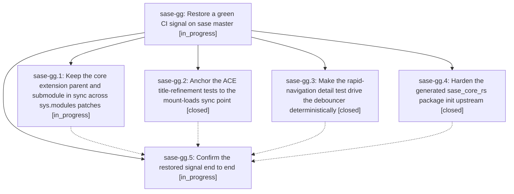

# Bead: sase-gg — Restore a green CI signal on sase master

[Bead Pages](../README.md) / sase-gg

**Status:** ◐ in_progress · **Type:** ▸ plan · **Tier:** epic
**Owner:** `bryanbugyi34@gmail.com` · **Created by:** [bbugyi200.athena.u6](https://github.com/sase-org/sase--agents/blob/main/agents/bbugyi200.athena.u6/README.md) · **Assignee:** `sase-gg.land`
**Created:** 2026-08-06 12:26:13 EDT
**Plan:** [202608/ci\_green\_restore.md](https://github.com/sase-org/sase--plans/blob/main/202608/ci_green_restore.md)

## Description

CI on sase master passes reliably: the sase_core_rs import defect can no longer poison a pytest-xdist worker, and the two racy ACE TUI tests assert against real synchronization points instead of wall-clock luck.

## Phases

| Bead | Title | Status | Size | Created | Agents | Commits |
|---|---|---|---|---|---:|---:|
| [sase-gg.1](sase-gg.1.md) | Keep the core extension parent and submodule in sync across sys.modules patches | ◐ in_progress | medium | 2026-08-06 | 1 | 0 |
| [sase-gg.2](sase-gg.2.md) | Anchor the ACE title-refinement tests to the mount-loads sync point | ✓ closed | small | 2026-08-06 | 1 | 0 |
| [sase-gg.3](sase-gg.3.md) | Make the rapid-navigation detail test drive the debouncer deterministically | ✓ closed | small | 2026-08-06 | 1 | 1 |
| [sase-gg.4](sase-gg.4.md) | Harden the generated sase\_core\_rs package init upstream | ✓ closed | small | 2026-08-06 | 1 | 0 |
| [sase-gg.5](sase-gg.5.md) | Confirm the restored signal end to end | ◐ in_progress | small | 2026-08-06 | 1 | 0 |

## Lineage

## Agents

| Agent | Bead | Commits |
|---|---|---:|
| [bbugyi200.athena.sase-gg.1](https://github.com/sase-org/sase--agents/blob/main/agents/bbugyi200.athena.sase-gg.1/README.md) | [sase-gg.1](sase-gg.1.md) | 0 |
| [bbugyi200.athena.sase-gg.2](https://github.com/sase-org/sase--agents/blob/main/agents/bbugyi200.athena.sase-gg.2/README.md) | [sase-gg.2](sase-gg.2.md) | 0 |
| [bbugyi200.athena.sase-gg.3](https://github.com/sase-org/sase--agents/blob/main/agents/bbugyi200.athena.sase-gg.3/README.md) | [sase-gg.3](sase-gg.3.md) | 1 |
| [bbugyi200.athena.sase-gg.4](https://github.com/sase-org/sase--agents/blob/main/agents/bbugyi200.athena.sase-gg.4/README.md) | [sase-gg.4](sase-gg.4.md) | 0 |
| [bbugyi200.athena.sase-gg.5](https://github.com/sase-org/sase--agents/blob/main/agents/bbugyi200.athena.sase-gg.5/README.md) | [sase-gg.5](sase-gg.5.md) | 0 |
| [bbugyi200.athena.sase-gg.land](https://github.com/sase-org/sase--agents/blob/main/agents/bbugyi200.athena.sase-gg.land/README.md) | [sase-gg](README.md) | 0 |

## Commits

| Repo | Commit | Subject | Bead | Committed |
|---|---|---|---|---|
| sase | [`7a5a40b`](https://github.com/sase-org/sase/commit/7a5a40b14a04955052275c9d3e2afd4965278dac) | test(ace): make rapid-navigation detail test drive the debouncer deterministically | [sase-gg.3](sase-gg.3.md) | 2026-08-06 12:39:03 EDT |
