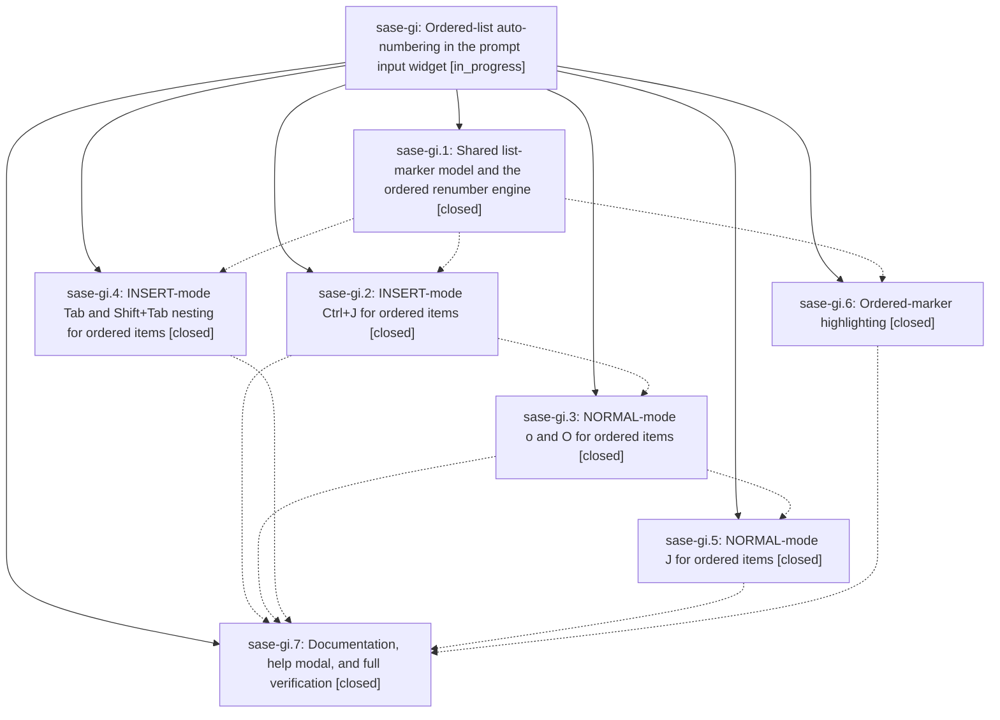

# Bead: sase-gi — Ordered-list auto-numbering in the prompt input widget

[Bead Pages](../README.md) / sase-gi

**Status:** ◐ in_progress · **Type:** ▸ plan · **Tier:** epic
**Owner:** `bryanbugyi34@gmail.com` · **Created by:** [bbugyi200.athena.ub](https://github.com/sase-org/sase--agents/blob/main/agents/bbugyi200.athena.ub/README.md) · **Assignee:** `sase-gi.land`
**Created:** 2026-08-06 15:22:31 EDT
**Plan:** [202608/prompt\_ordered\_lists.md](https://github.com/sase-org/sase--plans/blob/main/202608/prompt_ordered_lists.md)

## Description

The prompt input widget grows and maintains `<N>. ` ordered lists through every keymap that already serves `- ` bullets (Ctrl+J, o, O, J, Tab, Shift+Tab), renumbering the surrounding list so its numbering is always correct, and colors ordered markers like bullet dashes.

## Notes

[2026-08-06T20:52:03Z · sase-ct] DISCOVERED ISSUE: lint (symvision) currently fails 'just check'/'just check-full' for every agent in this repo (reproduced on clean master, unrelated to any other change): the Justfile's _lint-symvision recipe passes --epic-symbol entries for 'sase-gi.2(is_prompt_ordered_marker_only)', 'sase-gi.2(is_prompt_ordered_content_column)', 'sase-gi.2(prompt_ordered_row_has_item_above)', 'sase-gi.2(prompt_ordered_sibling_prefix)', 'sase-gi.4(OrderedRun)', 'sase-gi.4(RenumberResult)', and 'sase-gi.4(renumber_ordered_runs)', but sase-gi.2 and sase-gi.4 are now both CLOSED, so symvision refuses to run ('bead is closed. Remove this stale --epic-symbol entry and clean up the symbol.'). These entries need to be removed from the Justfile invocation and the referenced symbols' pragma/whitelist status cleaned up per sase/memory/symvision.md now that the phases that justified the temporary whitelist have landed. Likely belongs in sase-gi.7 (full verification) or the epic's land phase, since check-full cannot pass until this is fixed. Discovered while verifying just check for unrelated task bead sase-ct.

## Phases

| Bead | Title | Status | Size | Created | Agents | Commits |
|---|---|---|---|---|---:|---:|
| [sase-gi.1](sase-gi.1.md) | Shared list-marker model and the ordered renumber engine | ✓ closed | medium | 2026-08-06 | 1 | 1 |
| [sase-gi.2](sase-gi.2.md) | INSERT-mode Ctrl+J for ordered items | ✓ closed | medium | 2026-08-06 | 1 | 1 |
| [sase-gi.3](sase-gi.3.md) | NORMAL-mode o and O for ordered items | ✓ closed | medium | 2026-08-06 | 1 | 1 |
| [sase-gi.4](sase-gi.4.md) | INSERT-mode Tab and Shift+Tab nesting for ordered items | ✓ closed | medium | 2026-08-06 | 1 | 1 |
| [sase-gi.5](sase-gi.5.md) | NORMAL-mode J for ordered items | ✓ closed | small | 2026-08-06 | 1 | 1 |
| [sase-gi.6](sase-gi.6.md) | Ordered-marker highlighting | ✓ closed | small | 2026-08-06 | 1 | 1 |
| [sase-gi.7](sase-gi.7.md) | Documentation, help modal, and full verification | ✓ closed | small | 2026-08-06 | 1 | 1 |

## Lineage

## Agents

| Agent | Bead | Commits |
|---|---|---:|
| [bbugyi200.athena.sase-gi.1](https://github.com/sase-org/sase--agents/blob/main/agents/bbugyi200.athena.sase-gi.1/README.md) | [sase-gi.1](sase-gi.1.md) | 1 |
| [bbugyi200.athena.sase-gi.2](https://github.com/sase-org/sase--agents/blob/main/agents/bbugyi200.athena.sase-gi.2/README.md) | [sase-gi.2](sase-gi.2.md) | 1 |
| [bbugyi200.athena.sase-gi.3](https://github.com/sase-org/sase--agents/blob/main/agents/bbugyi200.athena.sase-gi.3/README.md) | [sase-gi.3](sase-gi.3.md) | 1 |
| [bbugyi200.athena.sase-gi.4](https://github.com/sase-org/sase--agents/blob/main/agents/bbugyi200.athena.sase-gi.4/README.md) | [sase-gi.4](sase-gi.4.md) | 1 |
| [bbugyi200.athena.sase-gi.5](https://github.com/sase-org/sase--agents/blob/main/agents/bbugyi200.athena.sase-gi.5/README.md) | [sase-gi.5](sase-gi.5.md) | 1 |
| [bbugyi200.athena.sase-gi.6](https://github.com/sase-org/sase--agents/blob/main/agents/bbugyi200.athena.sase-gi.6/README.md) | [sase-gi.6](sase-gi.6.md) | 1 |
| [bbugyi200.athena.sase-gi.7](https://github.com/sase-org/sase--agents/blob/main/agents/bbugyi200.athena.sase-gi.7/README.md) | [sase-gi.7](sase-gi.7.md) | 1 |
| [bbugyi200.athena.sase-gi.land](https://github.com/sase-org/sase--agents/blob/main/agents/bbugyi200.athena.sase-gi.land/README.md) | [sase-gi](README.md) | 0 |

## Commits

| Repo | Commit | Subject | Bead | Committed |
|---|---|---|---|---|
| sase | [`cb1007e`](https://github.com/sase-org/sase/commit/cb1007e0900c4be02fe4b94d966ccbec164a503d) | feat(ace-tui): add shared list-marker model and ordered renumber engine | [sase-gi.1](sase-gi.1.md) | 2026-08-06 16:13:57 EDT |
| sase | [`686bd5f`](https://github.com/sase-org/sase/commit/686bd5f5165734e719f7809fdc0f0f0b15444102) | feat(ace-tui): nest and unnest ordered prompt items with Tab and Shift+Tab | [sase-gi.4](sase-gi.4.md) | 2026-08-06 16:36:00 EDT |
| sase | [`f7f479a`](https://github.com/sase-org/sase/commit/f7f479a55ba1a6f7bfb5130e6ab8314f831b9b17) | feat(ace-tui): highlight ordered-list markers like bullet dashes | [sase-gi.6](sase-gi.6.md) | 2026-08-06 16:43:17 EDT |
| sase | [`af0555b`](https://github.com/sase-org/sase/commit/af0555bd60926526bc9087458647f9a935e30a5f) | feat(ace-tui): grow and renumber ordered lists on INSERT-mode Ctrl+J | [sase-gi.2](sase-gi.2.md) | 2026-08-06 16:45:58 EDT |
| sase | [`a3108ef`](https://github.com/sase-org/sase/commit/a3108ef4f2950f9d7fb1d481d0704471d6317d20) | feat(ace-tui): open numbered ordered siblings on NORMAL-mode o and O | [sase-gi.3](sase-gi.3.md) | 2026-08-06 17:50:10 EDT |
| sase | [`ecce0c3`](https://github.com/sase-org/sase/commit/ecce0c3888b8381dce9fb0881a2927090d05b2e0) | feat(ace-tui): drop and renumber ordered markers on NORMAL-mode J | [sase-gi.5](sase-gi.5.md) | 2026-08-06 18:33:20 EDT |
| sase | [`96a53e7`](https://github.com/sase-org/sase/commit/96a53e7ab0d06116fd9adb8a3b18565d00cac75e) | docs(ace-tui): document ordered-list numbering, run, and nesting rules | [sase-gi.7](sase-gi.7.md) | 2026-08-06 18:51:07 EDT |
