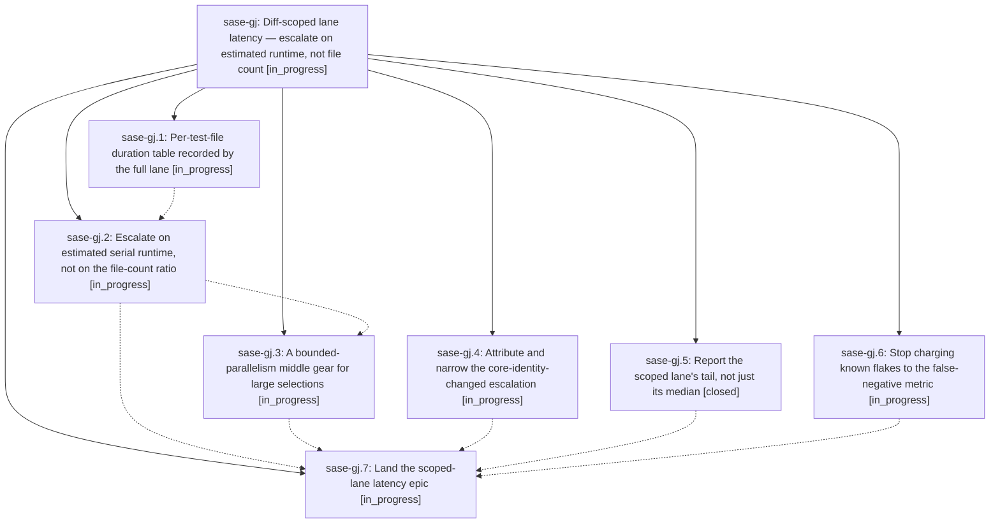

# Bead: sase-gj — Diff-scoped lane latency — escalate on estimated runtime, not file count

[Bead Pages](../README.md) / sase-gj

**Status:** ◐ in_progress · **Type:** ▸ plan · **Tier:** epic
**Owner:** `bryanbugyi34@gmail.com` · **Created by:** [bbugyi200.athena.ue](https://github.com/sase-org/sase--agents/blob/main/agents/bbugyi200.athena.ue/README.md) · **Assignee:** `sase-gj.land`
**Created:** 2026-08-06 16:00:33 EDT
**Plan:** [202608/scoped\_lane\_latency.md](https://github.com/sase-org/sase--plans/blob/main/202608/scoped_lane_latency.md)

## Description

`just check`'s scoped test stage is never slower than `just check-full` would have been, the full-suite escalations it does take are attributable to the agent's own diff, and `just selection-health` reports the tail and the flake-free false-negative count instead of hiding both.

## Phases

| Bead | Title | Status | Size | Created | Agents | Commits |
|---|---|---|---|---|---:|---:|
| [sase-gj.1](sase-gj.1.md) | Per-test-file duration table recorded by the full lane | ◐ in_progress | medium | 2026-08-06 | 1 | 0 |
| [sase-gj.2](sase-gj.2.md) | Escalate on estimated serial runtime, not on the file-count ratio | ◐ in_progress | medium | 2026-08-06 | 1 | 0 |
| [sase-gj.3](sase-gj.3.md) | A bounded-parallelism middle gear for large selections | ◐ in_progress | medium | 2026-08-06 | 1 | 0 |
| [sase-gj.4](sase-gj.4.md) | Attribute and narrow the core-identity-changed escalation | ◐ in_progress | small | 2026-08-06 | 1 | 0 |
| [sase-gj.5](sase-gj.5.md) | Report the scoped lane's tail, not just its median | ✓ closed | small | 2026-08-06 | 1 | 1 |
| [sase-gj.6](sase-gj.6.md) | Stop charging known flakes to the false-negative metric | ◐ in_progress | small | 2026-08-06 | 1 | 0 |
| [sase-gj.7](sase-gj.7.md) | Land the scoped-lane latency epic | ◐ in_progress | small | 2026-08-06 | 1 | 0 |

## Lineage

## Agents

| Agent | Bead | Commits |
|---|---|---:|
| [bbugyi200.athena.sase-gj.1](https://github.com/sase-org/sase--agents/blob/main/agents/bbugyi200.athena.sase-gj.1/README.md) | [sase-gj.1](sase-gj.1.md) | 0 |
| [bbugyi200.athena.sase-gj.2](https://github.com/sase-org/sase--agents/blob/main/agents/bbugyi200.athena.sase-gj.2/README.md) | [sase-gj.2](sase-gj.2.md) | 0 |
| [bbugyi200.athena.sase-gj.3](https://github.com/sase-org/sase--agents/blob/main/agents/bbugyi200.athena.sase-gj.3/README.md) | [sase-gj.3](sase-gj.3.md) | 0 |
| [bbugyi200.athena.sase-gj.4](https://github.com/sase-org/sase--agents/blob/main/agents/bbugyi200.athena.sase-gj.4/README.md) | [sase-gj.4](sase-gj.4.md) | 0 |
| [bbugyi200.athena.sase-gj.5](https://github.com/sase-org/sase--agents/blob/main/agents/bbugyi200.athena.sase-gj.5/README.md) | [sase-gj.5](sase-gj.5.md) | 1 |
| [bbugyi200.athena.sase-gj.6](https://github.com/sase-org/sase--agents/blob/main/agents/bbugyi200.athena.sase-gj.6/README.md) | [sase-gj.6](sase-gj.6.md) | 0 |
| [bbugyi200.athena.sase-gj.7](https://github.com/sase-org/sase--agents/blob/main/agents/bbugyi200.athena.sase-gj.7/README.md) | [sase-gj.7](sase-gj.7.md) | 0 |
| [bbugyi200.athena.sase-gj.land](https://github.com/sase-org/sase--agents/blob/main/agents/bbugyi200.athena.sase-gj.land/README.md) | [sase-gj](README.md) | 0 |

## Commits

| Repo | Commit | Subject | Bead | Committed |
|---|---|---|---|---|
| sase | [`cc241fa`](https://github.com/sase-org/sase/commit/cc241fae0c5cb96e0dbffc468e1cc5f77fde4d6b) | feat(test-selection): report the scoped lane's tail, not just its median | [sase-gj.5](sase-gj.5.md) | 2026-08-06 16:22:21 EDT |
