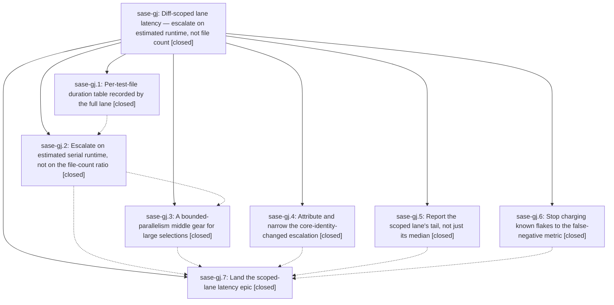

# Bead: sase-gj — Diff-scoped lane latency — escalate on estimated runtime, not file count

[Bead Pages](../README.md) / sase-gj

**Status:** ✓ closed · **Resolution:** done · **Type:** ▸ plan · **Tier:** epic
**Owner:** `bryanbugyi34@gmail.com` · **Created by:** [bbugyi200.athena.ue](https://github.com/sase-org/sase--agents/blob/main/agents/bbugyi200.athena.ue/README.md) · **Assignee:** `sase-gj.land`
**Created:** 2026-08-06 16:00:33 EDT · **Closed:** 2026-08-06 19:00:28 EDT
**Plan:** [202608/scoped\_lane\_latency.md](https://github.com/sase-org/sase--plans/blob/main/202608/scoped_lane_latency.md)

## Description

`just check`'s scoped test stage is never slower than `just check-full` would have been, the full-suite escalations it does take are attributable to the agent's own diff, and `just selection-health` reports the tail and the flake-free false-negative count instead of hiding both.

## Notes

[2026-08-06T23:00:28Z · sase-gj.land] VERIFIED IN SOURCE, not from phase reports. All six deliverables confirmed at HEAD 0de333e5d: (1) timings — tests/_test_selection_timings.py holds the per-file table with merge-newest-wins, host-keyed recordings, and estimate_serial_seconds() returning explicit REASON_* no-data answers rather than a guess; (2) budget — RULE_SERIAL_BUDGET_EXCEEDED in tests/_test_selection.py:472-482 supersedes the file-count ratio wherever the table can answer, with RULE_RATIO_EXCEEDED kept as the no-data fallback and max_serial_seconds + the timings block on every manifest; (3) gear — engage_scoped_gear() takes one non-blocking WorkerTokenLease.try_acquire(), tools/run_pytest:744-760 offers it only selection.gear_candidate (populated only for a budget-only escalation), de-escalates the manifest so the real duration and width reach the store, and releases in the finally; -n/SASE_PYTEST_WORKERS still rejected; (4) identity — per-input fingerprint map with ENVIRONMENT_ESCALATING_INPUTS narrowing the rule and environment_changed_inputs recording every bucket that moved, plus the nested sase_core_rs/ glob and content-hash fix in tools/validate_test_environment; (5) tail — p75/p90/max, FULL_LANE_WALL_SECONDS, SlowRun with worker_count, duration_widths, gear_runs/gear_refused_runs, and escalated runs rendered "cost not measured"; (6) flakes — reproducible_flake_nodeids/find_flake_suppressed split matches off find_false_negatives and count them separately.

RE-MEASURED against the real host store: 94 scoped / 121 full-lane records, 44.7% escalated, median 37.3s / p75 171.4s / p90 435.4s / max 1372.6s, 180,398 worker-seconds avoided, 6 false negatives and 4 flake-suppressed. All 11 "slower than the full lane" records predate the budget/gear commits landing in that workspace, so both mechanisms remain unit- and integration-tested but not yet exercised by a representative real selection — unchanged from sase-gj.7 and stated as such rather than claimed as a win.

INTEGRATED with the 10 non-epic commits that landed since cc241fae0. Four touch the selection area: 368cf151a (sase-g9 contexts breadth ranking), 3f69267d5 (sase-ct ACE flake fix), and the 2e6ba3dff / 0de333e5d test-module splits. Checked and found sound: no stale references to the split-away tests/test_test_selection.py or tests/test_test_selection_contexts.py remain anywhere in the tree; SELECTION_TOOLING_PATHS correctly still lists only the selection modules a change to which can corrupt a selection decision, and correctly excludes the two new _..._helpers.py fixture modules (reached by the import closure) and the timings/health plugins (loaded during a run, never at decision time); the coverage baseline naming the now-deleted test modules is handled by sase-g7 filtering the selection against graph.paths.

ONE REAL GAP FOUND AND FIXED HERE. sase-gj.3 made "the diff-scoped lane takes no suite-gate lease" false — the gear takes a real, bounded, non-blocking one. The plan anticipated the opposite ("after gear the second clause still holds and the first does not"), so sase-gj.7 corrected docs/development.md but nothing else. Corrected the Justfile test-scoped and check recipe comments here. The same claim also stands in sase/memory/build_and_run.md:13,27 and propagates into AGENTS.md/CLAUDE.md/GEMINI.md/OPENCODE.md/QWEN.md, i.e. into every agent Tier 1 memory; memory edits need the user permission a bead cannot grant, so that is task sase-gm rather than an edit made here.

FOLLOW-UP DISPOSITIONS, all six proposals:
- sase-gj.1 (contract set may eat over half the 232s budget) — DECLINED, misreading. Measured against the real table: the 34-file contract set estimates 20.3s serial at coverage 1.0, 8.7% of the budget. The 127.6s that prompted it belongs to tests/test_contract_manifest.py, which spawns a nested pytest over the whole contract set and is deliberately NOT a member of it, so no scoped run pays it unconditionally; the set already has its own 30s normalized-CPU guard.
- sase-gj.2a (calibrate the table for parallel contention) and sase-gj.7 (232s default may be stale; 159.0s re-measured) — merged into task sase-gk, with new evidence: a land-phase full lane ran 26,496 passed in 139.95s, and estimate-vs-actual over the 4 real serial schema>=6 records now in the store is mean 0.90x (0.74-1.03), i.e. the estimate slightly UNDER-states real lane wall clock rather than over-stating it as the hand samples suggested. The two measurements disagree; sase-gk is to settle them with more samples before moving a constant.
- sase-gj.2b (health store strips manifest["selected"], so the budget cannot be calibrated from lane history) — RESOLVED, no task. record_selection persists the whole manifest; a non-escalated schema>=6 record carries selected, timings.estimated_serial_seconds, and duration together, which is the calibration data the proposal asked for and which sase-gk now uses. Escalated runs still carry no candidate selection, which is REASON_ESCALATED by design.
- sase-gj.2c (three stale --epic-symbol sase-gi.4 entries block the symvision gate) — RESOLVED by others; only sase-gi.5 remains and symvision passes.
- sase-gj.4 (tests/test_test_selection.py past the toobig info threshold) — RESOLVED by 0de333e5d, which split it into five topic modules.

VERIFICATION. just check-full: every lint gate green (fmt, keep-sorted, ruff, mypy, pyscripts, changelog, symvision, toobig, SASE validation, committed plans), suite 1 failed / 26,496 passed / 7 skipped in 139.95s. The one failure, test_installing_prunes_the_cache_to_the_keep_limit, is a pre-existing load-sensitive flake — it passes 4/4 in isolation and already failed in a full-lane record at head 48bd0009e, which git merge-base confirms predates this epic; filed as sase-gl with an mtime-tie root-cause diagnosis. A second full run on the same tree passed that node and failed one different node under 4.5x the wall clock (635.83s, heavy contention): the known ACE-TUI flake test_tracked_executor_reports_terminal_and_extra_commands_live, recorded as independent evidence on umbrella sase-ct (now +20) rather than as a duplicate task. Neither failure is caused by this epic, and this epic's own gj.6 machinery independently classifies the second as flake-suppressed. Working tree carries the uncommitted Justfile comment fix.

[2026-08-06T23:03:31Z · sase-gj.land] Land verification (pass 2). VERIFY: all 7 phases closed; every child note read and confirmed addressed against HEAD source, not phase reports. Confirmed in source: per-file timings table with explicit no-data answers; RULE_SERIAL_BUDGET_EXCEEDED superseding the file-count ratio (ratio retained as the no-data fallback); the middle gear's single non-blocking try_acquire() offered only to budget-only escalations, with manifest de-escalation and release in the finally block; per-input environment fingerprint map plus nested sase_core_rs/ glob and content-hash fix; p75/p90/max, slow_runs, width-grouped durations and 'cost not measured'; reproducible_flake_nodeids splitting flakes off the false-negative count. Re-measured against the real store (94 scoped / 121 full-lane records): 44.7% escalated, 180,398 worker-seconds avoided; all 11 'slower than full lane' records predate budget/gear landing, so both mechanisms are tested but not yet exercised by a representative real selection. INTEGRATE: reviewed all 10 non-epic commits since cc241fae0; four touch the selection area (sase-g9 breadth ranking, an ACE flake fix, two test-module splits). No stale references to split-away modules remain; SELECTION_TOOLING_PATHS correctly still lists only decision-time modules; sase-g7's graph.paths filter already handles baseline naming of deleted test files. One real gap found and fixed: the gear made 'the diff-scoped lane takes no suite-gate lease' false, and gj.7 had corrected only docs/development.md -- corrected the two stale Justfile recipe comments (test-scoped, check) in this pass; the same claim in sase/memory/build_and_run.md needs user permission and is filed as sase-gm. FOLLOW-UPS: gj.1 declined (contract set estimates 20.3s, 8.7% of budget; the 127.6s belongs to a non-member guard module); gj.2a + gj.7 merged into sase-gk with new evidence that estimate-vs-actual over real lane records is 0.90x; gj.2b and gj.2c already resolved; gj.4 resolved by the test split. Filed sase-gk (small, recalibrate serial-runtime budget), sase-gl (small, mtime-tie flake in the prune test), sase-gm (xsmall, stale memory claim); added independent evidence to umbrella sase-ct rather than a duplicate. GATES: just check-full green on every lint gate, 26,496 passed; two runs each failed one node, both pre-existing load-sensitive flakes unrelated to this epic. Post-close symvision is red only on sase-gi.5's entry, which went stale mid-session when that bead closed; reproduction recorded on sase-gi for its land agent. sase-gj had no epic-symbol whitelist entries of its own.

## Phases

| Bead | Title | Status | Size | Created | Agents | Commits |
|---|---|---|---|---|---:|---:|
| [sase-gj.1](sase-gj.1.md) | Per-test-file duration table recorded by the full lane | ✓ closed | medium | 2026-08-06 | 1 | 1 |
| [sase-gj.2](sase-gj.2.md) | Escalate on estimated serial runtime, not on the file-count ratio | ✓ closed | medium | 2026-08-06 | 1 | 1 |
| [sase-gj.3](sase-gj.3.md) | A bounded-parallelism middle gear for large selections | ✓ closed | medium | 2026-08-06 | 1 | 1 |
| [sase-gj.4](sase-gj.4.md) | Attribute and narrow the core-identity-changed escalation | ✓ closed | small | 2026-08-06 | 1 | 1 |
| [sase-gj.5](sase-gj.5.md) | Report the scoped lane's tail, not just its median | ✓ closed | small | 2026-08-06 | 1 | 1 |
| [sase-gj.6](sase-gj.6.md) | Stop charging known flakes to the false-negative metric | ✓ closed | small | 2026-08-06 | 1 | 1 |
| [sase-gj.7](sase-gj.7.md) | Land the scoped-lane latency epic | ✓ closed | small | 2026-08-06 | 1 | 1 |

## Lineage

## Agents

| Agent | Bead | Commits |
|---|---|---:|
| [bbugyi200.athena.sase-gj.1](https://github.com/sase-org/sase--agents/blob/main/agents/bbugyi200.athena.sase-gj.1/README.md) | [sase-gj.1](sase-gj.1.md) | 1 |
| [bbugyi200.athena.sase-gj.2](https://github.com/sase-org/sase--agents/blob/main/agents/bbugyi200.athena.sase-gj.2/README.md) | [sase-gj.2](sase-gj.2.md) | 1 |
| [bbugyi200.athena.sase-gj.3](https://github.com/sase-org/sase--agents/blob/main/agents/bbugyi200.athena.sase-gj.3/README.md) | [sase-gj.3](sase-gj.3.md) | 1 |
| [bbugyi200.athena.sase-gj.4](https://github.com/sase-org/sase--agents/blob/main/agents/bbugyi200.athena.sase-gj.4/README.md) | [sase-gj.4](sase-gj.4.md) | 1 |
| [bbugyi200.athena.sase-gj.5](https://github.com/sase-org/sase--agents/blob/main/agents/bbugyi200.athena.sase-gj.5/README.md) | [sase-gj.5](sase-gj.5.md) | 1 |
| [bbugyi200.athena.sase-gj.6](https://github.com/sase-org/sase--agents/blob/main/agents/bbugyi200.athena.sase-gj.6/README.md) | [sase-gj.6](sase-gj.6.md) | 1 |
| [bbugyi200.athena.sase-gj.7](https://github.com/sase-org/sase--agents/blob/main/agents/bbugyi200.athena.sase-gj.7/README.md) | [sase-gj.7](sase-gj.7.md) | 1 |
| [bbugyi200.athena.sase-gj.land](https://github.com/sase-org/sase--agents/blob/main/agents/bbugyi200.athena.sase-gj.land/README.md) | [sase-gj](README.md) | 1 |

## Commits

| Repo | Commit | Subject | Bead | Committed |
|---|---|---|---|---|
| sase | [`cc241fa`](https://github.com/sase-org/sase/commit/cc241fae0c5cb96e0dbffc468e1cc5f77fde4d6b) | feat(test-selection): report the scoped lane's tail, not just its median | [sase-gj.5](sase-gj.5.md) | 2026-08-06 16:22:21 EDT |
| sase | [`87961cd`](https://github.com/sase-org/sase/commit/87961cd0e17a2d5a137b327325bb68b28156cc28) | fix(test-selection): stop charging known flakes to the false-negative metric | [sase-gj.6](sase-gj.6.md) | 2026-08-06 16:31:38 EDT |
| sase | [`6cf5a94`](https://github.com/sase-org/sase/commit/6cf5a94d7ce95c5e80e5f924bd58bddec13ecfb4) | feat(test-selection): record per-test-file timings from full-lane runs | [sase-gj.1](sase-gj.1.md) | 2026-08-06 16:44:06 EDT |
| sase | [`f88b740`](https://github.com/sase-org/sase/commit/f88b7403cd0dcc2d5522d909582a7cdbddbb1304) | fix(test-selection): attribute and narrow the core-identity-changed escalation | [sase-gj.4](sase-gj.4.md) | 2026-08-06 16:47:36 EDT |
| sase | [`af3aa32`](https://github.com/sase-org/sase/commit/af3aa326cfe5fa193251ed4968630a3a57fca731) | feat(test-selection): escalate on estimated serial runtime, not file count | [sase-gj.2](sase-gj.2.md) | 2026-08-06 17:14:32 EDT |
| sase | [`ca6c1e0`](https://github.com/sase-org/sase/commit/ca6c1e09e8be639db7d4f386860c043f4da1a3af) | feat(test-selection): add a bounded-parallelism middle gear for large selections | [sase-gj.3](sase-gj.3.md) | 2026-08-06 17:58:47 EDT |
| sase | [`a042950`](https://github.com/sase-org/sase/commit/a04295008fbb1e7c973ffd9ed69b848d2cea7a68) | docs(test-selection): document the tail phase's slow-run and cost-not-measured fields | [sase-gj.7](sase-gj.7.md) | 2026-08-06 18:18:54 EDT |
| sase | [`9e4e4ff`](https://github.com/sase-org/sase/commit/9e4e4ff54aff6ac9d37393625b4053e2bda6dbc8) | docs(justfile): correct the scoped lane's suite-gate lease claim | [sase-gj](README.md) | 2026-08-06 19:04:19 EDT |
