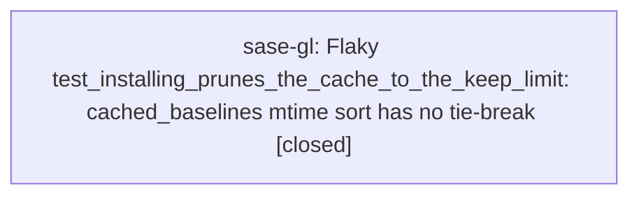

# Bead: sase-gl — Flaky test\_installing\_prunes\_the\_cache\_to\_the\_keep\_limit: cached\_baselines mtime sort has no tie-break

[Bead Pages](../README.md) / sase-gl

**Status:** ✓ closed · **Resolution:** done · **Type:** ◆ task · **+1 reports:** +1
**Owner:** `bryanbugyi34@gmail.com` · **Created by:** [bbugyi200.athena.sase-gj.land](https://github.com/sase-org/sase--agents/blob/main/agents/bbugyi200.athena.sase-gj.land/README.md) · **Assignee:** `sase-gl` · **Size:** small
**Created:** 2026-08-06 18:49:23 EDT · **Closed:** 2026-08-07 10:33:24 EDT

## Description

Found by the sase-gj land agent while running `just check-full` on master at 0de333e5d (plus a Justfile comment edit). Not caused by that epic.

FAILURE (full parallel lane, 28 workers, 1 failed / 26,496 passed / 7 skipped in 139.95s):

  tests/test_install_coverage_contexts_tool.py::test_installing_prunes_the_cache_to_the_keep_limit
  >       assert remaining[0].sha == _head(repo)
  E       AssertionError: assert 0000000000000000000000000000000000000003 == cc2e180224ba34abce1063410100858a67e0e00f

Passes 4/4 in isolation (`pytest tests/test_install_coverage_contexts_tool.py`, with and without -p no:randomly), so it is load-sensitive, not order-dependent.

PRE-EXISTING, not new: the same node ID appears in `just selection-health` as a false negative, failing in the full-lane record 20260806T201818Z-48bd0009ebdc-1524219-full-run.json at head 48bd0009ebdc, which `git merge-base --is-ancestor 48bd0009e cc241fae0` confirms predates the sase-gj epic.

SUSPECTED ROOT CAUSE (diagnosed by reading, not reproduced under load): tests/_test_selection_contexts.py:234 sorts with `baselines.sort(key=lambda baseline: _mtime(baseline.path), reverse=True)` and `_mtime` (line 238) returns `path.stat().st_mtime` — a float, whose precision at the current epoch is ~238ns — with no secondary sort key. `list.sort` is stable, so an mtime tie falls back to `directory.iterdir()` order, which is filesystem-arbitrary. The test writes four dummy databases and then installs the real one, and tools/install_coverage_contexts uses `shutil.copy2` + `Path.replace` (lines 177-178), both of which preserve the SOURCE mtime — so the installed baseline inherits repo/.coverage`s mtime rather than getting a fresh one, narrowing the gap that has to survive the float rounding.

Scope: confirm the mechanism under load, then either give cached_baselines a deterministic tie-break (st_mtime_ns, and a name tie-break under that) or make the test set explicit mtimes. Related but distinct from sase-g9, which changed resolve_baseline to rank by breadth and deliberately left cached_baselines on mtime order for pruning; this is about that mtime order being non-deterministic on ties, not about which ordering pruning should use.

## Notes

[2026-08-07T14:20:54Z · un] Reopened by +1 threshold: reached 1 +1s while snoozed until 2026-08-10T09:23:59-04:00.

[2026-08-07T14:33:24Z · sase-gl] Confirmed suspected root cause: cached_baselines sorted purely on _mtime (st_mtime, float, ~238ns precision) with no tie-break, so ties fell back to filesystem-arbitrary directory.iterdir() order. Fixed by sorting on (st_mtime_ns, sha) via a new _mtime_ns helper -- nanosecond precision plus a deterministic sha tie-break. Verified: tests/test_install_coverage_contexts_tool.py 15/15 pass; the target test test_installing_prunes_the_cache_to_the_keep_limit passed 20/20 consecutive standalone runs with fresh random seeds; the broader selection-contexts suite (135 tests across test_suite_gate_integration, test_select_tests_tool, test_test_selection_contexts_{baseline,diff,reporting,depth_boost,selection}, test_install_coverage_contexts_tool, test_run_pytest_command, test_github_actions_ci) all pass; ruff and mypy clean on the changed file. just check's SASE-validation step separately failed on pre-existing, unrelated init-skills/chezmoi drift (confirmed via clean git status showing only the one test file changed) -- corroborated as a duplicate on existing task sase-gw rather than expanding this bead's scope.

## +1 Evidence

> **+1** by `un` · 2026-08-07 10:20:54 EDT
>
> Reproduced again during empty_bead_notes_section (sase/repos/plans/202608/empty_bead_notes_section.md) implementation: full 'just check-full' on this diff showed 1 failed / 26749 passed / 7 skipped, the sole failure being tests/test_install_coverage_contexts_tool.py::test_installing_prunes_the_cache_to_the_keep_limit; re-run standalone (-x) passed immediately. Unrelated to the bead-notes change (touches only the coverage-contexts cache tool, not bead rendering or gate validation).

## Lineage

## Agents

| Agent | Bead | Commits |
|---|---|---:|
| [bbugyi200.athena.sase-gl](https://github.com/sase-org/sase--agents/blob/main/agents/bbugyi200.athena.sase-gl/README.md) | [sase-gl](README.md) | 1 |

## Commits

| Repo | Commit | Subject | Bead | Committed |
|---|---|---|---|---|
| sase | [`aec67f3`](https://github.com/sase-org/sase/commit/aec67f31c975e754392542a07a738c40bc180d26) | fix(tests): give cached\_baselines a deterministic mtime tie-break | [sase-gl](README.md) | 2026-08-07 10:33:59 EDT |
