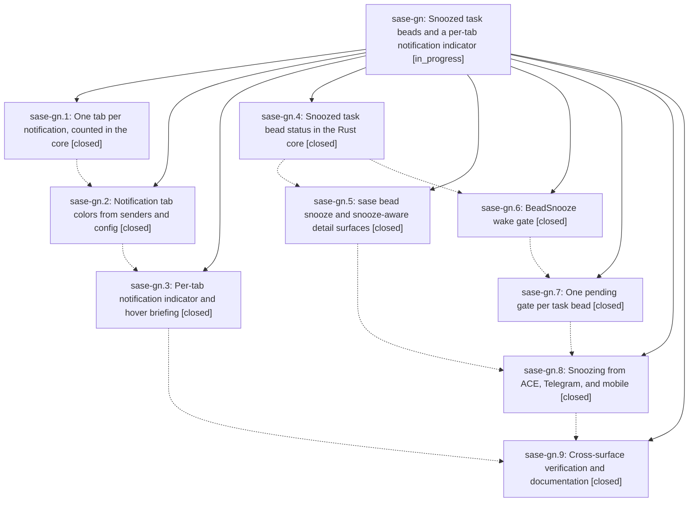

# Bead: sase-gn — Snoozed task beads and a per-tab notification indicator

[Bead Pages](../README.md) / sase-gn

**Status:** ◐ in_progress · **Type:** ▸ plan · **Tier:** epic
**Owner:** `bryanbugyi34@gmail.com` · **Created by:** [bbugyi200.athena.uh](https://github.com/sase-org/sase--agents/blob/main/agents/bbugyi200.athena.uh/README.md) · **Assignee:** `sase-gn.land`
**Created:** 2026-08-06 19:27:14 EDT
**Plan:** [202608/bead\_snooze\_and\_notification\_indicator.md](https://github.com/sase-org/sase--plans/blob/main/202608/bead_snooze_and_notification_indicator.md)

## Description

A task bead can be snoozed with a wake time, an optional +1 target, and a reason that every SASE surface displays; snoozing a task bead always snoozes its notification; the wake raises a gate whose primary action closes the bead with an overridable preset reason; and the top-bar notification indicator shows one accurately colored count per notification-panel tab, with a snoozed count that appears only when nothing else is pending, a rich hover briefing, and a structural guarantee that no notification can appear in two tabs.

## Notes

[2026-08-07T02:16:46Z · sase_ci_fix_sase_b5872ca] DISCOVERED ISSUE: the epic's Rust wake-due-snooze selector is now orphaned. Fixing a red 'just lint' on branch sase_ci_fix_sase_b5872ca (symvision: '--epic-symbol sase-gn.7(wake_due_snoozes)': bead is closed), I deleted the Python half that sase-gn.7's own PROPOSED FOLLOW-UP note already declared dead: bead_mutation_facade.wake_due_snoozes, its __all__ entry, and tests/test_bead/test_snooze_lifecycle.py::test_wake_selector_reports_due_beads_without_mutating_them. The Rust half remains and now has zero callers anywhere: sase-core crates/sase_core_py/src/lib.rs py_bead_wake_due_snoozes (binding 'bead_wake_due_snoozes') and the underlying wake_due_task_snoozes. Rationale per sase-gn.7: D2 means a snoozed bead gate is born snoozed and resurfaced by notification snooze expiry, so the reconciler never needs a due-wake selector. The land agent should decide whether to delete the Rust selector + binding + its core tests (and drop it from the binding-name inventory) or justify keeping it.

[2026-08-07T03:16:36Z · sase-gn.9] DISCOVERED ISSUE: closing a snoozed task bead permanently corrupts its bead store. Found during sase-gn.9's real (non-mocked) end-to-end walkthrough.

Repro (no mocks, real Rust-backed store): create a task bead, mark ready, project.snooze(...) it (status -> SNOOZED), then project.close([id], reason=..., resolution="canceled") raises ValueError: 'validation: Only snoozed issues can carry snooze metadata'. From that point on, EVERY subsequent read or write against that beads_dir — even list_issues()/show() from a brand-new process, even unrelated create() calls for other beads — fails with the identical error. The store is permanently bricked, confirmed across 3 independent isolated repros and across fresh interpreter processes.

Root cause: the close mutation's issue_closed event is durably appended to the event-sourced log (sdd/beads/events/streams/*.jsonl) BEFORE the derived post-close state is validated. The close reducer does not clear the issue's snooze field when transitioning status to closed, so replay re-derives an invalid record (status=closed, snooze still populated) and re-fails forever — there is no observed recovery path.

Confirmed narrow: closing a plain never-snoozed ready bead works fine. Confirmed workaround: calling project.cancel_snooze(id, actor=...) before project.close(...) avoids the bug (cancel_snooze clears snooze first).

Blast radius, both call sites go straight to mutation.project.close() with no snooze pre-clear:
- close_bead_snooze() in src/sase/bead/snooze_gate.py (~line 479) — the Close option on the BeadSnooze wake gate this epic shipped, which is that gate's PRIMARY/default branch (BEAD_SNOOZE_PRIMARY_BRANCH). Every default 'Close' on a woken snoozed bead corrupts the project's whole bead store.
- handle_bead_close() in src/sase/bead/cli_crud.py (~line 519) — plain 'sase bead close <id>' CLI, pre-existing, if the target happens to be snoozed.

Why existing tests missed it: tests/test_bead/test_snooze_gate.py's close/ready/resnooze coverage mocks the whole project as a MagicMock (_mutation_double()), so project.close() is never actually exercised against the real store.

Isolated in a scratch SASE_HOME + scratch bead store via a throwaway /tmp script (not committed); no real user data was touched.

## Phases

| Bead | Title | Status | Size | Created | Agents | Commits |
|---|---|---|---|---|---:|---:|
| [sase-gn.1](sase-gn.1.md) | One tab per notification, counted in the core | ✓ closed | medium | 2026-08-06 | 1 | 2 |
| [sase-gn.2](sase-gn.2.md) | Notification tab colors from senders and config | ✓ closed | medium | 2026-08-06 | 1 | 2 |
| [sase-gn.3](sase-gn.3.md) | Per-tab notification indicator and hover briefing | ✓ closed | medium | 2026-08-06 | 1 | 1 |
| [sase-gn.4](sase-gn.4.md) | Snoozed task bead status in the Rust core | ✓ closed | medium | 2026-08-06 | 1 | 2 |
| [sase-gn.5](sase-gn.5.md) | sase bead snooze and snooze-aware detail surfaces | ✓ closed | medium | 2026-08-06 | 1 | 1 |
| [sase-gn.6](sase-gn.6.md) | BeadSnooze wake gate | ✓ closed | medium | 2026-08-06 | 1 | 1 |
| [sase-gn.7](sase-gn.7.md) | One pending gate per task bead | ✓ closed | medium | 2026-08-06 | 1 | 1 |
| [sase-gn.8](sase-gn.8.md) | Snoozing from ACE, Telegram, and mobile | ✓ closed | medium | 2026-08-06 | 1 | 1 |
| [sase-gn.9](sase-gn.9.md) | Cross-surface verification and documentation | ✓ closed | small | 2026-08-06 | 1 | 1 |

## Lineage

## Agents

| Agent | Bead | Commits |
|---|---|---:|
| [bbugyi200.athena.sase-gn.1](https://github.com/sase-org/sase--agents/blob/main/agents/bbugyi200.athena.sase-gn.1/README.md) | [sase-gn.1](sase-gn.1.md) | 2 |
| [bbugyi200.athena.sase-gn.2](https://github.com/sase-org/sase--agents/blob/main/agents/bbugyi200.athena.sase-gn.2/README.md) | [sase-gn.2](sase-gn.2.md) | 2 |
| [bbugyi200.athena.sase-gn.3](https://github.com/sase-org/sase--agents/blob/main/agents/bbugyi200.athena.sase-gn.3/README.md) | [sase-gn.3](sase-gn.3.md) | 1 |
| [bbugyi200.athena.sase-gn.4](https://github.com/sase-org/sase--agents/blob/main/agents/bbugyi200.athena.sase-gn.4/README.md) | [sase-gn.4](sase-gn.4.md) | 2 |
| [bbugyi200.athena.sase-gn.5](https://github.com/sase-org/sase--agents/blob/main/agents/bbugyi200.athena.sase-gn.5/README.md) | [sase-gn.5](sase-gn.5.md) | 1 |
| [bbugyi200.athena.sase-gn.6](https://github.com/sase-org/sase--agents/blob/main/agents/bbugyi200.athena.sase-gn.6/README.md) | [sase-gn.6](sase-gn.6.md) | 1 |
| [bbugyi200.athena.sase-gn.7](https://github.com/sase-org/sase--agents/blob/main/agents/bbugyi200.athena.sase-gn.7/README.md) | [sase-gn.7](sase-gn.7.md) | 1 |
| [bbugyi200.athena.sase-gn.8](https://github.com/sase-org/sase--agents/blob/main/agents/bbugyi200.athena.sase-gn.8/README.md) | [sase-gn.8](sase-gn.8.md) | 1 |
| [bbugyi200.athena.sase-gn.9](https://github.com/sase-org/sase--agents/blob/main/agents/bbugyi200.athena.sase-gn.9/README.md) | [sase-gn.9](sase-gn.9.md) | 1 |
| [bbugyi200.athena.sase-gn.land](https://github.com/sase-org/sase--agents/blob/main/agents/bbugyi200.athena.sase-gn.land/README.md) | [sase-gn](README.md) | 0 |

## Commits

| Repo | Commit | Subject | Bead | Committed |
|---|---|---|---|---|
| sase-core | [`sase-core@7ee5105`](https://github.com/sase-org/sase-core/commit/7ee51051f61b79b679d9f591cbca5b79c7cc433b) | feat(notifications): make tab ownership a single-valued core rule | [sase-gn.1](sase-gn.1.md) | 2026-08-06 20:11:36 EDT |
| sase | [`5e6a94a`](https://github.com/sase-org/sase/commit/5e6a94a3890d192dca6091d2165783381c8348e3) | feat(ace-tui): give each notification exactly one tab, counted in the core | [sase-gn.1](sase-gn.1.md) | 2026-08-06 20:14:05 EDT |
| sase-core | [`sase-core@d5a08da`](https://github.com/sase-org/sase-core/commit/d5a08da01b170a8b832c996cb14d92991e3b7522) | feat(bead): add the snoozed task-bead status with two wake conditions | [sase-gn.4](sase-gn.4.md) | 2026-08-06 20:24:21 EDT |
| sase | [`1f0d1a2`](https://github.com/sase-org/sase/commit/1f0d1a2ae39b68634be1e1176454f694fefba5ee) | feat(bead): mirror the snoozed task-bead status in Python | [sase-gn.4](sase-gn.4.md) | 2026-08-06 20:27:55 EDT |
| sase-core | [`sase-core@97d8925`](https://github.com/sase-org/sase-core/commit/97d89257d3b905f3076b17f67e92be1a4aa9d965) | feat(notifications): carry a sender-declared color on each notification tab | [sase-gn.2](sase-gn.2.md) | 2026-08-06 20:46:54 EDT |
| sase | [`821966d`](https://github.com/sase-org/sase/commit/821966dd2812965d9deb2cc2045603644e69c342) | feat(ace-tui): give every notification tab a stable, configurable color | [sase-gn.2](sase-gn.2.md) | 2026-08-06 20:49:33 EDT |
| sase | [`b723ace`](https://github.com/sase-org/sase/commit/b723ace648b5c99923874f933c3f16e99cc1eeb9) | feat(bead): add sase bead snooze and snooze-aware detail surfaces | [sase-gn.5](sase-gn.5.md) | 2026-08-06 21:14:27 EDT |
| sase | [`17fcbb4`](https://github.com/sase-org/sase/commit/17fcbb485e907962b8be4a3aa396d1873f094b4f) | feat(bead): raise a BeadSnooze gate when a snoozed task wakes | [sase-gn.6](sase-gn.6.md) | 2026-08-06 21:16:05 EDT |
| sase | [`b0e10d1`](https://github.com/sase-org/sase/commit/b0e10d1284e0a364db8ccfae462ab3ab1e2d4a08) | feat(bead): keep exactly one pending gate per task bead | [sase-gn.7](sase-gn.7.md) | 2026-08-06 21:42:58 EDT |
| sase | [`09bb443`](https://github.com/sase-org/sase/commit/09bb443ea4206edf188b54042713cf561fc89f94) | feat(ace-tui): show one indicator chip per notification tab | [sase-gn.3](sase-gn.3.md) | 2026-08-06 21:45:00 EDT |
| sase | [`0f7960d`](https://github.com/sase-org/sase/commit/0f7960d0853a7cd52721cec1361ae1c394cd0dee) | feat(ace-tui): snooze task beads from the Beads pane | [sase-gn.8](sase-gn.8.md) | 2026-08-06 22:48:14 EDT |
| sase | [`44727b0`](https://github.com/sase-org/sase/commit/44727b0275df6c62f09c7929677ce54e35f4a8a4) | docs(bead): document the snoozed task-bead status and per-tab indicator | [sase-gn.9](sase-gn.9.md) | 2026-08-06 23:46:28 EDT |
