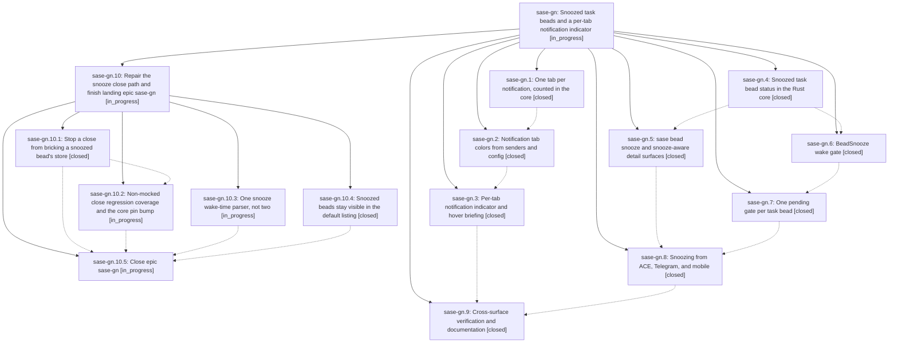

# Bead: sase-gn — Snoozed task beads and a per-tab notification indicator

[Bead Pages](../README.md) / sase-gn

**Status:** ◐ in_progress · **Type:** ▸ plan · **Tier:** epic
**Owner:** `bryanbugyi34@gmail.com` · **Created by:** [bbugyi200.athena.uh](https://github.com/sase-org/sase--agents/blob/main/agents/bbugyi200.athena.uh/README.md) · **Assignee:** `sase-gn.land`
**Created:** 2026-08-06 19:27:14 EDT
**Plan:** [202608/bead\_snooze\_and\_notification\_indicator.md](https://github.com/sase-org/sase--plans/blob/main/202608/bead_snooze_and_notification_indicator.md)

## Description

A task bead can be snoozed with a wake time, an optional +1 target, and a reason that every SASE surface displays; snoozing a task bead always snoozes its notification; the wake raises a gate whose primary action closes the bead with an overridable preset reason; and the top-bar notification indicator shows one accurately colored count per notification-panel tab, with a snoozed count that appears only when nothing else is pending, a rich hover briefing, and a structural guarantee that no notification can appear in two tabs.

## Notes

[2026-08-07T02:16:46Z · sase_ci_fix_sase_b5872ca] DISCOVERED ISSUE: the epic's Rust wake-due-snooze selector is now orphaned. Fixing a red 'just lint' on branch sase_ci_fix_sase_b5872ca (symvision: '--epic-symbol sase-gn.7(wake_due_snoozes)': bead is closed), I deleted the Python half that sase-gn.7's own PROPOSED FOLLOW-UP note already declared dead: bead_mutation_facade.wake_due_snoozes, its __all__ entry, and tests/test_bead/test_snooze_lifecycle.py::test_wake_selector_reports_due_beads_without_mutating_them. The Rust half remains and now has zero callers anywhere: sase-core crates/sase_core_py/src/lib.rs py_bead_wake_due_snoozes (binding 'bead_wake_due_snoozes') and the underlying wake_due_task_snoozes. Rationale per sase-gn.7: D2 means a snoozed bead gate is born snoozed and resurfaced by notification snooze expiry, so the reconciler never needs a due-wake selector. The land agent should decide whether to delete the Rust selector + binding + its core tests (and drop it from the binding-name inventory) or justify keeping it.

[2026-08-07T03:16:36Z · sase-gn.9] DISCOVERED ISSUE: closing a snoozed task bead permanently corrupts its bead store. Found during sase-gn.9's real (non-mocked) end-to-end walkthrough.

Repro (no mocks, real Rust-backed store): create a task bead, mark ready, project.snooze(...) it (status -> SNOOZED), then project.close([id], reason=..., resolution="canceled") raises ValueError: 'validation: Only snoozed issues can carry snooze metadata'. From that point on, EVERY subsequent read or write against that beads_dir — even list_issues()/show() from a brand-new process, even unrelated create() calls for other beads — fails with the identical error. The store is permanently bricked, confirmed across 3 independent isolated repros and across fresh interpreter processes.

Root cause: the close mutation's issue_closed event is durably appended to the event-sourced log (sdd/beads/events/streams/*.jsonl) BEFORE the derived post-close state is validated. The close reducer does not clear the issue's snooze field when transitioning status to closed, so replay re-derives an invalid record (status=closed, snooze still populated) and re-fails forever — there is no observed recovery path.

Confirmed narrow: closing a plain never-snoozed ready bead works fine. Confirmed workaround: calling project.cancel_snooze(id, actor=...) before project.close(...) avoids the bug (cancel_snooze clears snooze first).

Blast radius, both call sites go straight to mutation.project.close() with no snooze pre-clear:
- close_bead_snooze() in src/sase/bead/snooze_gate.py (~line 479) — the Close option on the BeadSnooze wake gate this epic shipped, which is that gate's PRIMARY/default branch (BEAD_SNOOZE_PRIMARY_BRANCH). Every default 'Close' on a woken snoozed bead corrupts the project's whole bead store.
- handle_bead_close() in src/sase/bead/cli_crud.py (~line 519) — plain 'sase bead close <id>' CLI, pre-existing, if the target happens to be snoozed.

Why existing tests missed it: tests/test_bead/test_snooze_gate.py's close/ready/resnooze coverage mocks the whole project as a MagicMock (_mutation_double()), so project.close() is never actually exercised against the real store.

Isolated in a scratch SASE_HOME + scratch bead store via a throwaway /tmp script (not committed); no real user data was touched.

[2026-08-07T03:53:13Z · toobig-1v.split_file.src.sase.bead.task_gate.0] DISCOVERED ISSUE: commit 0f7960d08 (phase sase-gn.8, 'snooze task beads from the Beads pane') left the ACE PNG golden tests/ace/tui/visual/snapshots/png/artifacts_beads_reopened_detail_120x40.png stale. It added the conditional 'z snooze' footer chip in the Beads pane but did not refresh this golden, so 'just test-visual' fails on clean master (1 failed, 410 passed, 1 skipped).

Repro (verified on master 0f7960d08 with a stashed working tree, so not caused by the change under test):
  just test-visual
  \# or: SASE_PYTEST_EXCLUDE_VISUAL=0 .venv/bin/python tools/run_pytest visual tests/ace/tui/visual/test_ace_png_snapshots_artifacts_beads_reopened.py

Failure: tests/ace/tui/visual/test_ace_png_snapshots_artifacts_beads_reopened.py::test_artifacts_beads_reopened_detail_png_snapshot -- 515/1520532 changed pixels (0.033870%), all material, tolerance 0. The diff PNG shows exactly one delta: the new footer chip 'z snooze' at the bottom-left of the Beads detail view. Everything else is pixel-identical.

The golden was last touched by 09bb443ea, one commit before 0f7960d08. The fix is an intentional golden refresh (--sase-update-visual-snapshots) for this one snapshot; no code change is implied. Reported by the agent that split src/sase/bead/task_gate.py -- 'just check-full' is otherwise fully green, and test-visual is not part of check/check-full.

Evidence: file:explicit:bd71db24c9d2d1e831611af5

[2026-08-07T04:13:14Z · sase-gn.land] LAND REVIEW (sase-gn.land): verification and integration complete; remaining work planned rather than closed.

VERIFIED. All nine phases deliver what their notes claim, checked against source and the epic's nine commits (5e6a94a38 .. 44727b027): the single-valued tab rule and classify_notification_tabs binding, the tab-color resolver and ace.notification_tabs config, NotificationIndicator.set_tabs with per-tab chips and bounded overflow, the snoozed status across the Rust core / Python model / SQLite CHECK constraints in _db_schema.py, 'sase bead snooze', the bead_snooze gate, the v3 reconciler state, the ACE BeadSnoozeModal on 'z', and the docs updates. The sase-core half is committed and pushed (7ee5105, d5a08da, 97d8925) and released as 0.18.5.

INTEGRATED. Exactly one non-epic commit landed during the epic: 5be45045d, the bead SQLite layer split. It already absorbed this epic's snooze work (snooze codecs in _db_codec.py, the snoozed-status CHECK constraints and column in _db_schema.py, _migrate_snoozed_status in _db_migrations.py, snooze hydration in _db_rows.py), and no later epic commit touched db.py. Nothing duplicates or conflicts; no integration work remained.

CORRUPTION BUG CONFIRMED AND ROOT-CAUSED at the Rust binding level, reproduced in a scratch store: bead_close on a snoozed bead raises 'Only snoozed issues can carry snooze metadata' and every later read of that beads_dir fails identically, in any process. Two faults combine. (1) MutableStore::close_one and the IssueClosed reducer arm both set status=Closed without clearing snooze, unlike apply_update_fields / apply_update_event_fields which clear it deliberately. (2) MutableStore::save writes the event store before write_issues_jsonl validates, so the issue_closed event is durable while issues.jsonl keeps the pre-close snapshot - confirmed on disk. Because issues.jsonl is still valid, clearing snooze in the reducer makes bricked stores self-heal on replay. Probing every mutation reachable from snoozed: close bricks the store; reopen and claim_for_agent_launch raise the same error but validate before persisting so the store survives; claim_for_agent_wait, update --status, plus_one, and remove are all correct.

PLANNED, not closed. The corruption, the save ordering, the orphaned Rust wake_due_task_snoozes selector, the two rival snooze parsers (snooze_time.py and snooze_duration.py, whose docstrings each claim to be the only one), and 'sase bead list' excluding snoozed are all epic-caused, so they stay epic work. Proposed as epic plan sase_plan_snooze_close_corruption.md, whose final phase closes this bead, runs symvision, and marks the sase-gn plan file done.

FOLLOW-UPS DISPOSITIONED. The four ACE TUI parallel-lane flakes from sase-gn.1/.2/.6/.8 were corroborated onto existing task sase-ct as a +1 rather than refiled. New tasks: sase-go (test_contract_set_serial_runtime_stays_within_budget flakes despite its calibration probes), sase-gp (mobile core knows neither bead gate kind, plus the mobile-priority question), sase-gq (Telegram /bead is read-only so snoozing needs a gate button), sase-gr (sase/memory/sase_beads.md status list is missing snoozed; needs owner approval). sase-gn.1's and sase-gn.2's release follow-ups are folded into the plan's pin bump. Two sase-gn.6 notes were design records needing no action: GateAdapter.validate_selection is the only place a mistyped re-snooze duration can be rejected while leaving the gate pending, and the shared parser layers days onto parse_duration, which has no day unit.

## Phases

| Bead | Title | Status | Size | Created | Agents | Commits |
|---|---|---|---|---|---:|---:|
| [sase-gn.1](sase-gn.1.md) | One tab per notification, counted in the core | ✓ closed | medium | 2026-08-06 | 1 | 2 |
| [sase-gn.2](sase-gn.2.md) | Notification tab colors from senders and config | ✓ closed | medium | 2026-08-06 | 1 | 2 |
| [sase-gn.3](sase-gn.3.md) | Per-tab notification indicator and hover briefing | ✓ closed | medium | 2026-08-06 | 1 | 1 |
| [sase-gn.4](sase-gn.4.md) | Snoozed task bead status in the Rust core | ✓ closed | medium | 2026-08-06 | 1 | 2 |
| [sase-gn.5](sase-gn.5.md) | sase bead snooze and snooze-aware detail surfaces | ✓ closed | medium | 2026-08-06 | 1 | 1 |
| [sase-gn.6](sase-gn.6.md) | BeadSnooze wake gate | ✓ closed | medium | 2026-08-06 | 1 | 1 |
| [sase-gn.7](sase-gn.7.md) | One pending gate per task bead | ✓ closed | medium | 2026-08-06 | 1 | 1 |
| [sase-gn.8](sase-gn.8.md) | Snoozing from ACE, Telegram, and mobile | ✓ closed | medium | 2026-08-06 | 1 | 1 |
| [sase-gn.9](sase-gn.9.md) | Cross-surface verification and documentation | ✓ closed | small | 2026-08-06 | 1 | 1 |

## Lineage

## Agents

| Agent | Bead | Commits |
|---|---|---:|
| [bbugyi200.athena.sase-gn.1](https://github.com/sase-org/sase--agents/blob/main/agents/bbugyi200.athena.sase-gn.1/README.md) | [sase-gn.1](sase-gn.1.md) | 2 |
| [bbugyi200.athena.sase-gn.10.1](https://github.com/sase-org/sase--agents/blob/main/agents/bbugyi200.athena.sase-gn.10.1/README.md) | [sase-gn.10.1](sase-gn.10.1.md) | 0 |
| [bbugyi200.athena.sase-gn.10.2](https://github.com/sase-org/sase--agents/blob/main/agents/bbugyi200.athena.sase-gn.10.2/README.md) | [sase-gn.10.2](sase-gn.10.2.md) | 0 |
| [bbugyi200.athena.sase-gn.10.3](https://github.com/sase-org/sase--agents/blob/main/agents/bbugyi200.athena.sase-gn.10.3/README.md) | [sase-gn.10.3](sase-gn.10.3.md) | 0 |
| [bbugyi200.athena.sase-gn.10.4](https://github.com/sase-org/sase--agents/blob/main/agents/bbugyi200.athena.sase-gn.10.4/README.md) | [sase-gn.10.4](sase-gn.10.4.md) | 1 |
| [bbugyi200.athena.sase-gn.10.5](https://github.com/sase-org/sase--agents/blob/main/agents/bbugyi200.athena.sase-gn.10.5/README.md) | [sase-gn.10.5](sase-gn.10.5.md) | 0 |
| [bbugyi200.athena.sase-gn.10.land](https://github.com/sase-org/sase--agents/blob/main/agents/bbugyi200.athena.sase-gn.10.land/README.md) | [sase-gn.10](sase-gn.10.md) | 0 |
| [bbugyi200.athena.sase-gn.2](https://github.com/sase-org/sase--agents/blob/main/agents/bbugyi200.athena.sase-gn.2/README.md) | [sase-gn.2](sase-gn.2.md) | 2 |
| [bbugyi200.athena.sase-gn.3](https://github.com/sase-org/sase--agents/blob/main/agents/bbugyi200.athena.sase-gn.3/README.md) | [sase-gn.3](sase-gn.3.md) | 1 |
| [bbugyi200.athena.sase-gn.4](https://github.com/sase-org/sase--agents/blob/main/agents/bbugyi200.athena.sase-gn.4/README.md) | [sase-gn.4](sase-gn.4.md) | 2 |
| [bbugyi200.athena.sase-gn.5](https://github.com/sase-org/sase--agents/blob/main/agents/bbugyi200.athena.sase-gn.5/README.md) | [sase-gn.5](sase-gn.5.md) | 1 |
| [bbugyi200.athena.sase-gn.6](https://github.com/sase-org/sase--agents/blob/main/agents/bbugyi200.athena.sase-gn.6/README.md) | [sase-gn.6](sase-gn.6.md) | 1 |
| [bbugyi200.athena.sase-gn.7](https://github.com/sase-org/sase--agents/blob/main/agents/bbugyi200.athena.sase-gn.7/README.md) | [sase-gn.7](sase-gn.7.md) | 1 |
| [bbugyi200.athena.sase-gn.8](https://github.com/sase-org/sase--agents/blob/main/agents/bbugyi200.athena.sase-gn.8/README.md) | [sase-gn.8](sase-gn.8.md) | 1 |
| [bbugyi200.athena.sase-gn.9](https://github.com/sase-org/sase--agents/blob/main/agents/bbugyi200.athena.sase-gn.9/README.md) | [sase-gn.9](sase-gn.9.md) | 1 |
| [bbugyi200.athena.sase-gn.land](https://github.com/sase-org/sase--agents/blob/main/agents/bbugyi200.athena.sase-gn.land/README.md) | [sase-gn](README.md) | 0 |

## Commits

| Repo | Commit | Subject | Bead | Committed |
|---|---|---|---|---|
| sase-core | [`sase-core@7ee5105`](https://github.com/sase-org/sase-core/commit/7ee51051f61b79b679d9f591cbca5b79c7cc433b) | feat(notifications): make tab ownership a single-valued core rule | [sase-gn.1](sase-gn.1.md) | 2026-08-06 20:11:36 EDT |
| sase | [`5e6a94a`](https://github.com/sase-org/sase/commit/5e6a94a3890d192dca6091d2165783381c8348e3) | feat(ace-tui): give each notification exactly one tab, counted in the core | [sase-gn.1](sase-gn.1.md) | 2026-08-06 20:14:05 EDT |
| sase-core | [`sase-core@d5a08da`](https://github.com/sase-org/sase-core/commit/d5a08da01b170a8b832c996cb14d92991e3b7522) | feat(bead): add the snoozed task-bead status with two wake conditions | [sase-gn.4](sase-gn.4.md) | 2026-08-06 20:24:21 EDT |
| sase | [`1f0d1a2`](https://github.com/sase-org/sase/commit/1f0d1a2ae39b68634be1e1176454f694fefba5ee) | feat(bead): mirror the snoozed task-bead status in Python | [sase-gn.4](sase-gn.4.md) | 2026-08-06 20:27:55 EDT |
| sase-core | [`sase-core@97d8925`](https://github.com/sase-org/sase-core/commit/97d89257d3b905f3076b17f67e92be1a4aa9d965) | feat(notifications): carry a sender-declared color on each notification tab | [sase-gn.2](sase-gn.2.md) | 2026-08-06 20:46:54 EDT |
| sase | [`821966d`](https://github.com/sase-org/sase/commit/821966dd2812965d9deb2cc2045603644e69c342) | feat(ace-tui): give every notification tab a stable, configurable color | [sase-gn.2](sase-gn.2.md) | 2026-08-06 20:49:33 EDT |
| sase | [`b723ace`](https://github.com/sase-org/sase/commit/b723ace648b5c99923874f933c3f16e99cc1eeb9) | feat(bead): add sase bead snooze and snooze-aware detail surfaces | [sase-gn.5](sase-gn.5.md) | 2026-08-06 21:14:27 EDT |
| sase | [`17fcbb4`](https://github.com/sase-org/sase/commit/17fcbb485e907962b8be4a3aa396d1873f094b4f) | feat(bead): raise a BeadSnooze gate when a snoozed task wakes | [sase-gn.6](sase-gn.6.md) | 2026-08-06 21:16:05 EDT |
| sase | [`b0e10d1`](https://github.com/sase-org/sase/commit/b0e10d1284e0a364db8ccfae462ab3ab1e2d4a08) | feat(bead): keep exactly one pending gate per task bead | [sase-gn.7](sase-gn.7.md) | 2026-08-06 21:42:58 EDT |
| sase | [`09bb443`](https://github.com/sase-org/sase/commit/09bb443ea4206edf188b54042713cf561fc89f94) | feat(ace-tui): show one indicator chip per notification tab | [sase-gn.3](sase-gn.3.md) | 2026-08-06 21:45:00 EDT |
| sase | [`0f7960d`](https://github.com/sase-org/sase/commit/0f7960d0853a7cd52721cec1361ae1c394cd0dee) | feat(ace-tui): snooze task beads from the Beads pane | [sase-gn.8](sase-gn.8.md) | 2026-08-06 22:48:14 EDT |
| sase | [`44727b0`](https://github.com/sase-org/sase/commit/44727b0275df6c62f09c7929677ce54e35f4a8a4) | docs(bead): document the snoozed task-bead status and per-tab indicator | [sase-gn.9](sase-gn.9.md) | 2026-08-06 23:46:28 EDT |
| sase | [`8b92115`](https://github.com/sase-org/sase/commit/8b92115e835227b0cd67754d4842ef9ef4183da1) | feat(bead): include snoozed status in default bead list filter | [sase-gn.10.4](sase-gn.10.4.md) | 2026-08-07 00:33:41 EDT |
