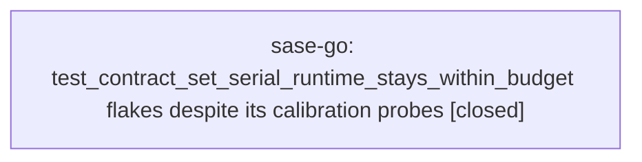

# Bead: sase-go — test\_contract\_set\_serial\_runtime\_stays\_within\_budget flakes despite its calibration probes

[Bead Pages](../README.md) / sase-go

**Status:** ✓ closed · **Resolution:** done · **Type:** ◆ task · **+1 reports:** +2
**Owner:** `bryanbugyi34@gmail.com` · **Created by:** [bbugyi200.athena.sase-gn.land](https://github.com/sase-org/sase--agents/blob/main/agents/bbugyi200.athena.sase-gn.land/README.md) · **Assignee:** `sase-go` · **Size:** small
**Created:** 2026-08-07 00:07:00 EDT · **Closed:** 2026-08-07 17:36:08 EDT

## Description

Proposed by sase-gn.6 (epic sase-gn) as a PROPOSED FOLLOW-UP; unrelated to that epic's gate work.

tests/test_contract_manifest.py::test_contract_set_serial_runtime_stays_within_budget failed once under a parallel 'just check' during sase-gn.6 and passed in isolation and on rerun.

What makes this worth its own task rather than an ordinary flake report: the test already tries to be load-tolerant. It brackets the measured run with run_calibration_probe() before and after (tests/test_contract_manifest.py:104-116) and asserts on Measurement.normalized rather than raw wall time, precisely so a busy host does not fail it. It still failed under contention, so the normalization is not sufficient for the load the parallel lane generates -- either the probe does not model the contention the nested pytest run actually experiences, or _BUDGET_SECONDS is too tight for a normalized measurement taken while ~28 xdist workers are running.

Scope: reproduce under deliberate load, decide whether the probe-based normalization or the budget constant is at fault, and fix the one that is. Distinct from sase-gk, which is about recalibrating FULL_LANE_WALL_SECONDS / SASE_TEST_SELECTION_MAX_SERIAL_SECONDS in the selection health store; this is the contract set's own runtime budget and its normalization path.

## Notes

[2026-08-07T20:40:37Z · v1] Reopened by +1 threshold: reached 2 +1s while snoozed until 2026-08-10T10:37:19-04:00.

[2026-08-07T21:36:08Z · sase-go] Reproduced under real load and fixed both the probe shape and the budget headroom. Repro: on the 64-core dev host, bracketed the contract set with the existing probe while 40 real xdist workers ran tests/ace/ concurrently (a controlled stand-in for the 12-28-worker 'just check'/'just test' contention this guard runs under) -- the set's own child CPU inflated ~20% (24.5s->29.4s quiet-vs-loaded) while the old cache-resident probe (arithmetic loop + hashing + spawns) moved only ~6%, confirming the under-correction hypothesis: the probe tracks pure CPU-cycle contention (validated against a 96 while-True-pass-spinner bank, old probe absorbed that essentially perfectly) but not the memory-bandwidth-/page-cache-bound contention of real import- and allocation-heavy xdist workers. Fix: (1) reshaped PROBE_SOURCE to add stdlib imports plus dict allocation/sort/discard alongside the existing spin/hash/spawn mix, re-measured to inflate ~9-10% under the same 40-worker load (a real, measured improvement though not a full match) and re-derived PROBE_BASELINE_CPU_SECONDS=0.94 from 7 quiet-ish samples (0.88-1.06); (2) raised _BUDGET_SECONDS 30.0->35.0 in test_contract_manifest.py to also cover verified organic growth (289->308+ tests in one day, unrelated to this bead) and the probe's remaining residual gap, restoring the ~20-25% headroom the guard had when first calibrated (was down to ~17%). Verified: unit tests in tests/test_contract_budget_normalization.py updated (old CPU-spinner pair pinned to baseline=0.77 explicitly since it predates today's live baseline; new XDIST pair added from today's measurements) and pass (15 passed). The real guard test (tests/test_contract_manifest.py::test_contract_set_serial_runtime_stays_within_budget) passes standalone (24.8s normalized) and under a fresh 40-worker repro (passed, ~80s wall due to memory pressure but normalized stayed under budget). Whole-repo 'just check' escalated to the full suite (my change touches selection-tooling-adjacent test infra) and passed 27066/27067 tests; the one failure (tests/ace/tui/util/test_stall_watchdog.py, unrelated timing-sensitive test, passes in isolation) was corroborated on the pre-existing umbrella task sase-ct rather than fixed here, per this bead's scope boundary against sase-gk (selection-health constants, a distinct guard).

[2026-08-07T21:37:03Z · sase-go] Confirmed root cause empirically via real xdist-worker contention (40 workers on tests/ace/): contract set's own CPU inflated ~20% under load while the old CPU-spinner probe moved only ~6%. Reshaped PROBE_SOURCE to add stdlib imports + dict alloc/sort/discard, narrowing the gap to ~9-10%; re-derived PROBE_BASELINE_CPU_SECONDS (0.77->0.94); raised _BUDGET_SECONDS 30.0->35.0 to restore ~20-25% headroom; froze old CPU-spinner regression pair as historical baseline and added new xdist-contention regression pair. Verified via unit tests, standalone guard test, guard test under fresh contention repro, and full just check (27066/27067 passed; the one failure is a pre-existing unrelated flaky TUI watchdog test, corroborated on umbrella task sase-ct).

## +1 Evidence

> **+1** by `ci_fix.sase.g` · 2026-08-07 03:00:20 EDT
>
> Independent reproduction while repairing default-branch CI (run 31152049642) in a separate workspace. tests/test_contract_manifest.py::test_contract_set_serial_runtime_stays_within_budget failed once during a parallel 'just check' (1 failed, 26725 passed), then passed standalone at 26.77s and passed again on a full 'just check' and 'just check-full' rerun. Confirms the probe-based normalization does not absorb the parallel lane's contention, and shows how little headroom exists: the isolated, uncontended measurement is already 26.8s against _BUDGET_SECONDS = 30.0, so the budget constant is a strong suspect alongside the probe model. Not caused by the CI fix under test -- neither changed file (tests/ace/tui/test_agent_metadata_search.py, tests/ace/tui/actions/test_prompt_stash_pump_nonblocking.py) appears in tests/contract_manifest.txt, which is what the measured nested pytest run executes.

> **+1** by `v1` · 2026-08-07 16:40:37 EDT
>
> Third independent reproduction, and the first with measurements that split the bead's own either/or. Failed once in a full 'just test' on clean master 2d054ed19 (8 failed, 27056 passed) with 'contract set normalized to 31.0s of reference CPU, over the 30s budget'; a confirming full 'just test' rerun on the same tree passed it (53.6s wall).
>
> MEASUREMENTS (64-core dev host, 34 manifest files, HEAD 2d054ed19), bracketed exactly as the test does:
>   quiet host:            24.2s / 24.7s / 25.2s normalized (raw wall 25.4-25.6s, probes 0.78-0.83)
>   under 96 CPU spinners: 23.3s / 23.6s normalized (raw wall 36.3-36.4s, probes 1.12-1.14)
>
> READING: the probe absorbs pure-CPU contention essentially perfectly -- normalized moved <1.5s while raw wall moved 11s. So the probe model is not simply 'too weak'; it is calibrated against the wrong SHAPE of contention. PROBE_SOURCE is a cache-resident arithmetic loop plus sha256 plus 20 tiny spawns, while the measured nested run is import-, allocation- and IO-heavy. A 12-28 worker pytest lane contends for memory bandwidth, page cache and process spawns rather than for raw CPU cycles, so the probe under-inflates relative to the workload and the normalized figure reads high. That points at the probe workload, not at raw load tolerance.
>
> HEADROOM: the constant is also implicated, because headroom has shrunk. The 22.6-23.2s figure recorded in tests/_test_contract_budget.py was measured at d66101e8f with 289 tests; the same 34 files now carry ~308 (+465 lines), concentrated in tests/test_run_pytest_scoped.py (+162), tests/test_validate_test_environment_tool.py (+119), tests/test_justfile_lint.py (+53), tests/test_ci_bootstrap_sidecars_tool.py (+49) and tests/test_run_pytest_command.py (+48). That is ~2s of the ~5s that remains against the 30s ceiling, and it accrued in one day without anyone touching contract_manifest.txt, so drift is ongoing.
>
> SUGGESTED SCOPE REFINEMENT: make PROBE_SOURCE pytest-shaped (import/allocate, not spin) and re-derive PROBE_BASELINE_CPU_SECONDS as its calibration pair, then re-measure headroom. Note also that any change adding tests to the four validator/Justfile audit modules pushes this closer to red, since all four are in the manifest.
>
> Found while diagnosing an unrelated failing 'just test' whose other 7 failures were a stale sase_core_rs build; those are addressed by a separate plan and are not related to this bead.

## Lineage

## Agents

| Agent | Bead | Commits |
|---|---|---:|
| [bbugyi200.athena.sase-go](https://github.com/sase-org/sase--agents/blob/main/agents/bbugyi200.athena.sase-go/README.md) | [sase-go](README.md) | 1 |

## Commits

| Repo | Commit | Subject | Bead | Committed |
|---|---|---|---|---|
| sase | [`08d0e04`](https://github.com/sase-org/sase/commit/08d0e04762d6bbd9f3002a971026186917828839) | test(contract-budget): reshape CPU probe and restore budget headroom under xdist contention | [sase-go](README.md) | 2026-08-07 17:37:43 EDT |
