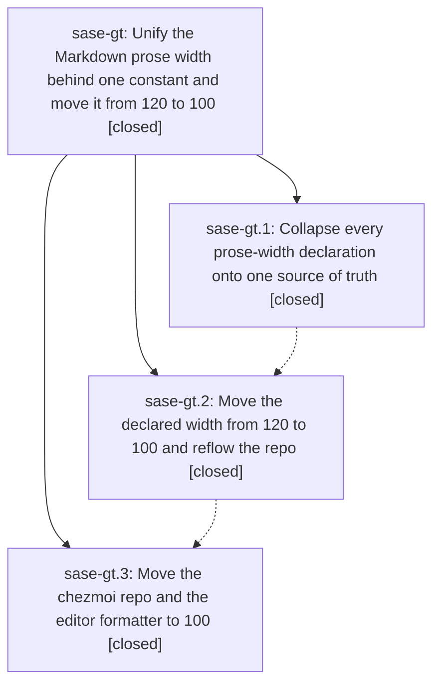

# Bead: sase-gt — Unify the Markdown prose width behind one constant and move it from 120 to 100

[Bead Pages](../README.md) / sase-gt

**Status:** ✓ closed · **Resolution:** done · **Type:** ▸ plan · **Tier:** epic
**Owner:** `bryanbugyi34@gmail.com` · **Created by:** [bbugyi200.athena.uj](https://github.com/sase-org/sase--agents/blob/main/agents/bbugyi200.athena.uj/README.md) · **Assignee:** `sase-gt.land`
**Created:** 2026-08-07 08:37:32 EDT · **Closed:** 2026-08-07 10:04:48 EDT
**Plan:** [202608/prettier\_width\_100.md](https://github.com/sase-org/sase--plans/blob/main/202608/prettier_width_100.md)

## Description

Every place that wraps Markdown prose derives its width from a single declared source of truth guarded by a test, and that source declares 100 columns instead of 120 across the sase repo and the chezmoi dotfiles repo.

## Notes

[2026-08-07T14:04:48Z · sase-gt.land] LAND VERIFICATION (sase-gt.land, 2026-08-07).

VERIFIED (step 1). Read all three phase beads and every child note against the source and the commits.
Phase 1 (c37e68f7a): src/sase/markdown_width.py is the single authority (MARKDOWN_PRINT_WIDTH + prettier_markdown_argv()), mirrored by the package.json prettier block; all five original Python sites derive from it (file_references, markdown_wrap, memory/notes, init_memory/formatting, _init_skills_rendering) and both Justfile recipes carry no width flag (Justfile:296,324). Phase 2 (57a045cfc): MARKDOWN_PRINT_WIDTH and package.json printWidth are both 100; the eighth site the plan inventory missed (_build_output in _init_skills_rendering.py) derives correctly at :99-101; no stale width prose survives — a repo-wide grep for print-width/printWidth/prose-wrap/proseWrap finds only the authority, package.json, and the guard tests, and no doc still names 120 as a width. Phase 3 (chezmoi 28079df8, which the closed bead recorded no note for — verified independently): chezmoi Justfile:65,83,109 and conform.lua:187,211 are all at 100, 119 files reflowed including every provider SKILL.md tree; chezmoi's own 'just fmt-md-check' passes over the deployed skills; the tree is clean and applied (home/dot_claude/skills/sase_repo/SKILL.md is byte-identical to ~/.claude/skills/sase_repo/SKILL.md, and ~/.config/nvim/lua/plugins/conform.lua is at 100). From the sase workspace, 'sase init --check' reports config/memory/repo/skills all clean, so the phase-2 known-drift of 86 chezmoi skill files is resolved.

INTEGRATION (step 2). Nothing to integrate: the last non-epic commit on master is 1e355887f at 01:52 EDT, the epic's first commit is c37e68f7a at 08:55 EDT, and local master is in sync with origin/master. No change landed in that window, and no code outside the epic duplicates or conflicts with the new authority.

EPIC WORK COMPLETED AT LAND. Closed the hole in the epic's own guard test that sase-gt.2 reported: tests/test_markdown_print_width.py only scanned module-level constants by name, which is why the inline 'width=118' and '> 120' literals in _build_output() escaped phase 1 and had to be caught by a failing golden. Added two AST guards scoped to the modules that import sase.markdown_width (the narrow self-declared signal, chosen over a whole-repo scan so Console(width=120) in TUI code does not trip it, per the plan's explicit warning), plus a non-vacuity assertion on that module set. Proved both guards bite by temporarily restoring the exact two literals: they failed naming _init_skills_rendering.py:101 width=118 and :99 len(...) vs 120, then passed after restore. 'just check' green — every lint gate plus a scoped test lane that escalated to the full suite.

FOLLOW-UP OUTCOMES. (1) sase-gt.1's proposal to gitignore the maturin abi3 build output in sase-core: DECLINED as already fixed — the proposing agent fixed it itself 6 minutes later in sase-core 6bcad2f ('build: ignore maturin-built abi3 extension modules', footer SASE_BEAD=[sase-gt.1]); '**/*.abi3.so' is in .gitignore and the checkout is clean with the .so present. No bead needed. (2) sase-gt.2's proposal to extend the prose-width guard to inline widths: RESOLVED as epic work above rather than deferred, since the guard test is this epic's own deliverable. (3) sase-gt.2's proposal about 'sase init skills' drift while sources are dirty: filed via /sase_new_task as sase-gw (small, ready) — no semantic duplicate among existing task beads and no causal link to any other in-progress epic (sase-gn, sase-gu, sase-gv). (4) NEW, found by the land agent, not proposed by any phase: release-please bumps pyproject.toml but never uv.lock, so the first 'just install' after each release dirties the tree with a stray version hunk no gate catches — filed as sase-gx (xsmall, ready). Reverted that incidental uv.lock hunk here rather than smuggling it into this epic's commit.

[2026-08-07T14:07:12Z · sase-gt.land] Land verification re-confirmed at commit finalizer: phases 1-3 verified against source and commits, no post-epic commits to integrate, guard-test gap closed in tests/test_markdown_print_width.py, follow-ups recorded (sase-gw, sase-gx).

## Phases

| Bead | Title | Status | Size | Created | Agents | Commits |
|---|---|---|---|---|---:|---:|
| [sase-gt.1](sase-gt.1.md) | Collapse every prose-width declaration onto one source of truth | ✓ closed | medium | 2026-08-07 | 1 | 2 |
| [sase-gt.2](sase-gt.2.md) | Move the declared width from 120 to 100 and reflow the repo | ✓ closed | medium | 2026-08-07 | 1 | 1 |
| [sase-gt.3](sase-gt.3.md) | Move the chezmoi repo and the editor formatter to 100 | ✓ closed | small | 2026-08-07 | 1 | 1 |

## Lineage

## Agents

| Agent | Bead | Commits |
|---|---|---:|
| [bbugyi200.athena.sase-gt.1](https://github.com/sase-org/sase--agents/blob/main/agents/bbugyi200.athena.sase-gt.1/README.md) | [sase-gt.1](sase-gt.1.md) | 2 |
| [bbugyi200.athena.sase-gt.2](https://github.com/sase-org/sase--agents/blob/main/agents/bbugyi200.athena.sase-gt.2/README.md) | [sase-gt.2](sase-gt.2.md) | 1 |
| [bbugyi200.athena.sase-gt.3](https://github.com/sase-org/sase--agents/blob/main/agents/bbugyi200.athena.sase-gt.3/README.md) | [sase-gt.3](sase-gt.3.md) | 1 |
| [bbugyi200.athena.sase-gt.land](https://github.com/sase-org/sase--agents/blob/main/agents/bbugyi200.athena.sase-gt.land/README.md) | [sase-gt](README.md) | 1 |

## Commits

| Repo | Commit | Subject | Bead | Committed |
|---|---|---|---|---|
| sase | [`c37e68f`](https://github.com/sase-org/sase/commit/c37e68f7a5bcf73ceaa90923cb60a12ffd91b7e0) | refactor: collapse every prose-width declaration onto one source of truth | [sase-gt.1](sase-gt.1.md) | 2026-08-07 08:55:19 EDT |
| sase-core | [`sase-core@6bcad2f`](https://github.com/sase-org/sase-core/commit/6bcad2f638826ab92ba6b986c9af85e785248eaa) | build: ignore maturin-built abi3 extension modules | [sase-gt.1](sase-gt.1.md) | 2026-08-07 08:59:38 EDT |
| sase | [`57a045c`](https://github.com/sase-org/sase/commit/57a045cfc6a7f72308d71d0ec66fb1b39f9af13f) | refactor: narrow the declared prose width from 120 to 100 and reflow | [sase-gt.2](sase-gt.2.md) | 2026-08-07 09:31:51 EDT |
| chezmoi | [`chezmoi@28079df`](https://github.com/bbugyi200/dotfiles/commit/28079df80bf1772a129be640e131621fe998903d) | build: move chezmoi's prettier prose width and the nvim conform formatter to 100 | [sase-gt.3](sase-gt.3.md) | 2026-08-07 09:43:42 EDT |
| sase | [`c710d96`](https://github.com/sase-org/sase/commit/c710d966cf1a09b4cdf32d7b4d20ceea37c54563) | test: guard inline prose-width literals, not just named constants | [sase-gt](README.md) | 2026-08-07 10:08:26 EDT |
