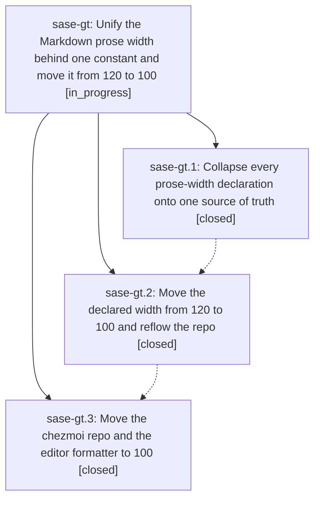

# Bead: sase-gt — Unify the Markdown prose width behind one constant and move it from 120 to 100

[Bead Pages](../README.md) / sase-gt

**Status:** ◐ in_progress · **Type:** ▸ plan · **Tier:** epic
**Owner:** `bryanbugyi34@gmail.com` · **Created by:** [bbugyi200.athena.uj](https://github.com/sase-org/sase--agents/blob/main/agents/bbugyi200.athena.uj/README.md) · **Assignee:** `sase-gt.land`
**Created:** 2026-08-07 08:37:32 EDT
**Plan:** [202608/prettier\_width\_100.md](https://github.com/sase-org/sase--plans/blob/main/202608/prettier_width_100.md)

## Description

Every place that wraps Markdown prose derives its width from a single declared source of truth guarded by a test, and that source declares 100 columns instead of 120 across the sase repo and the chezmoi dotfiles repo.

## Phases

| Bead | Title | Status | Size | Created | Agents | Commits |
|---|---|---|---|---|---:|---:|
| [sase-gt.1](sase-gt.1.md) | Collapse every prose-width declaration onto one source of truth | ✓ closed | medium | 2026-08-07 | 1 | 2 |
| [sase-gt.2](sase-gt.2.md) | Move the declared width from 120 to 100 and reflow the repo | ✓ closed | medium | 2026-08-07 | 1 | 1 |
| [sase-gt.3](sase-gt.3.md) | Move the chezmoi repo and the editor formatter to 100 | ✓ closed | small | 2026-08-07 | 1 | 1 |

## Lineage

## Agents

| Agent | Bead | Commits |
|---|---|---:|
| [bbugyi200.athena.sase-gt.1](https://github.com/sase-org/sase--agents/blob/main/agents/bbugyi200.athena.sase-gt.1/README.md) | [sase-gt.1](sase-gt.1.md) | 2 |
| [bbugyi200.athena.sase-gt.2](https://github.com/sase-org/sase--agents/blob/main/agents/bbugyi200.athena.sase-gt.2/README.md) | [sase-gt.2](sase-gt.2.md) | 1 |
| [bbugyi200.athena.sase-gt.3](https://github.com/sase-org/sase--agents/blob/main/agents/bbugyi200.athena.sase-gt.3/README.md) | [sase-gt.3](sase-gt.3.md) | 1 |
| [bbugyi200.athena.sase-gt.land](https://github.com/sase-org/sase--agents/blob/main/agents/bbugyi200.athena.sase-gt.land/README.md) | [sase-gt](README.md) | 0 |

## Commits

| Repo | Commit | Subject | Bead | Committed |
|---|---|---|---|---|
| sase | [`c37e68f`](https://github.com/sase-org/sase/commit/c37e68f7a5bcf73ceaa90923cb60a12ffd91b7e0) | refactor: collapse every prose-width declaration onto one source of truth | [sase-gt.1](sase-gt.1.md) | 2026-08-07 08:55:19 EDT |
| sase-core | [`sase-core@6bcad2f`](https://github.com/sase-org/sase-core/commit/6bcad2f638826ab92ba6b986c9af85e785248eaa) | build: ignore maturin-built abi3 extension modules | [sase-gt.1](sase-gt.1.md) | 2026-08-07 08:59:38 EDT |
| sase | [`57a045c`](https://github.com/sase-org/sase/commit/57a045cfc6a7f72308d71d0ec66fb1b39f9af13f) | refactor: narrow the declared prose width from 120 to 100 and reflow | [sase-gt.2](sase-gt.2.md) | 2026-08-07 09:31:51 EDT |
| chezmoi | [`chezmoi@28079df`](https://github.com/bbugyi200/dotfiles/commit/28079df80bf1772a129be640e131621fe998903d) | build: move chezmoi's prettier prose width and the nvim conform formatter to 100 | [sase-gt.3](sase-gt.3.md) | 2026-08-07 09:43:42 EDT |
