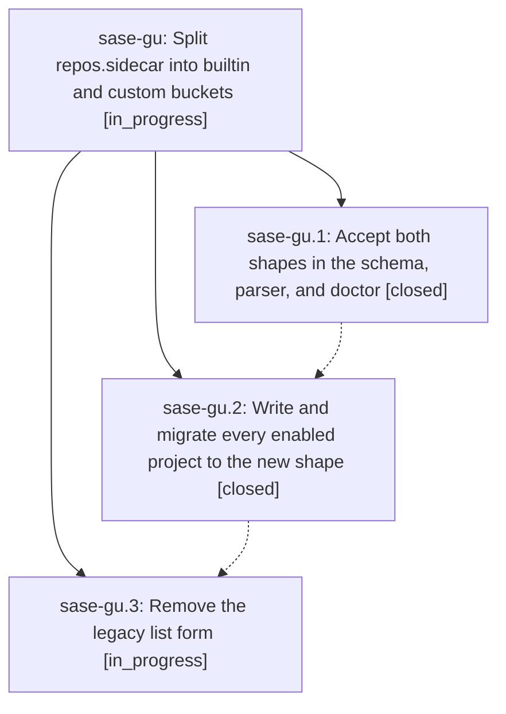

# Bead: sase-gu — Split repos.sidecar into builtin and custom buckets

[Bead Pages](../README.md) / sase-gu

**Status:** ◐ in_progress · **Type:** ▸ plan · **Tier:** epic
**Owner:** `bryanbugyi34@gmail.com` · **Created by:** [bbugyi200.athena.um](https://github.com/sase-org/sase--agents/blob/main/agents/bbugyi200.athena.um/README.md) · **Assignee:** `sase-gu.land`
**Created:** 2026-08-07 09:33:57 EDT
**Plan:** [202608/split\_sidecar\_config.md](https://github.com/sase-org/sase--plans/blob/main/202608/split_sidecar_config.md)

## Description

repos.sidecar is a two-bucket mapping (builtin for the reserved plans/beads/agents roles, custom for document sidecars such as research), keyed by role name, mirroring llm_provider.model_aliases; every enabled SASE project's config uses the new shape and the legacy list form is gone.

## Phases

| Bead | Title | Status | Size | Created | Agents | Commits |
|---|---|---|---|---|---:|---:|
| [sase-gu.1](sase-gu.1.md) | Accept both shapes in the schema, parser, and doctor | ✓ closed | medium | 2026-08-07 | 1 | 1 |
| [sase-gu.2](sase-gu.2.md) | Write and migrate every enabled project to the new shape | ✓ closed | medium | 2026-08-07 | 1 | 1 |
| [sase-gu.3](sase-gu.3.md) | Remove the legacy list form | ◐ in_progress | medium | 2026-08-07 | 1 | 0 |

## Lineage

## Agents

| Agent | Bead | Commits |
|---|---|---:|
| [bbugyi200.athena.sase-gu.1](https://github.com/sase-org/sase--agents/blob/main/agents/bbugyi200.athena.sase-gu.1/README.md) | [sase-gu.1](sase-gu.1.md) | 1 |
| [bbugyi200.athena.sase-gu.2](https://github.com/sase-org/sase--agents/blob/main/agents/bbugyi200.athena.sase-gu.2/README.md) | [sase-gu.2](sase-gu.2.md) | 1 |
| [bbugyi200.athena.sase-gu.3](https://github.com/sase-org/sase--agents/blob/main/agents/bbugyi200.athena.sase-gu.3/README.md) | [sase-gu.3](sase-gu.3.md) | 0 |
| [bbugyi200.athena.sase-gu.land](https://github.com/sase-org/sase--agents/blob/main/agents/bbugyi200.athena.sase-gu.land/README.md) | [sase-gu](README.md) | 0 |

## Commits

| Repo | Commit | Subject | Bead | Committed |
|---|---|---|---|---|
| sase | [`50bed7f`](https://github.com/sase-org/sase/commit/50bed7f99c48d78515bbc48f74c83924380982f5) | feat(config): accept role-keyed sidecar repo config alongside the legacy list | [sase-gu.1](sase-gu.1.md) | 2026-08-07 09:56:38 EDT |
| sase | [`f77bc98`](https://github.com/sase-org/sase/commit/f77bc9891e801c5003896aff76bbe471668f4c67) | feat(repos): write and document repos.sidecar as the builtin/custom mapping | [sase-gu.2](sase-gu.2.md) | 2026-08-07 10:33:42 EDT |
