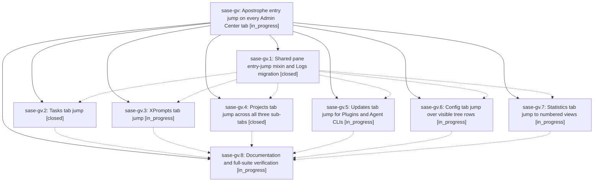

# Bead: sase-gv — Apostrophe entry jump on every Admin Center tab

[Bead Pages](../README.md) / sase-gv

**Status:** ◐ in_progress · **Type:** ▸ plan · **Tier:** epic
**Owner:** `bryanbugyi34@gmail.com` · **Created by:** [bbugyi200.athena.uo](https://github.com/sase-org/sase--agents/blob/main/agents/bbugyi200.athena.uo/README.md) · **Assignee:** `sase-gv.land`
**Created:** 2026-08-07 09:51:22 EDT
**Plan:** [202608/admin\_center\_apostrophe\_jump.md](https://github.com/sase-org/sase--plans/blob/main/202608/admin_center_apostrophe_jump.md)

## Description

Pressing the apostrophe key inside any SASE Admin Center working tab enters adaptive hint-jump mode and moves that tab's selection, using one shared implementation with the Logs tab's existing back-stack semantics.

## Phases

| Bead | Title | Status | Size | Created | Agents | Commits |
|---|---|---|---|---|---:|---:|
| [sase-gv.1](sase-gv.1.md) | Shared pane entry-jump mixin and Logs migration | ✓ closed | medium | 2026-08-07 | 1 | 1 |
| [sase-gv.2](sase-gv.2.md) | Tasks tab jump | ✓ closed | small | 2026-08-07 | 1 | 1 |
| [sase-gv.3](sase-gv.3.md) | XPrompts tab jump | ◐ in_progress | small | 2026-08-07 | 1 | 0 |
| [sase-gv.4](sase-gv.4.md) | Projects tab jump across all three sub-tabs | ✓ closed | medium | 2026-08-07 | 1 | 1 |
| [sase-gv.5](sase-gv.5.md) | Updates tab jump for Plugins and Agent CLIs | ◐ in_progress | medium | 2026-08-07 | 1 | 0 |
| [sase-gv.6](sase-gv.6.md) | Config tab jump over visible tree rows | ◐ in_progress | medium | 2026-08-07 | 1 | 0 |
| [sase-gv.7](sase-gv.7.md) | Statistics tab jump to numbered views | ◐ in_progress | small | 2026-08-07 | 1 | 0 |
| [sase-gv.8](sase-gv.8.md) | Documentation and full-suite verification | ◐ in_progress | small | 2026-08-07 | 1 | 0 |

## Lineage

## Agents

| Agent | Bead | Commits |
|---|---|---:|
| [bbugyi200.athena.sase-gv.1](https://github.com/sase-org/sase--agents/blob/main/agents/bbugyi200.athena.sase-gv.1/README.md) | [sase-gv.1](sase-gv.1.md) | 1 |
| [bbugyi200.athena.sase-gv.2](https://github.com/sase-org/sase--agents/blob/main/agents/bbugyi200.athena.sase-gv.2/README.md) | [sase-gv.2](sase-gv.2.md) | 1 |
| [bbugyi200.athena.sase-gv.3](https://github.com/sase-org/sase--agents/blob/main/agents/bbugyi200.athena.sase-gv.3/README.md) | [sase-gv.3](sase-gv.3.md) | 0 |
| [bbugyi200.athena.sase-gv.4](https://github.com/sase-org/sase--agents/blob/main/agents/bbugyi200.athena.sase-gv.4/README.md) | [sase-gv.4](sase-gv.4.md) | 1 |
| [bbugyi200.athena.sase-gv.5](https://github.com/sase-org/sase--agents/blob/main/agents/bbugyi200.athena.sase-gv.5/README.md) | [sase-gv.5](sase-gv.5.md) | 0 |
| [bbugyi200.athena.sase-gv.6](https://github.com/sase-org/sase--agents/blob/main/agents/bbugyi200.athena.sase-gv.6/README.md) | [sase-gv.6](sase-gv.6.md) | 0 |
| [bbugyi200.athena.sase-gv.7](https://github.com/sase-org/sase--agents/blob/main/agents/bbugyi200.athena.sase-gv.7/README.md) | [sase-gv.7](sase-gv.7.md) | 0 |
| [bbugyi200.athena.sase-gv.8](https://github.com/sase-org/sase--agents/blob/main/agents/bbugyi200.athena.sase-gv.8/README.md) | [sase-gv.8](sase-gv.8.md) | 0 |
| [bbugyi200.athena.sase-gv.land](https://github.com/sase-org/sase--agents/blob/main/agents/bbugyi200.athena.sase-gv.land/README.md) | [sase-gv](README.md) | 0 |

## Commits

| Repo | Commit | Subject | Bead | Committed |
|---|---|---|---|---|
| sase | [`b27059f`](https://github.com/sase-org/sase/commit/b27059f51d335bb101422dae2c8274a537edab15) | refactor(ace): extract a shared pane entry-jump mixin and migrate LogsPane | [sase-gv.1](sase-gv.1.md) | 2026-08-07 10:19:57 EDT |
| sase | [`9417428`](https://github.com/sase-org/sase/commit/94174283402c3b63bfc1bf9203e708e8ff13db0a) | feat(ace): wire Tasks pane onto the shared entry-jump mixin | [sase-gv.2](sase-gv.2.md) | 2026-08-07 10:48:30 EDT |
| sase | [`6103496`](https://github.com/sase-org/sase/commit/6103496016a9d3abea8e156113f2dc4178159859) | feat(ace): add entry-jump mode to all three Projects tab sub-tabs | [sase-gv.4](sase-gv.4.md) | 2026-08-07 11:05:59 EDT |
