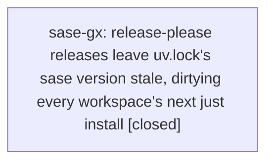

# Bead: sase-gx — release-please releases leave uv.lock's sase version stale, dirtying every workspace's next just install

[Bead Pages](../README.md) / sase-gx

**Status:** ✓ closed · **Resolution:** done · **Type:** ◆ task
**Owner:** `bryanbugyi34@gmail.com` · **Created by:** [bbugyi200.athena.sase-gt.land](https://github.com/sase-org/sase--agents/blob/main/agents/bbugyi200.athena.sase-gt.land/README.md) · **Assignee:** `sase-gx` · **Size:** xsmall
**Created:** 2026-08-07 10:03:41 EDT · **Closed:** 2026-08-07 11:20:45 EDT

## Description

Discovered while landing epic sase-gt (not caused by it, and not proposed by any phase bead — found by the land agent).

Reproduction: commit 1e355887f ('chore(master): release 0.16.0 (#275)') touched .release-please-manifest.json, CHANGELOG.md, pyproject.toml, and src/sase/__init__.py — but not uv.lock. uv.lock still records the editable root package as:

    [[package]]
    name = "sase"
    version = "0.15.0"
    source = { editable = "." }

The first 'just install' in any workspace after a release therefore rewrites that line to the new version and leaves uv.lock dirty. Observed directly in this workspace: a clean checkout at master 57a045cfc plus 'just install' produced a one-line uv.lock diff (0.15.0 -> 0.16.0) with no dependency change.

Impact is small but recurring and silent. No gate catches it — 'just check' is green either way — so the stray hunk is invisible until it gets swept into whatever unrelated commit the next agent happens to make. Every release reintroduces it, and it will keep landing in commits that have nothing to do with the version bump.

Scope: make the release automation refresh uv.lock as part of the version bump (e.g. run 'uv lock' in the release-please PR workflow, or add uv.lock to the release-please extra-files/updater config so the root package version is bumped alongside pyproject.toml). Confirm afterwards that a fresh 'just install' on a released commit leaves the tree clean.

## Notes

[2026-08-07T15:20:45Z · sase-gx] Root cause: release-please only updates pyproject.toml/__init__.py/CHANGELOG on the release PR branch, never uv.lock, so the editable root package's version line in uv.lock is stale until swept up by the next unrelated 'just install'. Fix: added a sync-lockfile job to .github/workflows/publish.yml that, on every push to master, checks whether the deterministic release-please--branches--master branch exists (via gh api), checks it out, runs 'uv lock' to refresh only the version-bump-driven diff, and pushes the update back onto that branch so it's included when the release PR merges. Verified: workflow YAML parses (python3 -c yaml.safe_load) and passes actionlint with no findings; confirmed current tree has pyproject.toml and uv.lock both already at 0.16.0 (in sync) and that 'just install' in this workspace produces no uv.lock diff. Ran 'just check': all lint/fmt/mypy/ruff/symvision gates pass with this change; the only failing gate (init memory/skills --check, chezmoi drift) reproduces identically on master without this change, confirming it's pre-existing and unrelated.

[2026-08-07T15:22:15Z · sase-gx] Added sync-lockfile job to .github/workflows/publish.yml to refresh uv.lock on the release-please branch after version bumps; verified via YAML parse, actionlint, and just check (pre-existing unrelated chezmoi drift aside).

## Lineage

## Agents

| Agent | Bead | Commits |
|---|---|---:|
| [bbugyi200.athena.sase-gx](https://github.com/sase-org/sase--agents/blob/main/agents/bbugyi200.athena.sase-gx/README.md) | [sase-gx](README.md) | 1 |

## Commits

| Repo | Commit | Subject | Bead | Committed |
|---|---|---|---|---|
| sase | [`d2b8cdb`](https://github.com/sase-org/sase/commit/d2b8cdb0ae58afeaf8cb606bbea8aca05d310a97) | ci(release): sync uv.lock on the pending release-please branch | [sase-gx](README.md) | 2026-08-07 11:23:42 EDT |
