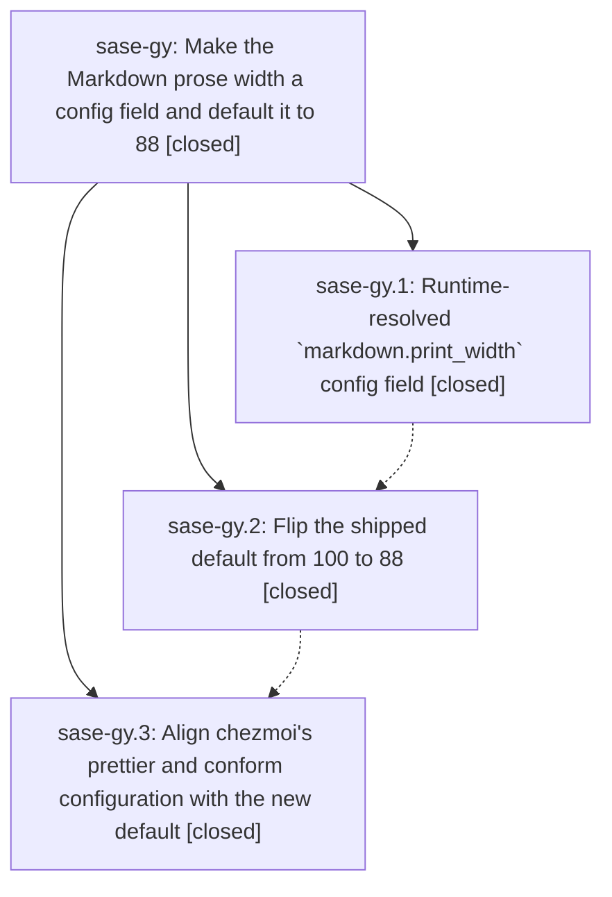

# Bead: sase-gy — Make the Markdown prose width a config field and default it to 88

[Bead Pages](../README.md) / sase-gy

**Status:** ✓ closed · **Resolution:** done · **Type:** ▸ plan · **Tier:** epic
**Owner:** `bryanbugyi34@gmail.com` · **Created by:** [bbugyi200.athena.sase-gt.land.f1](https://github.com/sase-org/sase--agents/blob/main/agents/bbugyi200.athena.sase-gt.land.f1/README.md) · **Assignee:** `sase-gy.land`
**Created:** 2026-08-07 10:25:07 EDT · **Closed:** 2026-08-07 12:24:50 EDT
**Plan:** [202608/configurable\_markdown\_print\_width.md](https://github.com/sase-org/sase--plans/blob/main/202608/configurable_markdown_print_width.md)

## Description

`markdown.print_width` is a first-class SASE config field that every Markdown-emitting code path resolves at runtime, its shipped default is 88 instead of 100, and the repo's own Markdown, generated artifacts, and dotfile formatter configuration all agree with the new default.

## Notes

[2026-08-07T16:24:50Z · sase-gy.land] LAND VERIFICATION (sase-gy.land, 2026-08-07, master c30958a57 + one uncommitted doc fix).

VERIFIED (step 1). Read all three phase beads and every note, plus the epic plan at plans:202608/configurable_markdown_print_width.md, and checked the claims against the source rather than the reports. Phase config-field (sase-gy.1, commit 0bea6801e): markdown_width.py now declares DEFAULT_MARKDOWN_PRINT_WIDTH plus a call-time markdown_print_width() accessor with the sase.config import kept function-local; config/core.py:341 get_markdown_print_width() is fail-open and floored at MIN_PROSE_WRAP_WIDTH; both names are exported from config/__init__.py. Every import-time snapshot named in the plan's Background table is gone -- grep for DEFAULT_PROSE_WRAP_WIDTH, DEFAULT_MARKDOWN_WRAP_WIDTH, and the old MARKDOWN_PRINT_WIDTH returns nothing across src/, tests/, tools/, docs/. All consumers resolve at call time: file_references.py:513,558 take print_width: int | None = None and pass None straight through so there is exactly one resolution point; memory/notes.py:251, init_memory/formatting.py:99, _init_skills_rendering.py:94, parser_bead_queries.py:244, parser_plan.py:455, and bead/cli_query.py:156 all hoist markdown_print_width() to the top of their enclosing function. Phase default-88 (sase-gy.2, commit 86c9b3181): all four declarations read 88 -- markdown_width.py, default_config.yml:50, sase.schema.json markdown.print_width default (minimum 20), package.json prettier.printWidth. Phase chezmoi-align (sase-gy.3): opened the chezmoi repo through /sase_repo and confirmed the work is committed at its origin/master as 28441b3a; Justfile:65,83,109 and conform.lua:187,211 all read --print-width=88 and the tree is clean.

GATES. just install, then just check: all nine lint gates green (fmt py, fmt md, keep-sorted, ruff, mypy, pyscripts, changelog, symvision, toobig), SASE validation green, committed-plans green, and the scoped test lane escalated to the full suite (contract-set-only, core-identity-changed) and passed. just fmt-md-check is clean at 88 over the whole tree and sase init --check reports config, memory, repo, and skills all clean -- the two gates the plan named as the real proof the flip is complete. The 127 tests in the width guard, prettier, wrap, and parser suites pass, including the new import-time-snapshot, parameter-default, and three-way default/schema contract guards. Note that sase-gy.1's and sase-gy.2's reported 'sase validate' failures (init skills --check drift, then chezmoi-side memory drift) no longer reproduce: both were resolved by sase-gy.3 landing and by commit 364bb6f99, and SASE validation is now green.

DEFECT FOUND AND FIXED (epic work). docs/configuration.md's new markdown section still documented the old default in two places: the YAML example said print_width: 100 and the field table's Default column said 100. Phase default-88 corrected docs/axe.md and docs/beads.md and the configuration.md prose, but missed the section's own example and table, and nothing gates it -- the three-way contract test covers the constant, default_config.yml, and the schema, but no test pins docs/configuration.md. Both now read 88. I cross-checked all 259 config-default rows in docs/configuration.md against the schema defaults programmatically; markdown.print_width was the only genuine numeric drift (the other 17 diffs are prose renderings such as '_system timezone_' and '"auto"'). This one-line doc correction is in the working tree pending the standard commit step.

INTEGRATED (step 2). Twenty-two commits landed between the epic's first commit (0bea6801e) and HEAD. Sixteen of them landed before the reflow commit 86c9b3181, so the reflow already covered their Markdown. Six landed after: b5ea6fa01, 94430f0f9, 3b5c76da4, 3867fe37c, 72a3ab92c, c30958a57. Their non-PNG surface is docs/ace.md, docs/configuration.md, sase/memory/README.md, the Justfile, four ACE/notification source files, and test files. Verified none of them reintroduced a width declaration or a Markdown-emitting path that bypasses the accessor: the repo Justfile carries no --print-width at all (the prettier width lives only in package.json), the notification and task-gate changes touch no Markdown wrapping, and the regenerated sase/memory/README.md is already at 88. just fmt-md-check and sase init --check being clean on the current tree is the direct proof that everything landed since the epic agrees with the new default.

FOLLOW-UPS. One PROPOSED FOLLOW-UP was recorded across the child beads, on sase-gy.2: tests/ace/tui/util/test_stall_watchdog.py::test_watchdog_keeps_hitch_and_stall_state_machines_independent is load-flaky. Via /sase_new_task this resolved to an existing semantic duplicate rather than a new task -- umbrella bead sase-ct (Flaky ACE TUI tests under full parallel just test run), which already absorbed this exact watchdog node when sase-cg was consolidated into it. Corroborated with sase bead +1 sase-ct carrying independent reproduction, impact, and the concrete threshold locations (now +24 reports, 1 short of its snooze target). No active epic (sase-gn, sase-gv, sase-gz) has a causal link to it. DECLINED: the epic plan's Out of scope section invited filing a sase doctor check for width drift between the effective config and a repo's prettier config 'if it still seems worth it at landing'. It no longer is -- the sharp edge only bites a user who sets a non-default markdown.print_width, nobody does (checked: chezmoi-managed ~/.config/sase/sase.yml deliberately leaves it unset because 88 is now the shipped default), prettier config discovery has four-plus shapes to handle, and the failure mode is already documented explicitly in docs/configuration.md. Filing it would raise a TaskTriage gate on the owner for a purely hypothetical configuration. Also considered and declined a docs/configuration.md-vs-schema default-drift guard: the 259-row cross-check above shows the true-positive rate would be 1 against 17 prose-formatting rows needing hand-written allowances.

[2026-08-07T16:26:20Z · sase-gy.land] Land verification for epic sase-gy (markdown print width -> 88).

Step 1 (verify): Reviewed all three child phases against source, not just reports.
- sase-gy.1 config-field (0bea6801e): markdown_width.py declares DEFAULT_MARKDOWN_PRINT_WIDTH plus a call-time markdown_print_width(); config/core.py:341 is fail-open and floored at MIN_PROSE_WRAP_WIDTH. All import-time snapshots named in the plan are gone (repo-wide grep for the three old constant names is empty); consumers hoist the accessor to function scope.
- sase-gy.2 default-88 (86c9b3181): all four declarations read 88 - the constant, default_config.yml:50, the JSON schema default, package.json.
- sase-gy.3 chezmoi-align: opened chezmoi via /sase_repo; work is committed at its origin/master 28441b3a - Justfile:65,83,109 and conform.lua:187,211 all read --print-width=88, tree clean.
just check green (nine lint gates, SASE validation, committed plans, scoped run escalated to full suite). fmt-md-check and sase init --check - the gates the plan named as real proof - clean. The sase validate failures the phase notes flagged as known no longer reproduce.

Defect found and fixed during landing: docs/configuration.md's own markdown section still documented 100 in both the YAML example and the field table Default column - default-88 fixed surrounding prose and axe.md/beads.md but missed these, and nothing gates them (the three-way contract test covers constant, YAML, and schema only). Both now read 88. Cross-checked all 259 config-default rows in that doc against the schema programmatically; this was the only genuine drift.

Step 2 (integrate): 22 commits landed since the epic's first commit; 16 predate the reflow so 86c9b3181 already covered them. Of the six after, the non-PNG surface is three Markdown files, the Justfile, four notification/ACE sources, and tests - none reintroduced a width declaration or a Markdown-emitting path bypassing the accessor. fmt-md-check + init --check clean on the current tree is the direct proof.

Follow-ups: the single PROPOSED FOLLOW-UP (load-flaky test_stall_watchdog node, from sase-gy.2) resolved through /sase_new_task to an existing duplicate - umbrella bead sase-ct, which already absorbed this exact node via sase-cg; corroborated with a +1 carrying independent reproduction and concrete threshold locations. No new task created. Declined: the plan's optional 'sase doctor' width-drift check (the sharp edge only bites a non-default markdown.print_width, nobody sets one, and it is already documented) and a docs-vs-schema default-drift guard (1 true positive against 17 prose rows needing allowances).

just symvision clean (no sase-gy whitelist entries existed); plan file frontmatter set to status: done.

## Phases

| Bead | Title | Status | Size | Created | Agents | Commits |
|---|---|---|---|---|---:|---:|
| [sase-gy.1](sase-gy.1.md) | Runtime-resolved \`markdown.print\_width\` config field | ✓ closed | medium | 2026-08-07 | 1 | 1 |
| [sase-gy.2](sase-gy.2.md) | Flip the shipped default from 100 to 88 | ✓ closed | medium | 2026-08-07 | 1 | 1 |
| [sase-gy.3](sase-gy.3.md) | Align chezmoi's prettier and conform configuration with the new default | ✓ closed | small | 2026-08-07 | 1 | 1 |

## Lineage

## Agents

| Agent | Bead | Commits |
|---|---|---:|
| [bbugyi200.athena.sase-gy.1](https://github.com/sase-org/sase--agents/blob/main/agents/bbugyi200.athena.sase-gy.1/README.md) | [sase-gy.1](sase-gy.1.md) | 1 |
| [bbugyi200.athena.sase-gy.2](https://github.com/sase-org/sase--agents/blob/main/agents/bbugyi200.athena.sase-gy.2/README.md) | [sase-gy.2](sase-gy.2.md) | 1 |
| [bbugyi200.athena.sase-gy.3](https://github.com/sase-org/sase--agents/blob/main/agents/bbugyi200.athena.sase-gy.3/README.md) | [sase-gy.3](sase-gy.3.md) | 1 |
| [bbugyi200.athena.sase-gy.land](https://github.com/sase-org/sase--agents/blob/main/agents/bbugyi200.athena.sase-gy.land/README.md) | [sase-gy](README.md) | 1 |

## Commits

| Repo | Commit | Subject | Bead | Committed |
|---|---|---|---|---|
| sase | [`0bea680`](https://github.com/sase-org/sase/commit/0bea6801eace98ffcd0dd839434173d556633bda) | feat(config): add a runtime-resolved markdown.print\_width config field | [sase-gy.1](sase-gy.1.md) | 2026-08-07 10:55:17 EDT |
| sase | [`86c9b31`](https://github.com/sase-org/sase/commit/86c9b3181e8b959b7fa58c373ef0684be43897d1) | feat(markdown)!: default the Markdown prose width to 88 | [sase-gy.2](sase-gy.2.md) | 2026-08-07 11:49:23 EDT |
| chezmoi | [`chezmoi@28441b3`](https://github.com/bbugyi200/dotfiles/commit/28441b3a2661e0f949b7fc70c047a725a7f7f82a) | chore(md): drop prose width from 100 to 88 chars | [sase-gy.3](sase-gy.3.md) | 2026-08-07 12:07:17 EDT |
| sase | [`d364936`](https://github.com/sase-org/sase/commit/d364936e2464e454273a625175a5be453755850b) | docs(config): correct markdown.print\_width default to 88 in configuration.md | [sase-gy](README.md) | 2026-08-07 12:26:56 EDT |
