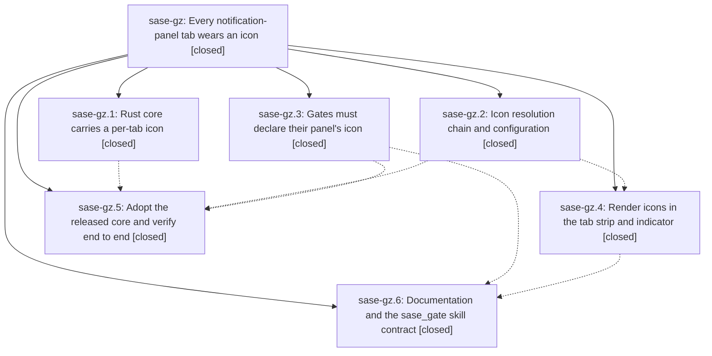

# Bead: sase-gz — Every notification-panel tab wears an icon

[Bead Pages](../README.md) / sase-gz

**Status:** ✓ closed · **Resolution:** done · **Type:** ▸ plan · **Tier:** epic
**Owner:** `bryanbugyi34@gmail.com` · **Created by:** [bbugyi200.athena.ui.w1](https://github.com/sase-org/sase--agents/blob/main/agents/bbugyi200.athena.ui.w1/README.md) · **Assignee:** `sase-gz.land`
**Created:** 2026-08-07 10:28:17 EDT · **Closed:** 2026-08-07 12:57:23 EDT
**Plan:** [202608/notification\_tab\_icons.md](https://github.com/sase-org/sase--plans/blob/main/202608/notification_tab_icons.md)

## Description

Every notification-panel tab renders a meaningful icon in the panel's tab strip and in the top-bar indicator's per-tab chips, resolved through a chain that can never come up empty; the Snoozed count sheds its `z` suffix for a moon glyph; and any gate that declares a new panel tab must declare that tab's icon.

## Notes

[2026-08-07T16:31:08Z · sase-gv.land] DISCOVERED ISSUE: this epic's own symvision whitelist entry now fails 'just check' repo-wide. Justfile:273 carries --epic-symbol 'sase-gz.4(resolve_notification_tab_icon)', and sase-gz.4 closed at 2026-08-07T15:58:17Z, so symvision refuses the entry:

  Error: --epic-symbol 'sase-gz.4(resolve_notification_tab_icon)': bead 'sase-gz.4' is closed. Remove this stale --epic-symbol entry and clean up the symbol.
  error: recipe `_lint-symvision` failed on line 274 with exit code 1

Reproduced on a clean master (3b5c76da4) plus only epic sase-gv's landing edits: 'just check' aborts at the symvision gate before its test lane, so no agent on this host can complete a required 'just check' until it is resolved. Not caused by sase-gv.

Running symvision without that entry shows the underlying symbol is still whitelist-worthy rather than deletable: src/sase/ace/tui/widgets/notification_tab_style.py's public resolve_notification_tab_icon is used only by tests/test_notification_tab_style.py, so it is reported as an unused public symbol. Landing sase-gz needs to either re-point the entry at the still-open phase sase-gz.6, make the symbol private, or give it a production caller. Left in place by sase-gv.land rather than edited, since it belongs to this epic's landing.

[2026-08-07T16:32:51Z · sase-gv.land] UPDATE to the DISCOVERED ISSUE note above (sase-gv.land): resolved before this landing finished. Commit 3867fe37c (feat(ace): render notification icons in the tab strip and indicator chips) dropped the --epic-symbol 'sase-gz.4(resolve_notification_tab_icon)' line from the Justfile, and symvision is green on origin/master at d364936e2. No action needed; recorded so the earlier note is not chased.

[2026-08-07T16:57:23Z · sase-gz.land] Verified all six phases against the source and their commits (72148dcab icon-chain, 61ace0852 gate-contract, 94430f0f9 core-floor, 3867fe37c + 72a3ab92c render, c9b0e2958 docs-skill; sase-core ce8c04b released as sase-core-rs 0.19.2). Confirmed on master c9b0e2958: resolve_notification_tab_icon implements all four rungs plus the '•' last resort with _BUILTIN_TAB_ICONS/_KIND_TAB_ICONS matching default_config.yml's six icon entries and sase.schema.json's icon field; presentation.panel_icon is normalized, required whenever panel is declared, protected in action_data, projected by the service, declared as '◈' by both bead gate producers, and settable via gate create -P; _NotificationTabWire carries icon so the sender-declared rung is live end to end; the indicator renders <icon><count> chips with the ☾ snoozed badge and cell-aware tooltip columns; the tab strip renders the icon in tab color with click ranges measured in cells. The sase-gz.4 symvision --epic-symbol entry is gone from the Justfile. just check-full green (all lint gates + full suite) and just test-visual 419 passed / 1 skipped.

INTEGRATION with the 16 non-epic commits since 72148dcab: c30958a57's test_task_gate split preserved the panel_icon presentation and action_data assertions; d7f34d84d's entry-jump goldens conflicted during rebase and were reconciled by 72a3ab92c; 86c9b3181's 88-char markdown width is satisfied by the epic's later docs commit (fmt (markdown) green); 364bb6f99's deferred skill-deploy warning is what made the epic's own skill drift non-blocking. Confirmed no gate producer outside this repo needs panel_icon: sase-github, sase-telegram, and sase-nvim author no gate request declaring a panel, so the plan's blast-radius survey still holds. sase-core has moved to 0.19.3 (bfdc411, a bead-snooze note feature) which the >=0.19.2,<0.20.0 floor already admits and which does not touch the tab-icon contract.

EPIC WORK FINISHED DURING LANDING (1): sase-gz.4's tag-strip clipping proposal was an epic-caused regression, not a follow-up — the added icons took the four-tab strip from 45 to 53 cells against a ~43-cell modal, pushing 'Done' entirely off screen and out of _tab_ranges, so it was neither visible nor clickable, and sase-gz.4 dropped that golden's 'Done' assertion to accommodate it. Fixed in NotificationTagStrip by reflowing on resize the way PanelTabStrip already does: when the full-label render would overflow the widget, inactive tabs shed their labels and are identified by the icon the chain guarantees, while the active tab keeps its name. The four-tab fixture drops 53 -> 35 cells, every tab stays rendered and clickable, and the golden was regenerated and reviewed. Added four tests plus the restored visual assertion.

DEFERRED DEPLOY COMPLETED (2): sase-gz.2, sase-gz.3, and sase-gz.5 each proposed the sase_gate chezmoi skill deploy that sase-gz.6's phase text deliberately postponed to landing. Ran sase skill init --force from this clean tree (HEAD == origin/master; recorded manifest commit b5ea6fa01 was a strict ancestor, so the provenance relation was forwards): 5 provider SKILL.md copies rewritten, manifest refreshed, chezmoi commit 40fc093f pushed and applied. sase init skills --check is now clean and the live ~/.claude copy carries the panel_icon contract.

RESOLVED WITHOUT ACTION (3): sase-gz.5's init memory --check drift is green. sase-gz.4's six bead-snooze failures were a stale linked-core build — after just install (sase-core 0.19.3) all 79 tests in test_cli_snooze.py, test_snooze_gate.py, and test_snooze_lifecycle.py pass. sase-gz.4's three stale config_center_edit_* goldens were already regenerated by that phase.

FILED (2): sase-h2 (medium, ready) for sase-gz.4's symbol-fallback-font proposal — not epic-caused, since the fixture font never carried these glyphs and ✉ has been tofu in goldens since epic sase-gn, but the epic makes it consequential and the landing fix above raises the stakes further by identifying narrow-strip tabs by icon alone. sase-h3 (small, ready) for a defect found while landing: sase validate captures each check's stdout and prints it only on failure, so 364bb6f99's 'redeploy is deferred until land' warning never reaches anyone running sase validate or just check — which is why three phase agents each rediscovered the same skill drift by hand. No proposal was declined.

[2026-08-07T17:05:48Z · sase-gz.land] Verified all six phases against source and commits: the four-rung resolve_notification_tab_icon chain with _BUILTIN_TAB_ICONS/_KIND_TAB_ICONS matching default_config.yml and the schema; presentation.panel_icon normalized, required-with-panel, protected in action_data, projected by the service, declared as a diamond icon by both bead gate producers, plus the -P/--panel-icon CLI override; _NotificationTabWire.icon making the sender-declared rung live end to end; <icon><count> indicator chips with the snoozed badge; cell-measured tab-strip click ranges. Integrated the 16 non-epic commits since 72148dcab: the test_task_gate split kept the panel_icon assertions, the entry-jump golden conflict was reconciled by 72a3ab92c, and no downstream plugin (sase-github, sase-telegram, sase-nvim) authors a panel-declaring gate, so the breaking contract needs no downstream change. Fixed one epic-caused regression: the icons took the four-tab strip from 45 to 53 cells against a ~43-cell modal, dropping 'Done' out of both the render and _tab_ranges; NotificationTagStrip now reflows on resize like PanelTabStrip, shedding inactive labels so every tab stays visible and clickable. Completed the deferred skill redeploy (chezmoi 40fc093f). Filed sase-h2 (symbol-fallback font) and sase-h3 (sase validate swallows check stdout on success); no proposal declined.

## Phases

| Bead | Title | Status | Size | Created | Agents | Commits |
|---|---|---|---|---|---:|---:|
| [sase-gz.1](sase-gz.1.md) | Rust core carries a per-tab icon | ✓ closed | medium | 2026-08-07 | 1 | 1 |
| [sase-gz.2](sase-gz.2.md) | Icon resolution chain and configuration | ✓ closed | medium | 2026-08-07 | 1 | 1 |
| [sase-gz.3](sase-gz.3.md) | Gates must declare their panel's icon | ✓ closed | medium | 2026-08-07 | 1 | 1 |
| [sase-gz.4](sase-gz.4.md) | Render icons in the tab strip and indicator | ✓ closed | medium | 2026-08-07 | 1 | 2 |
| [sase-gz.5](sase-gz.5.md) | Adopt the released core and verify end to end | ✓ closed | small | 2026-08-07 | 1 | 1 |
| [sase-gz.6](sase-gz.6.md) | Documentation and the sase\_gate skill contract | ✓ closed | small | 2026-08-07 | 1 | 1 |

## Lineage

## Agents

| Agent | Bead | Commits |
|---|---|---:|
| [bbugyi200.athena.sase-gz.1](https://github.com/sase-org/sase--agents/blob/main/agents/bbugyi200.athena.sase-gz.1/README.md) | [sase-gz.1](sase-gz.1.md) | 1 |
| [bbugyi200.athena.sase-gz.2](https://github.com/sase-org/sase--agents/blob/main/agents/bbugyi200.athena.sase-gz.2/README.md) | [sase-gz.2](sase-gz.2.md) | 1 |
| [bbugyi200.athena.sase-gz.3](https://github.com/sase-org/sase--agents/blob/main/agents/bbugyi200.athena.sase-gz.3/README.md) | [sase-gz.3](sase-gz.3.md) | 1 |
| [bbugyi200.athena.sase-gz.4](https://github.com/sase-org/sase--agents/blob/main/agents/bbugyi200.athena.sase-gz.4/README.md) | [sase-gz.4](sase-gz.4.md) | 2 |
| [bbugyi200.athena.sase-gz.5](https://github.com/sase-org/sase--agents/blob/main/agents/bbugyi200.athena.sase-gz.5/README.md) | [sase-gz.5](sase-gz.5.md) | 1 |
| [bbugyi200.athena.sase-gz.6](https://github.com/sase-org/sase--agents/blob/main/agents/bbugyi200.athena.sase-gz.6/README.md) | [sase-gz.6](sase-gz.6.md) | 1 |
| [bbugyi200.athena.sase-gz.land](https://github.com/sase-org/sase--agents/blob/main/agents/bbugyi200.athena.sase-gz.land/README.md) | [sase-gz](README.md) | 1 |

## Commits

| Repo | Commit | Subject | Bead | Committed |
|---|---|---|---|---|
| sase-core | [`sase-core@ce8c04b`](https://github.com/sase-org/sase-core/commit/ce8c04ba94ade551e8972f3314935d1130949ecb) | feat(notifications): donate a per-tab icon from the newest declaring row | [sase-gz.1](sase-gz.1.md) | 2026-08-07 10:45:21 EDT |
| sase | [`72148dc`](https://github.com/sase-org/sase/commit/72148dcab071a6f4ee1bc69832b1d96481a22ef0) | feat(ace): resolve notification tab icons through a four-rung chain | [sase-gz.2](sase-gz.2.md) | 2026-08-07 11:15:20 EDT |
| sase | [`61ace08`](https://github.com/sase-org/sase/commit/61ace0852e8d40a4bd99ab5b8a0ad74e2325949e) | feat(gates)!: require gates to declare their panel's icon | [sase-gz.3](sase-gz.3.md) | 2026-08-07 11:17:55 EDT |
| sase | [`94430f0`](https://github.com/sase-org/sase/commit/94430f0f945002114ee1621cc1f0f0eb2abd4477) | fix(notifications): declare icon field on \_NotificationTabWire, raise sase-core-rs floor to 0.19.2 | [sase-gz.5](sase-gz.5.md) | 2026-08-07 11:56:08 EDT |
| sase | [`3867fe3`](https://github.com/sase-org/sase/commit/3867fe37c8419c5e46af869a0cb7ec5d4a9b9670) | feat(ace): render notification icons in the tab strip and indicator chips | [sase-gz.4](sase-gz.4.md) | 2026-08-07 12:00:14 EDT |
| sase | [`72a3ab9`](https://github.com/sase-org/sase/commit/72a3ab92c448eeb95131e2b0308e82df78aa5f5e) | test(ace): refresh Admin Center goldens for the notification badge | [sase-gz.4](sase-gz.4.md) | 2026-08-07 12:04:28 EDT |
| sase | [`c9b0e29`](https://github.com/sase-org/sase/commit/c9b0e2958282b10e58098b8760b4bb321bafddd4) | docs(ace): document notification tab icons and panel\_icon gate contract | [sase-gz.6](sase-gz.6.md) | 2026-08-07 12:32:36 EDT |
| sase | [`07742d7`](https://github.com/sase-org/sase/commit/07742d7bdf9d98c1c0f1cd91af147f2b590352fd) | fix(ace): reflow the notification tag strip instead of clipping tabs | [sase-gz](README.md) | 2026-08-07 13:14:27 EDT |
