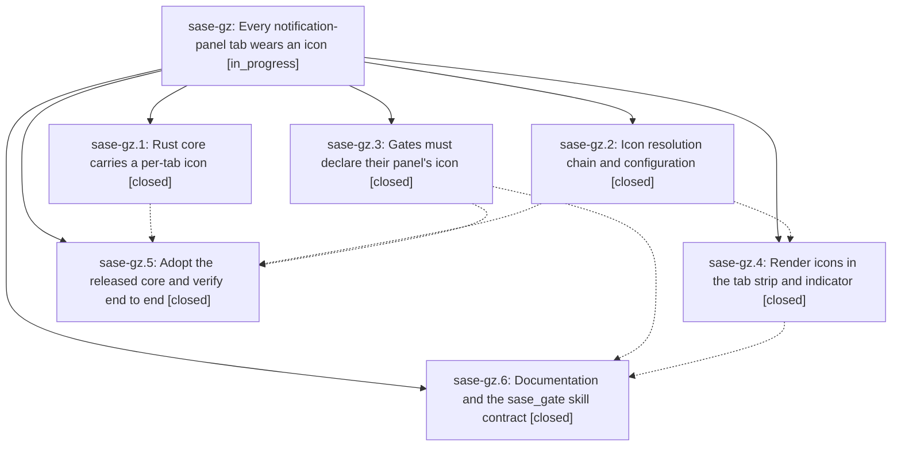

# Bead: sase-gz — Every notification-panel tab wears an icon

[Bead Pages](../README.md) / sase-gz

**Status:** ◐ in_progress · **Type:** ▸ plan · **Tier:** epic
**Owner:** `bryanbugyi34@gmail.com` · **Created by:** [bbugyi200.athena.ui.w1](https://github.com/sase-org/sase--agents/blob/main/agents/bbugyi200.athena.ui.w1/README.md) · **Assignee:** `sase-gz.land`
**Created:** 2026-08-07 10:28:17 EDT
**Plan:** [202608/notification\_tab\_icons.md](https://github.com/sase-org/sase--plans/blob/main/202608/notification_tab_icons.md)

## Description

Every notification-panel tab renders a meaningful icon in the panel's tab strip and in the top-bar indicator's per-tab chips, resolved through a chain that can never come up empty; the Snoozed count sheds its `z` suffix for a moon glyph; and any gate that declares a new panel tab must declare that tab's icon.

## Notes

[2026-08-07T16:31:08Z · sase-gv.land] DISCOVERED ISSUE: this epic's own symvision whitelist entry now fails 'just check' repo-wide. Justfile:273 carries --epic-symbol 'sase-gz.4(resolve_notification_tab_icon)', and sase-gz.4 closed at 2026-08-07T15:58:17Z, so symvision refuses the entry:

  Error: --epic-symbol 'sase-gz.4(resolve_notification_tab_icon)': bead 'sase-gz.4' is closed. Remove this stale --epic-symbol entry and clean up the symbol.
  error: recipe `_lint-symvision` failed on line 274 with exit code 1

Reproduced on a clean master (3b5c76da4) plus only epic sase-gv's landing edits: 'just check' aborts at the symvision gate before its test lane, so no agent on this host can complete a required 'just check' until it is resolved. Not caused by sase-gv.

Running symvision without that entry shows the underlying symbol is still whitelist-worthy rather than deletable: src/sase/ace/tui/widgets/notification_tab_style.py's public resolve_notification_tab_icon is used only by tests/test_notification_tab_style.py, so it is reported as an unused public symbol. Landing sase-gz needs to either re-point the entry at the still-open phase sase-gz.6, make the symbol private, or give it a production caller. Left in place by sase-gv.land rather than edited, since it belongs to this epic's landing.

## Phases

| Bead | Title | Status | Size | Created | Agents | Commits |
|---|---|---|---|---|---:|---:|
| [sase-gz.1](sase-gz.1.md) | Rust core carries a per-tab icon | ✓ closed | medium | 2026-08-07 | 1 | 1 |
| [sase-gz.2](sase-gz.2.md) | Icon resolution chain and configuration | ✓ closed | medium | 2026-08-07 | 1 | 1 |
| [sase-gz.3](sase-gz.3.md) | Gates must declare their panel's icon | ✓ closed | medium | 2026-08-07 | 1 | 1 |
| [sase-gz.4](sase-gz.4.md) | Render icons in the tab strip and indicator | ✓ closed | medium | 2026-08-07 | 1 | 2 |
| [sase-gz.5](sase-gz.5.md) | Adopt the released core and verify end to end | ✓ closed | small | 2026-08-07 | 1 | 1 |
| [sase-gz.6](sase-gz.6.md) | Documentation and the sase\_gate skill contract | ✓ closed | small | 2026-08-07 | 1 | 1 |

## Lineage

## Agents

| Agent | Bead | Commits |
|---|---|---:|
| [bbugyi200.athena.sase-gz.1](https://github.com/sase-org/sase--agents/blob/main/agents/bbugyi200.athena.sase-gz.1/README.md) | [sase-gz.1](sase-gz.1.md) | 1 |
| [bbugyi200.athena.sase-gz.2](https://github.com/sase-org/sase--agents/blob/main/agents/bbugyi200.athena.sase-gz.2/README.md) | [sase-gz.2](sase-gz.2.md) | 1 |
| [bbugyi200.athena.sase-gz.3](https://github.com/sase-org/sase--agents/blob/main/agents/bbugyi200.athena.sase-gz.3/README.md) | [sase-gz.3](sase-gz.3.md) | 1 |
| [bbugyi200.athena.sase-gz.4](https://github.com/sase-org/sase--agents/blob/main/agents/bbugyi200.athena.sase-gz.4/README.md) | [sase-gz.4](sase-gz.4.md) | 2 |
| [bbugyi200.athena.sase-gz.5](https://github.com/sase-org/sase--agents/blob/main/agents/bbugyi200.athena.sase-gz.5/README.md) | [sase-gz.5](sase-gz.5.md) | 1 |
| [bbugyi200.athena.sase-gz.6](https://github.com/sase-org/sase--agents/blob/main/agents/bbugyi200.athena.sase-gz.6/README.md) | [sase-gz.6](sase-gz.6.md) | 1 |
| [bbugyi200.athena.sase-gz.land](https://github.com/sase-org/sase--agents/blob/main/agents/bbugyi200.athena.sase-gz.land/README.md) | [sase-gz](README.md) | 0 |

## Commits

| Repo | Commit | Subject | Bead | Committed |
|---|---|---|---|---|
| sase-core | [`sase-core@ce8c04b`](https://github.com/sase-org/sase-core/commit/ce8c04ba94ade551e8972f3314935d1130949ecb) | feat(notifications): donate a per-tab icon from the newest declaring row | [sase-gz.1](sase-gz.1.md) | 2026-08-07 10:45:21 EDT |
| sase | [`72148dc`](https://github.com/sase-org/sase/commit/72148dcab071a6f4ee1bc69832b1d96481a22ef0) | feat(ace): resolve notification tab icons through a four-rung chain | [sase-gz.2](sase-gz.2.md) | 2026-08-07 11:15:20 EDT |
| sase | [`61ace08`](https://github.com/sase-org/sase/commit/61ace0852e8d40a4bd99ab5b8a0ad74e2325949e) | feat(gates)!: require gates to declare their panel's icon | [sase-gz.3](sase-gz.3.md) | 2026-08-07 11:17:55 EDT |
| sase | [`94430f0`](https://github.com/sase-org/sase/commit/94430f0f945002114ee1621cc1f0f0eb2abd4477) | fix(notifications): declare icon field on \_NotificationTabWire, raise sase-core-rs floor to 0.19.2 | [sase-gz.5](sase-gz.5.md) | 2026-08-07 11:56:08 EDT |
| sase | [`3867fe3`](https://github.com/sase-org/sase/commit/3867fe37c8419c5e46af869a0cb7ec5d4a9b9670) | feat(ace): render notification icons in the tab strip and indicator chips | [sase-gz.4](sase-gz.4.md) | 2026-08-07 12:00:14 EDT |
| sase | [`72a3ab9`](https://github.com/sase-org/sase/commit/72a3ab92c448eeb95131e2b0308e82df78aa5f5e) | test(ace): refresh Admin Center goldens for the notification badge | [sase-gz.4](sase-gz.4.md) | 2026-08-07 12:04:28 EDT |
| sase | [`c9b0e29`](https://github.com/sase-org/sase/commit/c9b0e2958282b10e58098b8760b4bb321bafddd4) | docs(ace): document notification tab icons and panel\_icon gate contract | [sase-gz.6](sase-gz.6.md) | 2026-08-07 12:32:36 EDT |
