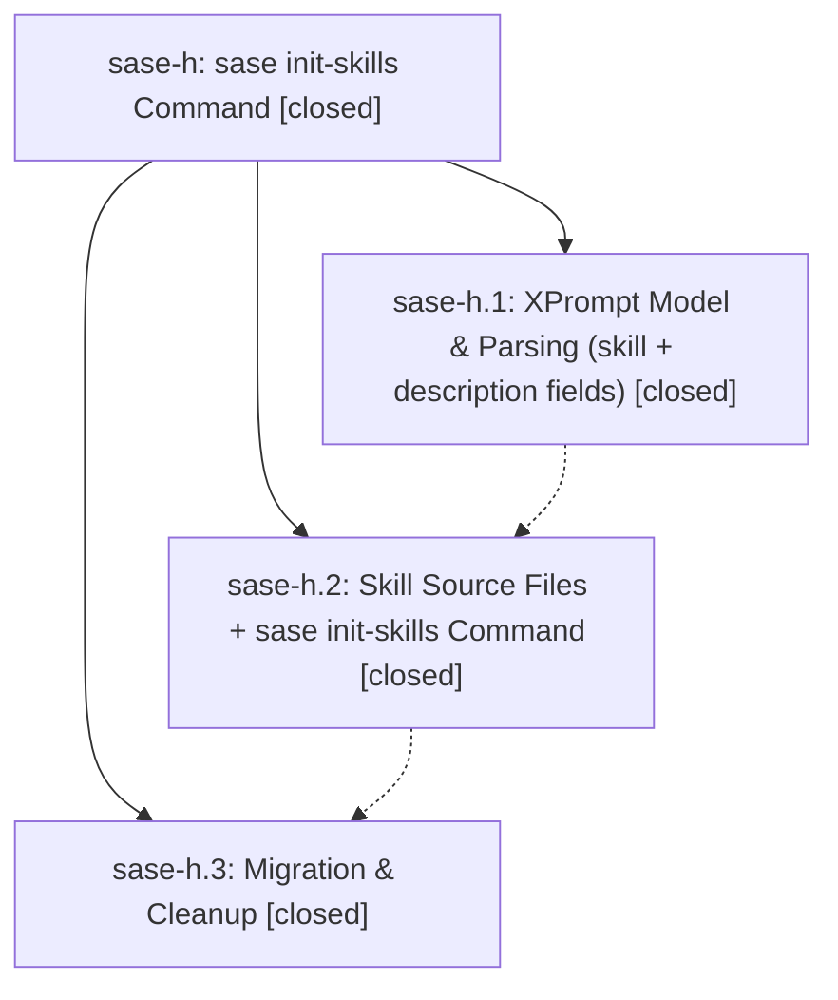

# Bead: sase-h — sase init-skills Command

[Bead Pages](../README.md) / sase-h

**Status:** ✓ closed · **Resolution:** (unrecorded) · **Type:** plan · **Tier:** epic
**Owner:** `bryanbugyi34@gmail.com`
**Created:** 2026-04-12 00:48:57 UTC · **Closed:** 2026-04-12 01:27:04 UTC
**Plan:** [202604/init\_skills\_1.md](https://github.com/sase-org/sase--plans/blob/main/202604/init_skills_1.md)

## Phases

| Bead | Title | Status | Size | Agents | Commits |
|---|---|---|---|---:|---:|
| [sase-h.1](sase-h.1.md) | XPrompt Model & Parsing (skill + description fields) | ✓ closed | small | 0 | 0 |
| [sase-h.2](sase-h.2.md) | Skill Source Files + sase init-skills Command | ✓ closed | small | 0 | 1 |
| [sase-h.3](sase-h.3.md) | Migration & Cleanup | ✓ closed | small | 0 | 1 |

## Lineage

## Commits

| Commit | Subject | Bead | Committed (UTC) |
|---|---|---|---|
| [`731a7f8`](https://github.com/sase-org/sase/commit/731a7f884c651e5367717c50886a55863b50e00e) | feat(init-skills): Add \`sase init-skills\` command and skill source files (sase-h.2) | [sase-h.2](sase-h.2.md) | 2026-04-12 01:18:00 |
| [`31d4200`](https://github.com/sase-org/sase/commit/31d420065d6a726ab8503535cc0df5de141409f3) | docs: Document generated skill files workflow in AGENTS.md (sase-h.3) | [sase-h.3](sase-h.3.md) | 2026-04-12 01:24:59 |
