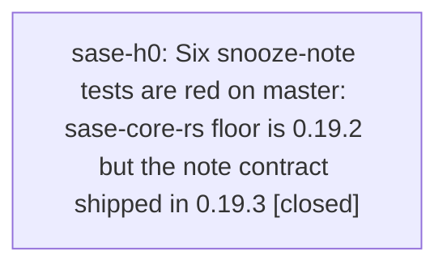

# Bead: sase-h0 — Six snooze-note tests are red on master: sase-core-rs floor is 0.19.2 but the note contract shipped in 0.19.3

[Bead Pages](../README.md) / sase-h0

**Status:** ✓ closed · **Resolution:** done · **Type:** ◆ task
**Owner:** `bryanbugyi34@gmail.com` · **Created by:** [bbugyi200.athena.sase-gv.land](https://github.com/sase-org/sase--agents/blob/main/agents/bbugyi200.athena.sase-gv.land/README.md) · **Assignee:** `sase-h0` · **Size:** xsmall
**Created:** 2026-08-07 12:34:46 EDT · **Closed:** 2026-08-07 12:50:13 EDT

## Description

Found by epic land agent sase-gv.land while running the full suite over epic sase-gv's landing tree. Not caused by sase-gv (it touches only ACE Admin Center jump code). Reproduced on a clean tree via 'git stash' and again on origin/master at d364936e2.

FAILING (6 nodes, 'just test' and a direct pytest run alike):
  tests/test_bead/test_cli_snooze.py::test_snooze_leaves_one_note_naming_wake_time_length_target_and_reason
  tests/test_bead/test_cli_snooze.py::test_bare_snooze_with_no_reason_or_target_still_leaves_a_note
  tests/test_bead/test_cli_snooze.py::test_re_snoozing_appends_a_second_note_naming_the_replaced_wake_time
  tests/test_bead/test_cli_snooze.py::test_a_multiline_reason_collapses_to_one_note_but_keeps_the_raw_reason
  tests/test_bead/test_snooze_gate.py::test_bead_snooze_gate_preview_carries_the_real_snooze_note
  tests/test_bead/test_snooze_lifecycle.py::test_snooze_round_trips_through_every_persistence_surface

SYMPTOM: every one asserts the snooze note text and gets an empty notes field, e.g.
  assert stored.notes == '[2026-08-06T16:00:00Z . bryan] Snoozed until 2026-08-09T12:00:00-04:00 (in 3d).'
  AssertionError: assert '' == '[2026-08-06T...'

ROOT CAUSE: commit 8865cf54d (test(bead): pin the snooze note contract across CLI, gate, and lifecycle, plan 202608/snooze_note.md) added these tests for behavior that lives in the Rust core -- sase-core commit bfdc411 'feat(bead): append a snooze note recording wake conditions', first released in sase-core v0.19.3 (4d1d05f). pyproject.toml:46 still pins 'sase-core-rs>=0.19.2,<0.20.0', so the resolved wheel is 0.19.2 and snooze_task never appends the note. Confirmed: 'uv pip show sase-core-rs' reports 0.19.2 installed, and the linked sase-core checkout at v0.19.3 does contain the note code (crates/sase_core/src/bead/mutation.rs:450).

FIX: raise the floor to 'sase-core-rs>=0.19.3,<0.20.0' and refresh uv.lock, the same shape as commit 94430f0f9 which raised the floor to 0.19.2. 'uv pip install --dry-run sase-core-rs>=0.19.3' resolves, so the wheel is published. Re-run the six nodes plus tests/test_sase_core_rs_telemetry_smoke_tool.py, which also pins the floor.

IMPACT: 'just test' and 'just check-full' cannot go green on master for any agent until the pin moves.

## Notes

[2026-08-07T16:50:13Z · sase-h0] Raised sase-core-rs floor to >=0.19.3,<0.20.0 in pyproject.toml and refreshed uv.lock (uv lock resolved 0.19.2 -> 0.19.3). Reinstalled via just install. Updated tests/test_sase_core_rs_telemetry_smoke_tool.py::test_declared_minimum_tracks_pyproject_dependency to expect 0.19.3. Verified all 6 originally-failing snooze tests plus the telemetry smoke test pass (82 passed in tests/test_bead/test_cli_snooze.py, test_snooze_gate.py, test_snooze_lifecycle.py, test_sase_core_rs_telemetry_smoke_tool.py). Ran 'just check', which escalated to the full suite due to the packaging change and passed cleanly.

[2026-08-07T16:50:39Z · sase-h0] Raised sase-core-rs floor to >=0.19.3,<0.20.0 in pyproject.toml, refreshed uv.lock, updated telemetry smoke test expected version; all 6 previously-failing snooze tests pass; just check passed (escalated to full suite).

## Lineage

## Agents

| Agent | Bead | Commits |
|---|---|---:|
| [bbugyi200.athena.sase-h0](https://github.com/sase-org/sase--agents/blob/main/agents/bbugyi200.athena.sase-h0/README.md) | [sase-h0](README.md) | 1 |

## Commits

| Repo | Commit | Subject | Bead | Committed |
|---|---|---|---|---|
| sase | [`7bdeee0`](https://github.com/sase-org/sase/commit/7bdeee08e25708e3775330fc59bead099e48b332) | fix(deps): raise sase-core-rs floor to 0.19.3 for snooze note contract | [sase-h0](README.md) | 2026-08-07 12:51:11 EDT |
