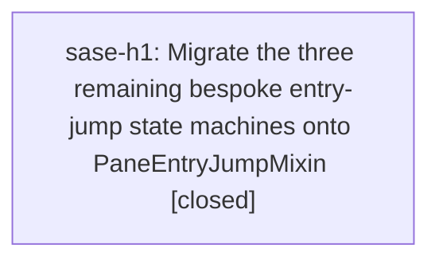

# Bead: sase-h1 — Migrate the three remaining bespoke entry-jump state machines onto PaneEntryJumpMixin

[Bead Pages](../README.md) / sase-h1

**Status:** ✓ closed · **Resolution:** done · **Type:** ◆ task
**Owner:** `bryanbugyi34@gmail.com` · **Created by:** [bbugyi200.athena.sase-gv.land](https://github.com/sase-org/sase--agents/blob/main/agents/bbugyi200.athena.sase-gv.land/README.md) · **Assignee:** `sase-h1` · **Size:** medium
**Created:** 2026-08-07 12:36:19 EDT · **Closed:** 2026-08-07 13:00:43 EDT

## Description

Proposed by epic land agent sase-gv.land after landing epic sase-gv (Apostrophe entry jump on every Admin Center tab). Not a defect and not caused by that epic: these three modals predate it and were explicitly out of its Admin-Center-only scope. Filing it because sase-gv created the shared mixin that makes the consolidation possible, and its plan's goal line ('Exactly one implementation of that state machine exists in the tree when this epic lands') reads as unfinished until they move.

sase-gv added src/sase/ace/tui/modals/pane_entry_jump.py: PaneEntryJumpMixin owns hint allocation via build_jump_hint_maps, the pending-prefix matcher via match_jump_hint, and a back stack capped at JUMP_BACK_STACK_LIMIT, behind four host hooks (_jump_target_count, _jump_current_index, _jump_select_index, _jump_repaint). All seven Admin Center working tabs now share it.

Three modals still hand-roll the same state machine against the same jump_hints helpers:
  - src/sase/ace/tui/modals/notification_modal_options.py (_entry_jump_mode_active, _entry_jump_pending_prefix; state lives on notification_modal.py:107)
  - src/sase/ace/tui/modals/model_picker_modal.py (_model_jump_mode_active, _model_jump_pending_prefix, _model_jump_hint_to_id/_id_to_hint -- note this one hints by option *id* rather than by index)
  - src/sase/ace/tui/modals/saved_agent_group_revival_modal.py (_entry_jump_mode_active, _entry_jump_pending_prefix; it also owns apply_jump_hint_prefix in saved_agent_group_revival_rendering.py, which pane_entry_jump.py re-exports)

Each duplicates enter/pend/complete/cancel and its own hint bookkeeping, so a fix to one does not reach the others -- exactly what sase-gv.land had to hand-fix three times for the g/G interception bug. Scope: adopt the mixin in all three, keeping each modal's existing selection path inside _jump_select_index, and reconcile the id-keyed hints in model_picker_modal with the mixin's logical-index space (either map id to index in the host hook or widen the mixin). Existing tests for all three should pass with only attribute-name edits; treat any behavior difference as a migration bug, the way sase-gv.1 did for LogsPane.

## Notes

[2026-08-07T17:00:43Z · sase-h1] Migrated all three bespoke entry-jump state machines onto the shared mixin.

Added KeyedPaneEntryJumpMixin[K] to src/sase/ace/tui/modals/pane_entry_jump.py: a thin
adapter over PaneEntryJumpMixin that translates between a host's key space (option id,
notification index) and the mixin's logical-index space in one place, via three hooks
(_jump_target_keys / _jump_current_key / _jump_select_key) plus jump_hints_by_key() for
rendering. This is how model_picker_modal's id-keyed hints were reconciled, rather than
widening the base mixin.

Adopted it in notification_modal_options.py (NotificationOptionMixin), model_picker_modal.py,
and saved_agent_group_revival_modal.py. Deleted from all three: enter/pend/complete/cancel
handling, hint-map bookkeeping, and the per-modal last-target field
(_entry_jump_last_index / _model_jump_last_id / _entry_jump_last_option_id). Each modal now
supplies only its own row list, selection path, and repaint; jump_hints_by_key() feeds the
existing hint-prefix rendering, and _update_hint_footer/_update_jump_footer/_update_hints
read jump_mode_active + jump_back_stack. No bespoke jump state machine remains outside the
main ace app (which is a different, multi-target-type machine and out of this bead's scope).

Intentional behavior change, the mixin's semantics winning as the single implementation:
' back now pops a bounded back stack instead of toggling one saved last-target, and the
footer reads 'back' only while that stack is non-empty. Row-set changes that shift logical
positions (model-picker refilter, revival pagination/delete) now call
invalidate_jump_hints(identities_changed=True), which drops the back stack along with the
hints instead of leaving it pointing at renamed rows.

Verified: updated tests/test_notification_modal_jump.py, tests/test_model_picker_jump.py,
tests/test_model_picker_aliases.py, and
tests/ace/tui/modals/test_saved_agent_group_revival_jump_mode.py to the shared attribute
names and the back-stack semantics (38 passed). No behavior assertion other than the two
back-jump ones needed rewriting. 'just check-full' is fully green: every lint gate (ruff,
mypy, symvision, keep-sorted, pyscripts, changelog, toobig), SASE validation, and the full
test suite. Net -161 lines.

[2026-08-07T17:01:22Z · sase-h1] Verified: just check-full green (all lint gates + full test suite); 38 modal jump tests pass.

## Lineage

## Dependencies

- **Depends on:** [sase-gv](../sase-gv/README.md) ✓ · ⧖ 2026-08-07

## Agents

| Agent | Bead | Commits |
|---|---|---:|
| [bbugyi200.athena.sase-h1](https://github.com/sase-org/sase--agents/blob/main/agents/bbugyi200.athena.sase-h1/README.md) | [sase-h1](README.md) | 1 |

## Commits

| Repo | Commit | Subject | Bead | Committed |
|---|---|---|---|---|
| sase | [`4eb631e`](https://github.com/sase-org/sase/commit/4eb631e35530228334162002e64385e98d19178e) | refactor(ace)!: migrate remaining modal entry jumps onto PaneEntryJumpMixin | [sase-h1](README.md) | 2026-08-07 13:02:08 EDT |
