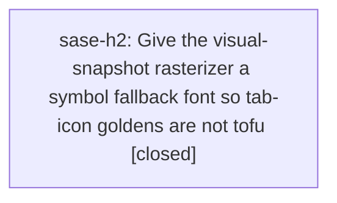

# Bead: sase-h2 — Give the visual-snapshot rasterizer a symbol fallback font so tab-icon goldens are not tofu

[Bead Pages](../README.md) / sase-h2

**Status:** ✓ closed · **Resolution:** done · **Type:** ◆ task
**Owner:** `bryanbugyi34@gmail.com` · **Created by:** [bbugyi200.athena.sase-gz.land](https://github.com/sase-org/sase--agents/blob/main/agents/bbugyi200.athena.sase-gz.land/README.md) · **Assignee:** `sase-h2` · **Size:** medium
**Created:** 2026-08-07 12:53:39 EDT · **Closed:** 2026-08-07 14:03:44 EDT

## Description

Proposed by epic phase sase-gz.4 (Render icons in the tab strip and indicator) and filed by epic land agent sase-gz.land. Not caused by that epic: the defect predates it, and sase-gz.4's ✉ box has been in committed goldens since epic sase-gn introduced the indicator. sase-gz made it consequential, because the ACE notification tab strip and top-bar indicator now identify every tab by a glyph.

tests/ace/tui/visual/fonts holds only Fira Code 6.2 and the visual fixtures pin fontconfig with skip_system_fonts=True. Fira Code carries none of the glyphs the notification tab-icon chain resolves — ⚑ ✖ ◈ ✉ ☾ ⊘ — nor any of the plan's listed alternates except ◆ ▪ # •. Those glyphs therefore rasterize as replacement boxes in every PNG golden while rendering correctly in a real terminal.

Reproduce: open tests/ace/tui/visual/snapshots/png/notification_beads_tab_120x40.png and read the tab strip; every icon is a box. Same for the indicator badge band in any 120x40 golden.

Impact: the goldens cannot distinguish a real glyph from tofu, so the 'glyph audit' the notification_tab_icons plan specified — every glyph must render as a real mark, not tofu, in the pinned fixture font — cannot actually be performed. Any future icon change (a new built-in tab, a kind default, a user-configured glyph) is unverifiable the same way. The stakes rose again in sase-gz.land, which made a narrow tab strip drop inactive labels and identify those tabs by icon alone.

Scope: add a symbol-bearing fallback font to tests/ace/tui/visual/fonts and register it in the fixture's fontconfig so the rasterizer resolves it after Fira Code, keeping rendering deterministic (pinned version, still skip_system_fonts). Then regenerate the affected goldens and add an assertion or check that the bundled tab-icon glyph set rasterizes to non-tofu, so the glyph audit becomes mechanical.

## Notes

[2026-08-07T18:03:44Z · sase-h2] Added DejaVu Sans 2.37 (upstream release ttf, sha256 7da195a7…, Bitstream Vera/Arev licenses) to tests/ace/tui/visual/fonts as a symbol fallback and pinned it in renderer_env.json. Fira Code stays the named family for every generic, so resvg only reaches the new file for a codepoint Fira Code lacks; verified an ASCII-only render is byte-identical with and without DejaVu present, so the fallback is strictly additive.

Verified the exact defect the bead reported: with Fira Code alone, the six tab-icon glyphs U+2691 U+2716 U+25C8 U+2709 U+263E U+2298 rasterize as hex .notdef boxes; with the fallback all six render as real marks. notification_beads_tab_120x40.png now shows a flag/diamond/cross tab strip and a flag+envelope top-bar indicator instead of six boxes.

Made the glyph audit mechanical in the new tests/ace/tui/visual/test_tab_icon_glyphs.py (19 cases, marked visual): every icon ACE can choose with nothing configured — the default_config.yml ace.notification_tabs icons, the in-module built-ins, the per-kind defaults, and the last-resort mark — must be covered by a bundled font cmap and must rasterize to non-blank ink, plus a guard that the coverage assertion is not vacuous. Confirmed the audit fails on exactly those six glyphs when only Fira Code is bundled, so a future built-in tab, kind default, or font swap that reintroduces tofu is caught. Added fonttools==4.60.1 to the visual extra for the cmap read (deliberately not in renderer_env.json — it does not participate in rendering).

Regenerated 396 goldens with 'just update-visual-snapshots' on Linux; 'just test-visual' then passed 438/438 twice. Documented the fallback contract in fonts/README.md and docs/development.md. No src/ code changed: the audit reads the private icon tables directly rather than adding a test-only public accessor, which symvision rejects.

'just check' green on all gates in a single run (fmt python+markdown, keep-sorted, ruff, mypy, pyscripts, changelog, symvision, toobig, SASE validation, committed plans, scoped tests 27005 passed). Three earlier runs each flaked one different ACE TUI node under parallel load, each passing in isolation; controlled that against a stashed clean tree (green) and the restored tree (green) and corroborated sase-ct with the evidence.

Emoji-presentation glyphs (44 codepoints in src/sase) are still tofu and are deliberately out of scope — they need a monochrome emoji face, filed as ready task sase-h4 and recorded as a caveat in docs/development.md.

[2026-08-07T18:04:53Z · sase-h2] Added DejaVuSans.ttf fallback font for the ACE PNG visual renderer (pinned by sha256 in renderer_env.json); Fira Code remains the named family so the fallback is strictly additive (ASCII-only render byte-identical with and without it). Confirmed the six reported glyphs U+2691 U+2716 U+25C8 U+2709 U+263E U+2298 rendered as .notdef boxes before and render real marks after. Added tests/ace/tui/visual/test_tab_icon_glyphs.py (19 cases) asserting every default-reachable ACE icon is cmap-covered by a bundled font and rasterizes non-blank, with a vacuity guard; verified it fails on exactly those six when DejaVu is removed. Regenerated 396 goldens; just test-visual 438/438 green; just check green on all gates. Emoji tofu (44 codepoints) left out of scope and filed as sase-h4.

## Lineage

## Agents

| Agent | Bead | Commits |
|---|---|---:|
| [bbugyi200.athena.sase-h2](https://github.com/sase-org/sase--agents/blob/main/agents/bbugyi200.athena.sase-h2/README.md) | [sase-h2](README.md) | 1 |

## Commits

| Repo | Commit | Subject | Bead | Committed |
|---|---|---|---|---|
| sase | [`1a43f49`](https://github.com/sase-org/sase/commit/1a43f494535e2b21af388775b5278703a975a3f7) | test(visual): add a symbol fallback font so tab-icon goldens are not tofu | [sase-h2](README.md) | 2026-08-07 14:12:18 EDT |
