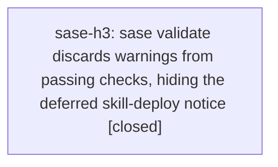

# Bead: sase-h3 — sase validate discards warnings from passing checks, hiding the deferred skill-deploy notice

[Bead Pages](../README.md) / sase-h3

**Status:** ✓ closed · **Resolution:** done · **Type:** ◆ task
**Owner:** `bryanbugyi34@gmail.com` · **Created by:** [bbugyi200.athena.sase-gz.land](https://github.com/sase-org/sase--agents/blob/main/agents/bbugyi200.athena.sase-gz.land/README.md) · **Assignee:** `sase-h3` · **Size:** small
**Created:** 2026-08-07 12:54:26 EDT · **Closed:** 2026-08-07 13:19:31 EDT

## Description

Discovered by epic land agent sase-gz.land while landing epic sase-gz. Not caused by that epic; the root cause is 364bb6f99 (fix(init): defer unresolvable skill deploy drift under --check to a warning, closes sase-gw).

364bb6f99 stopped 'sase init skills --check' from hard-failing on chezmoi deploy drift and instead emits a warning naming the required post-land rerun. Running it directly shows the warning and exits 0:

  $ .venv/bin/sase init skills --check
  Up to date:
    ok   init skills  provider skill files are current
  Warnings:
    init skills: 5 provider skill files out of sync with rendered sources; redeploy is deferred until land. Rerun `sase init skills` after landing.

But src/sase/main/validate_handler.py::_print_results only prints a check's captured stdout when its returncode is non-zero, so 'sase validate' reports a bare 'ok init skills --check' and drops the warning entirely. 'just check' inherits this — its SASE-validation stage printed a plain '✓ SASE validation' on a tree with five stale provider sase_gate/SKILL.md copies.

Reproduce on master c9b0e2958 with a stale chezmoi skill deploy: '.venv/bin/sase validate' prints five ok lines and no warning, while '.venv/bin/sase init skills --check' prints the Warnings block.

Impact: the warning exists precisely to tell whoever lands a skill-source change to redeploy, and 'sase validate' / 'just check' is where agents actually look. Three sase-gz phase agents each rediscovered the same drift by hand instead. Any other check that warns while exiting 0 is invisible the same way.

Scope: surface warnings from passing checks in sase validate's output (a Warnings section, distinct from the failure detail dump), keep the exit code at 0, and cover it with a test.

## Notes

[2026-08-07T17:19:31Z · sase-h3] Added _print_passing_warnings/_extract_check_warnings in src/sase/main/validate_handler.py to surface a passing check's Warnings: section in a distinct Warnings block (exit code stays 0, failure dump unchanged). Added test_validate_prints_warnings_section_for_passing_checks in tests/main/test_validate_handler.py. Verified: just install then just check — all lint gates green, SASE validation green, scoped test lane escalated to the full suite (core-identity-changed) and passed.

## Lineage

## Agents

| Agent | Bead | Commits |
|---|---|---:|
| [bbugyi200.athena.sase-h3](https://github.com/sase-org/sase--agents/blob/main/agents/bbugyi200.athena.sase-h3/README.md) | [sase-h3](README.md) | 1 |

## Commits

| Repo | Commit | Subject | Bead | Committed |
|---|---|---|---|---|
| sase | [`9baffe8`](https://github.com/sase-org/sase/commit/9baffe83bcab46bed1623213b205051c5990e1e0) | fix(validate): surface passing checks' Warnings: section in sase validate | [sase-h3](README.md) | 2026-08-07 13:20:17 EDT |
