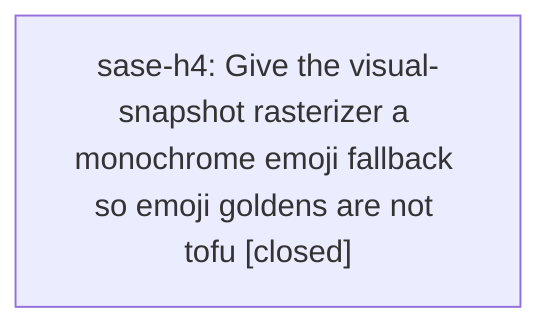

# Bead: sase-h4 — Give the visual-snapshot rasterizer a monochrome emoji fallback so emoji goldens are not tofu

[Bead Pages](../README.md) / sase-h4

**Status:** ✓ closed · **Resolution:** done · **Type:** ◆ task
**Owner:** `bryanbugyi34@gmail.com` · **Created by:** [bbugyi200.athena.sase-h2](https://github.com/sase-org/sase--agents/blob/main/agents/bbugyi200.athena.sase-h2/README.md) · **Assignee:** `sase-h4` · **Size:** small
**Created:** 2026-08-07 14:02:43 EDT · **Closed:** 2026-08-07 15:00:13 EDT

## Description

Follow-up discovered while completing sase-h2, which added DejaVu Sans to tests/ace/tui/visual/fonts as a symbol fallback and a mechanical glyph audit (tests/ace/tui/visual/test_tab_icon_glyphs.py). That work fixed the text-presentation symbol set the notification tab icons draw from, and deliberately left emoji out of scope.

Defect: 44 distinct emoji-presentation codepoints appear in src/sase (14 sites for U+2705 'check mark button', 13 for U+274C 'cross mark', 7 for U+1F50D, plus U+1F680, U+1F916, U+23F3, U+1F514, U+2753 and 36 more). None are covered by the bundled Fira Code or DejaVu Sans, so every one of them rasterizes as a .notdef box in the PNG goldens while rendering correctly in a real terminal. Same class of defect sase-h2 fixed, different glyph family.

Reproduce: after sase-h2, open tests/ace/tui/visual/snapshots/png/notification_beads_tab_120x40.png and look at the ACE top bar left of the tab row -- the box there is U+2753. Or run:
  .venv/bin/python -c "from fontTools.ttLib import TTFont; from pathlib import Path; c=set();
  [c.update(TTFont(p).getBestCmap()) for p in Path('tests/ace/tui/visual/fonts').glob('*.ttf')];
  print([hex(o) for o in (0x2705,0x274C,0x1F50D,0x2753) if o not in c])"
and see every one reported uncovered.

Impact: the same audit gap sase-h2 closed for tab icons remains open for emoji -- a golden cannot distinguish a correctly rendered emoji from tofu, so an emoji change anywhere in ACE is unverifiable by snapshot review.

Scope: resvg cannot use a color-emoji font (CBDT/COLR bitmaps are not deterministic in this pipeline), so the candidate is the monochrome Noto Emoji static TTF (OFL). Add it to tests/ace/tui/visual/fonts pinned by sha256 in renderer_env.json, regenerate the affected goldens, and extend the sase-h2 audit to cover the emoji set the ACE surfaces actually use. Confirm first that the outline face renders deterministically here; if any codepoint still cannot be covered, document the residue in docs/development.md alongside the italic and emoji caveats sase-h2 recorded rather than leaving it silent.

Note: docs/development.md currently records this as an accepted caveat; that paragraph should be updated or removed by whatever this task concludes.

## Notes

[2026-08-07T19:00:13Z · sase-h4] Added NotoEmoji-Regular.ttf (Google Fonts Noto Emoji, wght=400 static instance from the variable font, glyf outlines only) to tests/ace/tui/visual/fonts, pinned by sha256 in renderer_env.json. Extracted the sase-h2 cmap/render-ink helpers into tests/ace/tui/visual/_glyph_audit.py, shared by test_tab_icon_glyphs.py (refactored, no behavior change) and the new test_emoji_glyphs.py, which scans src/sase for the 59 emoji codepoints actually in use (via the emoji package's EMOJI_DATA classification) and asserts each is covered by a bundled font and rasterizes to non-blank ink. Verified: all 138 glyph-audit tests pass; confirmed the outline face renders deterministically through the pinned resvg pipeline (repeat renders byte-identical, real ink not tofu) before wiring it in. Regenerated the 392 affected PNG goldens via just update-visual-snapshots (557 passed, 1 skipped). Updated tests/ace/tui/visual/fonts/README.md and removed the now-resolved emoji caveat from docs/development.md. just check passed clean (all lint gates; scoped test lane escalated to the full suite because pyproject.toml/uv.lock changed, 557 passed/1 skipped).

## Lineage

## Agents

| Agent | Bead | Commits |
|---|---|---:|
| [bbugyi200.athena.sase-h4](https://github.com/sase-org/sase--agents/blob/main/agents/bbugyi200.athena.sase-h4/README.md) | [sase-h4](README.md) | 1 |

## Commits

| Repo | Commit | Subject | Bead | Committed |
|---|---|---|---|---|
| sase | [`f47fb21`](https://github.com/sase-org/sase/commit/f47fb214669398b4ea1dfe20bd3802853e12acd1) | test(visual): add a Noto Emoji fallback font so emoji goldens are not tofu | [sase-h4](README.md) | 2026-08-07 15:01:21 EDT |
