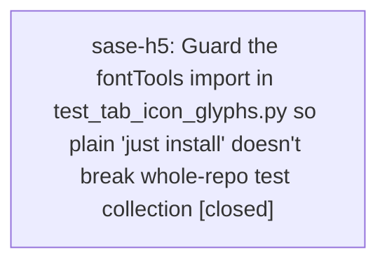

# Bead: sase-h5 — Guard the fontTools import in test\_tab\_icon\_glyphs.py so plain 'just install' doesn't break whole-repo test collection

[Bead Pages](../README.md) / sase-h5

**Status:** ✓ closed · **Resolution:** done · **Type:** ◆ task
**Owner:** `bryanbugyi34@gmail.com` · **Created by:** [bbugyi200.athena.ux](https://github.com/sase-org/sase--agents/blob/main/families/bbugyi200.athena.ux.md) · **Assignee:** `sase-h5` · **Size:** small
**Created:** 2026-08-07 14:50:29 EDT · **Closed:** 2026-08-07 15:08:47 EDT

## Description

Discovered while verifying 'just check' after implementing a fix for the byte-free
artifact-file viewer crash (sase/repos/plans/202608/ace_byte_free_artifact_view_crash.md).
Not caused by that work -- reproduces on a clean master checkout via git stash.

Defect: tests/ace/tui/visual/test_tab_icon_glyphs.py:17 unconditionally does
'from fontTools.ttLib import TTFont' at module scope. fontTools was deliberately added
only to the 'visual' pyproject extra (see sase-h2's closing note), not to 'dev'. But
'just install' (the command this repo's CLAUDE.md/sase memory documents as the
required gate-prep step) only installs '.[dev]'; a separate 'just install-visual'
target carries the visual extras. Because pytest must import a test module before
marker filtering can deselect it, a missing fontTools aborts collection for the
*entire* suite with 'Interrupted: 1 error during collection', not just the visual
test -- even though '-m visual' would otherwise exclude it from execution.

Reproduce on clean master (confirmed via git stash, no working-tree changes):
  just install   # NOT install-visual
  .venv/bin/python -m pytest tests/test_contract_manifest.py::test_contract_manifest_matches_marker_selection -q
  \# ModuleNotFoundError: No module named 'fontTools' during collection of
  \# tests/ace/tui/visual/test_tab_icon_glyphs.py; 1 failed, "Interrupted: 1 error
  \# during collection"
Same failure reproduces running 'just check' directly after only 'just install'.

Impact: any agent or developer who follows the documented 'just install' + 'just check'
flow without separately knowing to run 'just install-visual' gets a hard, confusing
'just check' failure unrelated to their change. This is exactly the trap the diff-scoped
test lane and contract-manifest collection check are meant to avoid.

Scope: guard the fontTools import in tests/ace/tui/visual/test_tab_icon_glyphs.py with
'pytest.importorskip("fontTools")' (or move the import inside the test functions that
need it) so the module still collects and skips cleanly when the visual extra is not
installed, matching how other optional/extras-gated test modules in this repo avoid
breaking collection. Confirm 'just install' (without -visual) + 'just check' passes
clean afterward. Do not weaken the audit itself when the visual extra IS installed.

## Notes

[2026-08-07T19:08:47Z · sase-h5] Guarded the fontTools import in test_tab_icon_glyphs.py with pytest.importorskip('fontTools.ttLib'), matching the RUST_EXTENSION_MODULE_NAME/sase_hg.workspace_plugin pattern used elsewhere in tests/. Verified: (1) uninstalled fonttools from .venv, ran 'just check' clean (all gates incl. scoped tests passed, no collection interruption); (2) test_tab_icon_glyphs.py itself reports '1 skipped' instead of erroring when fontTools is absent; (3) reinstalled fonttools (just install-visual) and reran the module with -m visual: all 19 tests still pass, so the audit is not weakened when the visual extra is present. Also confirmed via git stash that an unrelated stale sase_core_rs build (needed a rebuild) was a pre-existing environment artifact, not caused by or related to this fix.

[2026-08-07T19:09:15Z · sase-h5] Guarded the fontTools import in test_tab_icon_glyphs.py with pytest.importorskip; verified just check passes clean both with and without the visual extra installed, and that the tofu-audit tests still fully execute when fontTools is present.

## Lineage

## Agents

| Agent | Bead | Commits |
|---|---|---:|
| [bbugyi200.athena.sase-h5](https://github.com/sase-org/sase--agents/blob/main/agents/bbugyi200.athena.sase-h5/README.md) | [sase-h5](README.md) | 1 |

## Commits

| Repo | Commit | Subject | Bead | Committed |
|---|---|---|---|---|
| sase | [`98114b0`](https://github.com/sase-org/sase/commit/98114b0e20c757c52ec43c96d7dff616cbfdc38a) | fix(tests): guard fontTools import in tab-icon glyph visual test | [sase-h5](README.md) | 2026-08-07 15:12:19 EDT |
