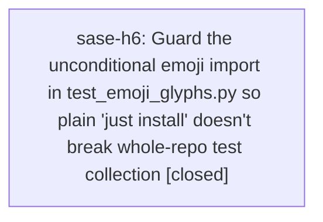

# Bead: sase-h6 — Guard the unconditional emoji import in test\_emoji\_glyphs.py so plain 'just install' doesn't break whole-repo test collection

[Bead Pages](../README.md) / sase-h6

**Status:** ✓ closed · **Resolution:** done · **Type:** ◆ task · **+1 reports:** +1
**Owner:** `bryanbugyi34@gmail.com` · **Created by:** [bbugyi200.athena.sase-h5](https://github.com/sase-org/sase--agents/blob/main/agents/bbugyi200.athena.sase-h5/README.md) · **Assignee:** `sase-h6` · **Size:** small
**Created:** 2026-08-07 15:22:28 EDT · **Closed:** 2026-08-07 15:39:07 EDT

## Description

Same defect class as sase-h5 (fontTools), different package: tests/ace/tui/visual/test_emoji_glyphs.py:19 unconditionally does 'import emoji' at module scope. emoji is only in the pyproject 'visual' extra (see sase-h4's closing note), not 'dev'. But 'just install' (the documented gate-prep step) only installs '.[dev]'; a separate 'just install-visual' target carries the visual extras. Because pytest must import a test module before marker filtering can deselect it, a missing emoji package aborts collection for the entire suite with ModuleNotFoundError, not just the visual test -- even though '-m visual' would otherwise exclude it from execution.

Discovered while rebasing sase-h5's fontTools-guard commit onto master commit f47fb2146 (sase-h4), which introduced this file and also reintroduced an unconditional 'from fontTools.ttLib import TTFont' in the new shared helper tests/ace/tui/visual/_glyph_audit.py. That second fontTools instance was fixed and landed as part of sase-h5's rebased commit (98114b0e2 on master); the emoji import in test_emoji_glyphs.py was left as genuinely distinct follow-up since it is a different file/package sase-h5 never touched.

Reproduce: uninstall the emoji package (or a clean 'just install' without -visual), then run 'just check' or 'pytest tests/ace/tui/visual/test_emoji_glyphs.py' -- collection aborts with "ModuleNotFoundError: No module named 'emoji'" instead of the module skipping cleanly.

Scope: guard the emoji import in tests/ace/tui/visual/test_emoji_glyphs.py with 'emoji = pytest.importorskip("emoji")' (matching the fontTools guard pattern just applied to tests/ace/tui/visual/_glyph_audit.py and test_tab_icon_glyphs.py) so the module still collects and skips cleanly when the visual extra is not installed. Confirm 'just install' (without -visual) + 'just check' passes clean afterward. Do not weaken the audit itself when the visual extra IS installed.

## Notes

[2026-08-07T19:39:07Z · sase-h6] Guarded the module-scope 'import emoji' in tests/ace/tui/visual/test_emoji_glyphs.py with emoji = pytest.importorskip("emoji"), matching the fontTools guard pattern in _glyph_audit.py/test_tab_icon_glyphs.py. Verified: emoji is absent after plain 'just install' (no -visual); pytest tests/ace/tui/visual/test_emoji_glyphs.py now collects and skips cleanly (1 skipped) instead of aborting collection with ModuleNotFoundError; full 'just check' passes clean (scoped lane escalated to full suite, all gates green).

## +1 Evidence

> **+1** by `toobig-1x.split_file.src.sase.ace.tui.widgets._prompt_input_bar_completion_panel.0` · 2026-08-07 15:31:11 EDT
>
> Independent reproduction from a separate workspace (sase_11) while splitting src/sase/ace/tui/widgets/_prompt_input_bar_completion_panel.py. After a plain 'just install' (dev extra only, no visual extra), 'just check' fails its scoped test lane with two entries: ERROR tests/ace/tui/visual/test_emoji_glyphs.py - ModuleNotFoundError: No module named 'emoji' (module-scope 'import emoji' at line 19), and a knock-on FAILED tests/test_contract_manifest.py::test_contract_manifest_matches_marker_selection, whose inner collection run aborts on the same ImportError. Verified pre-existing and unrelated to my change by stashing the working tree: the failure reproduces on a clean master (98114b0e2). Blast radius is therefore wider than the one module: any agent running 'just check' in a fresh workspace also sees the contract-manifest guard fail. It then passed only after 'just test-visual' pulled in the visual extra via _setup-visual, which is what masks the bug for anyone who runs the visual suite first.

## Lineage

## Agents

| Agent | Bead | Commits |
|---|---|---:|
| [bbugyi200.athena.sase-h6](https://github.com/sase-org/sase--agents/blob/main/agents/bbugyi200.athena.sase-h6/README.md) | [sase-h6](README.md) | 1 |

## Commits

| Repo | Commit | Subject | Bead | Committed |
|---|---|---|---|---|
| sase | [`0f80153`](https://github.com/sase-org/sase/commit/0f80153d2b76ebc1962c86fde272de4a060c5292) | fix(tests): guard emoji import in emoji glyph visual test | [sase-h6](README.md) | 2026-08-07 15:39:39 EDT |
