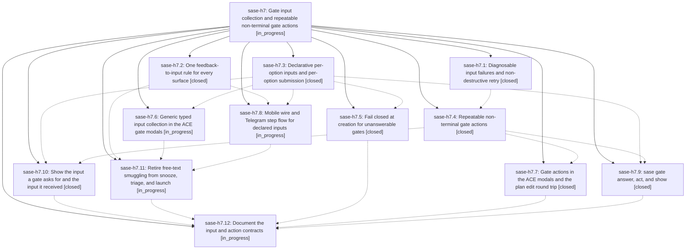

# Bead: sase-h7 — Gate input collection and repeatable non-terminal gate actions

[Bead Pages](../README.md) / sase-h7

**Status:** ◐ in_progress · **Type:** ▸ plan · **Tier:** epic
**Owner:** `bryanbugyi34@gmail.com` · **Created by:** [bbugyi200.athena.v2](https://github.com/sase-org/sase--agents/blob/main/agents/bbugyi200.athena.v2/README.md) · **Assignee:** `sase-h7.land`
**Created:** 2026-08-07 17:05:53 EDT
**Plan:** [202608/gate\_input\_collection.md](https://github.com/sase-org/sase--plans/blob/main/202608/gate_input_collection.md)

## Description

A reviewer can supply typed, validated input to any gate command from every surface, and can run repeatable non-terminal gate actions — starting with `edit_file` — that help them decide without answering the gate. Custom gates that declare required input become answerable instead of silently stuck, the three incompatible feedback rules collapse into one, and the free-text smuggling that snooze and triage rely on is retired.

## Notes

[2026-08-07T21:47:19Z · v1.f1] DISCOVERED ISSUE: just check's 'sase validate' plan-links-validate step fails repo-wide with 'sase/repos/plans/202608/gate_inputs_core.md: PARENT target does not resolve to a plan file: 202608/gate_input_collection.md (parent-missing-target)'. gate_inputs_core.md (closed phase sase-h7.3) declares PARENT plans:202608/gate_input_collection.md, but that file does not exist in the plans sidecar checkout (confirmed up to date at origin/main ac1b3cf8) or anywhere under sase/repos/plans in this workspace (sase_10), even though sase-h7's own PLAN field points to that same path. Likely the epic's plan file hasn't been committed/pushed to the plans sidecar yet while several phases (h7.4-h7.12) are still in progress. Discovered incidentally while implementing an unrelated plan (revert_stale_core_memory_note.md) in workspace sase_10; not caused by that change. Blocks a clean 'just check' for every agent until the plan file lands.

[2026-08-08T00:17:59Z · v9] DISCOVERED ISSUE: six tests fail on clean master (7bbd82a47) from an interaction between two of this epic's own phases. sase-h7.5's fail-closed validator (`_validate_option_answerability` in src/sase/notification_gates/kind_validation/custom.py:44, added in ff0b765a4) rejects any option whose raw `input_schema` marks a property required without also declaring it under the option's `inputs`. sase-h7.9's fixtures (cce9e9e22) do exactly that, so they now fail at gate creation:

  tests/test_gate_cli_show.py::test_show_json_reports_declared_inputs_branches_and_actions
  tests/test_gate_cli_show.py::test_show_prints_a_readable_summary_of_the_decision_surface
  tests/test_gate_cli_show.py::test_show_reports_the_terminal_status_of_an_answered_gate
  tests/test_gate_cli_show.py::test_show_reports_a_cancelled_gate
  tests/gate_conformance/test_gate_conformance.py::test_gate_conformance[cli-legacy_shared_input]
  tests/gate_conformance/test_gate_conformance.py::test_gate_conformance[ace-legacy_shared_input]

Errors are 'option `audit` cannot be answered: no surface can submit a value its input_schema accepts (`reason` is a required property)' and the same for option `apply` / property `ticket`. These are deterministic (they fail in isolation, not under load), so they are not the sase-ct/sase-h8 flake class.

The fixtures are presumably meant to exercise the legacy shared-input path, which is what sase-h7.11 is retiring, so the right fix is probably to declare the property under `inputs` (or drop it from `required`) in those fixtures rather than to loosen the validator.

Discovered while implementing an unrelated plan (.sase/artifacts/home/.sase/plans/202608/suite_gate_bypass.md, the pytest suite-gate bypass) in workspace sase_13; confirmed pre-existing by stashing that diff and re-running at 7bbd82a47. It fails 'just check' for every agent on master until fixed.

[2026-08-08T00:23:12Z · vc] DISCOVERED ISSUE: 6 tests fail on a clean master checkout (7bbd82a47) because the fail-closed creation validation added by phase sase-h7.5 rejects fixtures those tests still declare. Failing: tests/test_gate_cli_show.py::{test_show_json_reports_declared_inputs_branches_and_actions, test_show_prints_a_readable_summary_of_the_decision_surface, test_show_reports_the_terminal_status_of_an_answered_gate, test_show_reports_a_cancelled_gate} and tests/gate_conformance/test_gate_conformance.py::test_gate_conformance[cli-legacy_shared_input] and [ace-legacy_shared_input]. Both roots are the same GateError from src/sase/notification_gates/kind_validation/custom.py:44-52 via validation.py:215 and service.py:68 -- e.g. "option 'audit' cannot be answered: no surface can submit a value its input_schema accepts ('reason' is a required property)" for the CLI show tests, and "option 'apply' cannot be answered ... ('ticket' is a required property)" for the legacy_shared_input conformance case. The fixtures put a key under an option input_schema 'required' without declaring it under that option's 'inputs', which ff0b765a4 now rejects at creation. Verified pre-existing via git stash on a clean tree; not caused by the unrelated file_hooks agent_name_globs change being implemented in workspace sase_16. Blocks a clean 'just check'/'just check-full' for every agent. Likely belongs to in-flight phase sase-h7.10 (gate show surface) and sase-h7.11 (legacy shared-input retirement).

[2026-08-08T00:34:10Z · sase-h7.8] DISCOVERED ISSUE: 9 tests in sase-telegram's tests/test_custom_gates.py fail against sase HEAD with GateError 'custom gates require presentation.title' (src/sase/notification_gates/validation.py). Root cause: sase-h7.5's fail-closed-at-creation validation now requires presentation.title for kind=="custom" gates, but (a) sase-telegram's tests/test_custom_gates.py::_custom_spec() test helper doesn't set presentation.title, and (b) sase's own src/sase/bead/task_gate.py create_task_triage_gate (via build_task_triage_gate_spec in _task_gate_spec.py) also doesn't set presentation.title -- task_triage gates resolve to the custom adapter kind. Confirmed pre-existing on unmodified sase-telegram code via git stash (same 9 failures). Affected tests: test_custom_gate_renders_expanded_group_with_compact_callbacks_and_fallback, test_task_triage_outbound_renders_tracks_attaches_and_launches, test_optional_feedback_callback_submits_expanded_group_selection, test_disabled_feedback_branch_has_no_feedback_button, test_registry_declared_generic_forms_render_keyboards, test_group_selection_matrix_executes_options_in_query_order[one/defaults/all], test_required_feedback_uses_generic_two_step_text_flow. Discovered while implementing sase-h7.8 (Telegram declared-input step flow) in workspace sase_11; unrelated to that plan's scope, left unfixed there. Fix needs sase-telegram's _custom_spec() to set presentation.title, and sase's build_task_triage_gate_spec to set presentation.title too.

## Phases

| Bead | Title | Status | Size | Created | Agents | Commits |
|---|---|---|---|---|---:|---:|
| [sase-h7.1](sase-h7.1.md) | Diagnosable input failures and non-destructive retry | ✓ closed | medium | 2026-08-07 | 1 | 1 |
| [sase-h7.10](sase-h7.10.md) | Show the input a gate asks for and the input it received | ✓ closed | small | 2026-08-07 | 1 | 1 |
| [sase-h7.11](sase-h7.11.md) | Retire free-text smuggling from snooze, triage, and launch | ◐ in_progress | medium | 2026-08-07 | 1 | 0 |
| [sase-h7.12](sase-h7.12.md) | Document the input and action contracts | ◐ in_progress | small | 2026-08-07 | 1 | 0 |
| [sase-h7.2](sase-h7.2.md) | One feedback-to-input rule for every surface | ✓ closed | medium | 2026-08-07 | 1 | 1 |
| [sase-h7.3](sase-h7.3.md) | Declarative per-option inputs and per-option submission | ✓ closed | large | 2026-08-07 | 1 | 3 |
| [sase-h7.4](sase-h7.4.md) | Repeatable non-terminal gate actions | ✓ closed | medium | 2026-08-07 | 1 | 1 |
| [sase-h7.5](sase-h7.5.md) | Fail closed at creation for unanswerable gates | ✓ closed | medium | 2026-08-07 | 1 | 1 |
| [sase-h7.6](sase-h7.6.md) | Generic typed input collection in the ACE gate modals | ◐ in_progress | large | 2026-08-07 | 1 | 0 |
| [sase-h7.7](sase-h7.7.md) | Gate actions in the ACE modals and the plan edit round trip | ✓ closed | medium | 2026-08-07 | 1 | 1 |
| [sase-h7.8](sase-h7.8.md) | Mobile wire and Telegram step flow for declared inputs | ◐ in_progress | large | 2026-08-07 | 1 | 2 |
| [sase-h7.9](sase-h7.9.md) | sase gate answer, act, and show | ✓ closed | medium | 2026-08-07 | 1 | 1 |

## Lineage

## Agents

| Agent | Bead | Commits |
|---|---|---:|
| [bbugyi200.athena.sase-h7.1](https://github.com/sase-org/sase--agents/blob/main/agents/bbugyi200.athena.sase-h7.1/README.md) | [sase-h7.1](sase-h7.1.md) | 1 |
| [bbugyi200.athena.sase-h7.10](https://github.com/sase-org/sase--agents/blob/main/agents/bbugyi200.athena.sase-h7.10/README.md) | [sase-h7.10](sase-h7.10.md) | 1 |
| [bbugyi200.athena.sase-h7.11](https://github.com/sase-org/sase--agents/blob/main/agents/bbugyi200.athena.sase-h7.11/README.md) | [sase-h7.11](sase-h7.11.md) | 0 |
| [bbugyi200.athena.sase-h7.12](https://github.com/sase-org/sase--agents/blob/main/agents/bbugyi200.athena.sase-h7.12/README.md) | [sase-h7.12](sase-h7.12.md) | 0 |
| [bbugyi200.athena.sase-h7.2](https://github.com/sase-org/sase--agents/blob/main/agents/bbugyi200.athena.sase-h7.2/README.md) | [sase-h7.2](sase-h7.2.md) | 1 |
| [bbugyi200.athena.sase-h7.3](https://github.com/sase-org/sase--agents/blob/main/families/bbugyi200.athena.sase-h7.3.md) | [sase-h7.3](sase-h7.3.md) | 3 |
| [bbugyi200.athena.sase-h7.4](https://github.com/sase-org/sase--agents/blob/main/agents/bbugyi200.athena.sase-h7.4/README.md) | [sase-h7.4](sase-h7.4.md) | 1 |
| [bbugyi200.athena.sase-h7.5](https://github.com/sase-org/sase--agents/blob/main/agents/bbugyi200.athena.sase-h7.5/README.md) | [sase-h7.5](sase-h7.5.md) | 1 |
| [bbugyi200.athena.sase-h7.6](https://github.com/sase-org/sase--agents/blob/main/families/bbugyi200.athena.sase-h7.6.md) | [sase-h7.6](sase-h7.6.md) | 0 |
| [bbugyi200.athena.sase-h7.7](https://github.com/sase-org/sase--agents/blob/main/agents/bbugyi200.athena.sase-h7.7/README.md) | [sase-h7.7](sase-h7.7.md) | 1 |
| [bbugyi200.athena.sase-h7.8](https://github.com/sase-org/sase--agents/blob/main/families/bbugyi200.athena.sase-h7.8.md) | [sase-h7.8](sase-h7.8.md) | 2 |
| [bbugyi200.athena.sase-h7.9](https://github.com/sase-org/sase--agents/blob/main/agents/bbugyi200.athena.sase-h7.9/README.md) | [sase-h7.9](sase-h7.9.md) | 1 |
| [bbugyi200.athena.sase-h7.land](https://github.com/sase-org/sase--agents/blob/main/agents/bbugyi200.athena.sase-h7.land/README.md) | [sase-h7](README.md) | 0 |

## Commits

| Repo | Commit | Subject | Bead | Committed |
|---|---|---|---|---|
| sase | [`396380c`](https://github.com/sase-org/sase/commit/396380c640bf0d9164b1a9356201fa181535fc10) | feat(notification-gates): make gate rejections diagnosable and retries deliberate | [sase-h7.1](sase-h7.1.md) | 2026-08-07 17:39:50 EDT |
| sase-core | [`sase-core@a35fe91`](https://github.com/sase-org/sase-core/commit/a35fe9180e2d4dc756b08019a9951cec9088c0d2) | feat(xprompt): add enum input type with declared choices | [sase-h7.3](sase-h7.3.md) | 2026-08-07 17:41:48 EDT |
| sase | [`e184090`](https://github.com/sase-org/sase/commit/e18409056355a8013772060644e6381426d74364) | refactor(gates): one feedback-to-input rule for every surface | [sase-h7.2](sase-h7.2.md) | 2026-08-07 17:43:33 EDT |
| sase | [`8e52e46`](https://github.com/sase-org/sase/commit/8e52e46386c7a7950f3335e6e9ae58d8c388df90) | feat(notification-gates): add declarative per-option inputs and per-option submission | [sase-h7.3](sase-h7.3.md) | 2026-08-07 18:17:17 EDT |
| sase | [`0c971ff`](https://github.com/sase-org/sase/commit/0c971ff81078aff31542b2953ec35fb178e25228) | feat(notification-gates): generalize operations into repeatable gate actions | [sase-h7.4](sase-h7.4.md) | 2026-08-07 18:25:42 EDT |
| sase--plans | [`sase--plans@2f213a1`](https://github.com/sase-org/sase--plans/commit/2f213a1ed034a10a36ae9fe333a42c37b05c1d8a) | docs: add SDD plan for gate\_input\_collection epic | [sase-h7.3](sase-h7.3.md) | 2026-08-07 18:28:17 EDT |
| sase-core | [`sase-core@65e0ec1`](https://github.com/sase-org/sase-core/commit/65e0ec1e7323fc1ca958e7dabe806acc6661bd96) | feat(mobile)!: carry declared gate inputs on the mobile wire | [sase-h7.8](sase-h7.8.md) | 2026-08-07 19:08:56 EDT |
| sase | [`ff0b765`](https://github.com/sase-org/sase/commit/ff0b765a4d395ef91f9b89aeabd5d3e7d831aed1) | feat(notification-gates)!: fail closed at creation for unanswerable gates | [sase-h7.5](sase-h7.5.md) | 2026-08-07 19:24:06 EDT |
| sase | [`cce9e9e`](https://github.com/sase-org/sase/commit/cce9e9e2266924bc335eee820e014627ef2737f8) | feat(notification-gates): add gate answer, act, and show CLI subcommands | [sase-h7.9](sase-h7.9.md) | 2026-08-07 19:24:42 EDT |
| sase | [`a78b105`](https://github.com/sase-org/sase/commit/a78b105b5fc1055345fe9d783fe71c6d798f42ef) | feat(notification-gates): run gate actions from the ACE modals | [sase-h7.7](sase-h7.7.md) | 2026-08-07 19:30:40 EDT |
| sase | [`7bbd82a`](https://github.com/sase-org/sase/commit/7bbd82a47ed7b3e2aec55ec0dfce76ed128f1cb5) | feat(mobile): accept per-option gate inputs on the mobile bridge | [sase-h7.8](sase-h7.8.md) | 2026-08-07 19:31:45 EDT |
| sase | [`a1cc172`](https://github.com/sase-org/sase/commit/a1cc172d337957f2d68d42ec9fe6c3187907ae87) | feat(notification-gates): surface declared and submitted gate input | [sase-h7.10](sase-h7.10.md) | 2026-08-07 20:41:46 EDT |
