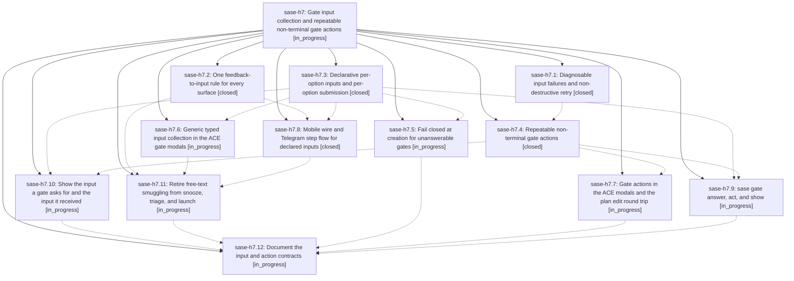

# Bead: sase-h7 — Gate input collection and repeatable non-terminal gate actions

[Bead Pages](../README.md) / sase-h7

**Status:** ◐ in_progress · **Type:** ▸ plan · **Tier:** epic
**Owner:** `bryanbugyi34@gmail.com` · **Created by:** [bbugyi200.athena.v2](https://github.com/sase-org/sase--agents/blob/main/agents/bbugyi200.athena.v2/README.md) · **Assignee:** `sase-h7.land`
**Created:** 2026-08-07 17:05:53 EDT
**Plan:** [202608/gate\_input\_collection.md](https://github.com/sase-org/sase--plans/blob/main/202608/gate_input_collection.md)

## Description

A reviewer can supply typed, validated input to any gate command from every surface, and can run repeatable non-terminal gate actions — starting with `edit_file` — that help them decide without answering the gate. Custom gates that declare required input become answerable instead of silently stuck, the three incompatible feedback rules collapse into one, and the free-text smuggling that snooze and triage rely on is retired.

## Notes

[2026-08-07T21:47:19Z · v1.f1] DISCOVERED ISSUE: just check's 'sase validate' plan-links-validate step fails repo-wide with 'sase/repos/plans/202608/gate_inputs_core.md: PARENT target does not resolve to a plan file: 202608/gate_input_collection.md (parent-missing-target)'. gate_inputs_core.md (closed phase sase-h7.3) declares PARENT plans:202608/gate_input_collection.md, but that file does not exist in the plans sidecar checkout (confirmed up to date at origin/main ac1b3cf8) or anywhere under sase/repos/plans in this workspace (sase_10), even though sase-h7's own PLAN field points to that same path. Likely the epic's plan file hasn't been committed/pushed to the plans sidecar yet while several phases (h7.4-h7.12) are still in progress. Discovered incidentally while implementing an unrelated plan (revert_stale_core_memory_note.md) in workspace sase_10; not caused by that change. Blocks a clean 'just check' for every agent until the plan file lands.

## Phases

| Bead | Title | Status | Size | Created | Agents | Commits |
|---|---|---|---|---|---:|---:|
| [sase-h7.1](sase-h7.1.md) | Diagnosable input failures and non-destructive retry | ✓ closed | medium | 2026-08-07 | 1 | 1 |
| [sase-h7.10](sase-h7.10.md) | Show the input a gate asks for and the input it received | ◐ in_progress | small | 2026-08-07 | 1 | 0 |
| [sase-h7.11](sase-h7.11.md) | Retire free-text smuggling from snooze, triage, and launch | ◐ in_progress | medium | 2026-08-07 | 1 | 0 |
| [sase-h7.12](sase-h7.12.md) | Document the input and action contracts | ◐ in_progress | small | 2026-08-07 | 1 | 0 |
| [sase-h7.2](sase-h7.2.md) | One feedback-to-input rule for every surface | ✓ closed | medium | 2026-08-07 | 1 | 1 |
| [sase-h7.3](sase-h7.3.md) | Declarative per-option inputs and per-option submission | ✓ closed | large | 2026-08-07 | 1 | 3 |
| [sase-h7.4](sase-h7.4.md) | Repeatable non-terminal gate actions | ✓ closed | medium | 2026-08-07 | 1 | 1 |
| [sase-h7.5](sase-h7.5.md) | Fail closed at creation for unanswerable gates | ◐ in_progress | medium | 2026-08-07 | 1 | 0 |
| [sase-h7.6](sase-h7.6.md) | Generic typed input collection in the ACE gate modals | ◐ in_progress | large | 2026-08-07 | 1 | 0 |
| [sase-h7.7](sase-h7.7.md) | Gate actions in the ACE modals and the plan edit round trip | ◐ in_progress | medium | 2026-08-07 | 1 | 0 |
| [sase-h7.8](sase-h7.8.md) | Mobile wire and Telegram step flow for declared inputs | ✓ closed | large | 2026-08-07 | 1 | 1 |
| [sase-h7.9](sase-h7.9.md) | sase gate answer, act, and show | ◐ in_progress | medium | 2026-08-07 | 1 | 0 |

## Lineage

## Agents

| Agent | Bead | Commits |
|---|---|---:|
| [bbugyi200.athena.sase-h7.1](https://github.com/sase-org/sase--agents/blob/main/agents/bbugyi200.athena.sase-h7.1/README.md) | [sase-h7.1](sase-h7.1.md) | 1 |
| [bbugyi200.athena.sase-h7.10](https://github.com/sase-org/sase--agents/blob/main/agents/bbugyi200.athena.sase-h7.10/README.md) | [sase-h7.10](sase-h7.10.md) | 0 |
| [bbugyi200.athena.sase-h7.11](https://github.com/sase-org/sase--agents/blob/main/agents/bbugyi200.athena.sase-h7.11/README.md) | [sase-h7.11](sase-h7.11.md) | 0 |
| [bbugyi200.athena.sase-h7.12](https://github.com/sase-org/sase--agents/blob/main/agents/bbugyi200.athena.sase-h7.12/README.md) | [sase-h7.12](sase-h7.12.md) | 0 |
| [bbugyi200.athena.sase-h7.2](https://github.com/sase-org/sase--agents/blob/main/agents/bbugyi200.athena.sase-h7.2/README.md) | [sase-h7.2](sase-h7.2.md) | 1 |
| [bbugyi200.athena.sase-h7.3](https://github.com/sase-org/sase--agents/blob/main/families/bbugyi200.athena.sase-h7.3.md) | [sase-h7.3](sase-h7.3.md) | 3 |
| [bbugyi200.athena.sase-h7.4](https://github.com/sase-org/sase--agents/blob/main/agents/bbugyi200.athena.sase-h7.4/README.md) | [sase-h7.4](sase-h7.4.md) | 1 |
| [bbugyi200.athena.sase-h7.5](https://github.com/sase-org/sase--agents/blob/main/agents/bbugyi200.athena.sase-h7.5/README.md) | [sase-h7.5](sase-h7.5.md) | 0 |
| [bbugyi200.athena.sase-h7.6](https://github.com/sase-org/sase--agents/blob/main/families/bbugyi200.athena.sase-h7.6.md) | [sase-h7.6](sase-h7.6.md) | 0 |
| [bbugyi200.athena.sase-h7.7](https://github.com/sase-org/sase--agents/blob/main/agents/bbugyi200.athena.sase-h7.7/README.md) | [sase-h7.7](sase-h7.7.md) | 0 |
| [bbugyi200.athena.sase-h7.8](https://github.com/sase-org/sase--agents/blob/main/families/bbugyi200.athena.sase-h7.8.md) | [sase-h7.8](sase-h7.8.md) | 1 |
| [bbugyi200.athena.sase-h7.9](https://github.com/sase-org/sase--agents/blob/main/agents/bbugyi200.athena.sase-h7.9/README.md) | [sase-h7.9](sase-h7.9.md) | 0 |
| [bbugyi200.athena.sase-h7.land](https://github.com/sase-org/sase--agents/blob/main/agents/bbugyi200.athena.sase-h7.land/README.md) | [sase-h7](README.md) | 0 |

## Commits

| Repo | Commit | Subject | Bead | Committed |
|---|---|---|---|---|
| sase | [`396380c`](https://github.com/sase-org/sase/commit/396380c640bf0d9164b1a9356201fa181535fc10) | feat(notification-gates): make gate rejections diagnosable and retries deliberate | [sase-h7.1](sase-h7.1.md) | 2026-08-07 17:39:50 EDT |
| sase-core | [`sase-core@a35fe91`](https://github.com/sase-org/sase-core/commit/a35fe9180e2d4dc756b08019a9951cec9088c0d2) | feat(xprompt): add enum input type with declared choices | [sase-h7.3](sase-h7.3.md) | 2026-08-07 17:41:48 EDT |
| sase | [`e184090`](https://github.com/sase-org/sase/commit/e18409056355a8013772060644e6381426d74364) | refactor(gates): one feedback-to-input rule for every surface | [sase-h7.2](sase-h7.2.md) | 2026-08-07 17:43:33 EDT |
| sase | [`8e52e46`](https://github.com/sase-org/sase/commit/8e52e46386c7a7950f3335e6e9ae58d8c388df90) | feat(notification-gates): add declarative per-option inputs and per-option submission | [sase-h7.3](sase-h7.3.md) | 2026-08-07 18:17:17 EDT |
| sase | [`0c971ff`](https://github.com/sase-org/sase/commit/0c971ff81078aff31542b2953ec35fb178e25228) | feat(notification-gates): generalize operations into repeatable gate actions | [sase-h7.4](sase-h7.4.md) | 2026-08-07 18:25:42 EDT |
| sase--plans | [`sase--plans@2f213a1`](https://github.com/sase-org/sase--plans/commit/2f213a1ed034a10a36ae9fe333a42c37b05c1d8a) | docs: add SDD plan for gate\_input\_collection epic | [sase-h7.3](sase-h7.3.md) | 2026-08-07 18:28:17 EDT |
| sase-core | [`sase-core@65e0ec1`](https://github.com/sase-org/sase-core/commit/65e0ec1e7323fc1ca958e7dabe806acc6661bd96) | feat(mobile)!: carry declared gate inputs on the mobile wire | [sase-h7.8](sase-h7.8.md) | 2026-08-07 19:08:56 EDT |
