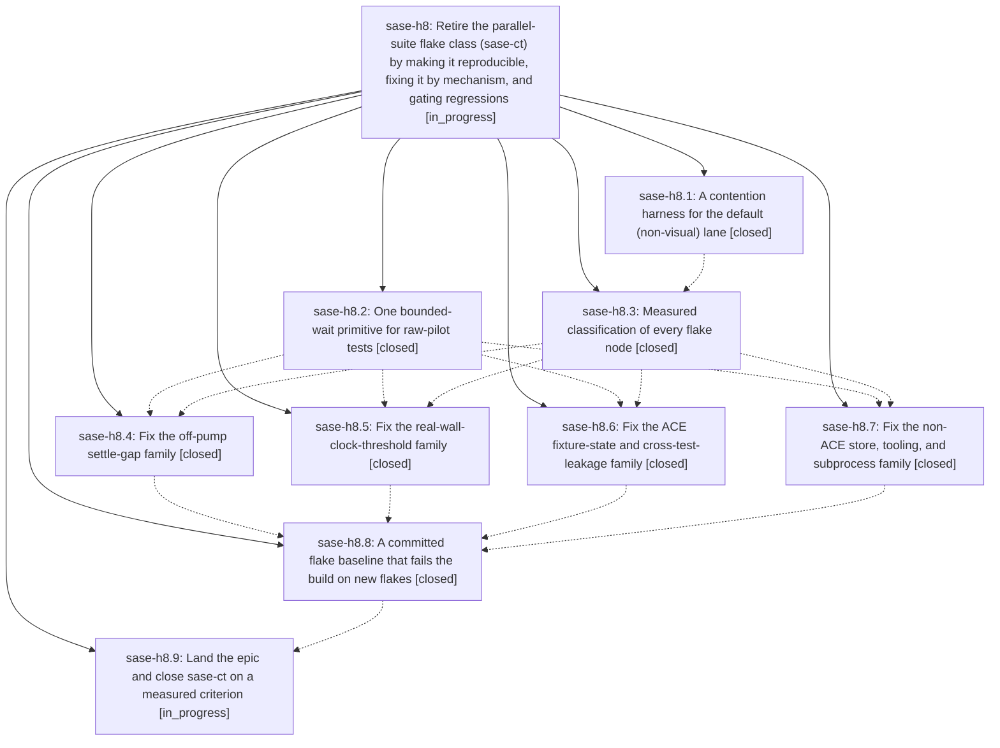

# Bead: sase-h8 — Retire the parallel-suite flake class (sase-ct) by making it reproducible, fixing it by mechanism, and gating regressions

[Bead Pages](../README.md) / sase-h8

**Status:** ◐ in_progress · **Type:** ▸ plan · **Tier:** epic
**Owner:** `bryanbugyi34@gmail.com` · **Created by:** [bbugyi200.athena.v5](https://github.com/sase-org/sase--agents/blob/main/agents/bbugyi200.athena.v5/README.md) · **Assignee:** `sase-h8.land`
**Created:** 2026-08-07 18:03:39 EDT
**Plan:** [202608/parallel\_suite\_flake\_class.md](https://github.com/sase-org/sase--plans/blob/main/202608/parallel_suite_flake_class.md)

## Description

The default parallel test lanes stop producing unattributable one-node failures. The flake class becomes reproducible on demand instead of only under accidental host load, every node the durable health store calls a reproducible flake is fixed at its mechanism rather than one-at-a-time as it surfaces, and a committed baseline gate fails the build when a new flake node appears — so sase-ct can close on a measured, enforced criterion instead of on "the node named in the latest reopen is fixed".

## Notes

[2026-08-08T00:18:53Z · v9] DISCOVERED ISSUE: sase-h8.1's contention harness is the caller broken by the suite-gate bypass fix now landing from .sase/artifacts/home/.sase/plans/202608/suite_gate_bypass.md.

That plan was written from an incident this harness caused: a controller running `-n 64` with SASE_PYTEST_WORKERS=64 and SASE_TEST_GATE_DISABLED=1 held zero worker tokens while consuming 64 workers' worth of memory against a 32-token pool, and athena reached load average 97.60 on 64 cores with 25 GiB in swap and /proc/pressure/io some avg10=48.36 (CPU pressure was ~0 — it was pure memory oversubscription). The pool's arithmetic was correct throughout; the harness's demand was simply invisible to it.

After this change, a top-level SASE_TEST_GATE_DISABLED=1 still takes no tokens and never queues, but its width is clamped to the host budget, and an *exact* over-budget request (SASE_PYTEST_WORKERS/-n above the budget) now raises a pytest.UsageError instead of silently succeeding. The harness must move to the supported route: set SASE_TEST_GATE_SLOTS=<intended host capacity>, which enlarges the pool where concurrent runs can see it, so sibling agents' automatic grants shrink accordingly instead of being blindsided. Verified by hand on this host: `SASE_TEST_GATE_DISABLED=1 SASE_PYTEST_WORKERS=64 tools/run_pytest fast` now exits with 'Requested 64 pytest worker tokens, but the computed host budget permits only 32. Reduce SASE_PYTEST_WORKERS/-n or increase SASE_TEST_GATE_SLOTS deliberately.'

A run whose exemption is corroborated by a real ancestor lease (SASE_TEST_GATE_GOVERNED=1, or PYTEST_XDIST_WORKER) is unaffected and still gets its full width untouched.

[2026-08-08T04:26:05Z · sase-h7.13.land] DISCOVERED ISSUE: two more members of the sase-ct flake class this epic is chartered to retire, both 'passes in isolation, fails only in the full parallel run'. (1) tests/ace/tui/test_commits_pane_rendering.py::test_commits_renderer_builds_compact_single_line_rows -- observed under a full 'just test' at master 86a54a674 by epic sase-h7.13's land phase; did not recur in my own full 'just check-full' at 20752def2. (2) tests/ace/tui/visual/test_ace_png_snapshots_agents_slow_tools.py::test_agents_slow_tool_calls_fold_levels_png_snapshots -- failed in a full 'just test-visual' run (1 failed, 561 passed) at 20752def2 and passed on a targeted rerun of the same file seconds later. (2) matters for scope: the flake class is not confined to the default 'just test' lane, so any reproducer harness or regression gate this epic builds should cover 'just test-visual' too. Corroborated on task bead sase-ct as well. Found by sase-h7.13's land agent.

[2026-08-08T04:32:39Z · sase-h7.13.land] SHARPER DIAGNOSIS of the visual-lane case in my previous note: tests/ace/tui/visual/test_ace_png_snapshots_agents_slow_tools.py::test_agents_slow_tool_calls_fold_levels_png_snapshots is NOT intermittent — it failed in 3 of 3 full 'just test-visual' runs at 20752def2 (2 with an unrelated working-tree diff, 1 on a fully clean tree via git stash) and passed in 1 of 1 targeted rerun of that file alone. The clean-tree run reported '2 failed, 560 passed, 1 skipped', the second failure being the separately-fixed frontmatter_panel_raw_diagnostics golden. Failure artifact: agents_slow_tool_calls_level_1_120x40, 4574/1520532 changed pixels (0.30%), max_diff_ratio 0.0, so it is a content difference under parallel execution rather than renderer drift. That determinism makes this the cheapest reproducer in the class so far — it does not need soak runs to trigger, only the full visual lane. Recorded by sase-h7.13's land agent.

## Phases

| Bead | Title | Status | Size | Created | Agents | Commits |
|---|---|---|---|---|---:|---:|
| [sase-h8.1](sase-h8.1.md) | A contention harness for the default (non-visual) lane | ✓ closed | medium | 2026-08-07 | 1 | 1 |
| [sase-h8.2](sase-h8.2.md) | One bounded-wait primitive for raw-pilot tests | ✓ closed | small | 2026-08-07 | 1 | 1 |
| [sase-h8.3](sase-h8.3.md) | Measured classification of every flake node | ✓ closed | medium | 2026-08-07 | 1 | 1 |
| [sase-h8.4](sase-h8.4.md) | Fix the off-pump settle-gap family | ✓ closed | medium | 2026-08-07 | 1 | 1 |
| [sase-h8.5](sase-h8.5.md) | Fix the real-wall-clock-threshold family | ✓ closed | medium | 2026-08-07 | 1 | 0 |
| [sase-h8.6](sase-h8.6.md) | Fix the ACE fixture-state and cross-test-leakage family | ✓ closed | medium | 2026-08-07 | 1 | 1 |
| [sase-h8.7](sase-h8.7.md) | Fix the non-ACE store, tooling, and subprocess family | ✓ closed | medium | 2026-08-07 | 1 | 1 |
| [sase-h8.8](sase-h8.8.md) | A committed flake baseline that fails the build on new flakes | ✓ closed | medium | 2026-08-07 | 1 | 1 |
| [sase-h8.9](sase-h8.9.md) | Land the epic and close sase-ct on a measured criterion | ◐ in_progress | small | 2026-08-07 | 1 | 0 |

## Lineage

## Agents

| Agent | Bead | Commits |
|---|---|---:|
| [bbugyi200.athena.sase-h8.1](https://github.com/sase-org/sase--agents/blob/main/agents/bbugyi200.athena.sase-h8.1/README.md) | [sase-h8.1](sase-h8.1.md) | 1 |
| [bbugyi200.athena.sase-h8.2](https://github.com/sase-org/sase--agents/blob/main/agents/bbugyi200.athena.sase-h8.2/README.md) | [sase-h8.2](sase-h8.2.md) | 1 |
| [bbugyi200.athena.sase-h8.3](https://github.com/sase-org/sase--agents/blob/main/agents/bbugyi200.athena.sase-h8.3/README.md) | [sase-h8.3](sase-h8.3.md) | 1 |
| [bbugyi200.athena.sase-h8.4](https://github.com/sase-org/sase--agents/blob/main/agents/bbugyi200.athena.sase-h8.4/README.md) | [sase-h8.4](sase-h8.4.md) | 1 |
| [bbugyi200.athena.sase-h8.5](https://github.com/sase-org/sase--agents/blob/main/agents/bbugyi200.athena.sase-h8.5/README.md) | [sase-h8.5](sase-h8.5.md) | 0 |
| [bbugyi200.athena.sase-h8.6](https://github.com/sase-org/sase--agents/blob/main/agents/bbugyi200.athena.sase-h8.6/README.md) | [sase-h8.6](sase-h8.6.md) | 1 |
| [bbugyi200.athena.sase-h8.7](https://github.com/sase-org/sase--agents/blob/main/agents/bbugyi200.athena.sase-h8.7/README.md) | [sase-h8.7](sase-h8.7.md) | 1 |
| [bbugyi200.athena.sase-h8.8](https://github.com/sase-org/sase--agents/blob/main/agents/bbugyi200.athena.sase-h8.8/README.md) | [sase-h8.8](sase-h8.8.md) | 1 |
| [bbugyi200.athena.sase-h8.9](https://github.com/sase-org/sase--agents/blob/main/agents/bbugyi200.athena.sase-h8.9/README.md) | [sase-h8.9](sase-h8.9.md) | 0 |
| [bbugyi200.athena.sase-h8.land](https://github.com/sase-org/sase--agents/blob/main/agents/bbugyi200.athena.sase-h8.land/README.md) | [sase-h8](README.md) | 0 |

## Commits

| Repo | Commit | Subject | Bead | Committed |
|---|---|---|---|---|
| sase | [`6476ec6`](https://github.com/sase-org/sase/commit/6476ec65c5b525dbb3623d91b70e7319e52b9f20) | refactor(ace-testing): consolidate raw-pilot \_wait\_until copies into wait\_for | [sase-h8.2](sase-h8.2.md) | 2026-08-07 18:37:20 EDT |
| sase | [`2bac5ad`](https://github.com/sase-org/sase/commit/2bac5ad9e2fe07db5a023a5ed361b1a63c3faeb6) | test(contention): add a contention harness for the default pytest lane | [sase-h8.1](sase-h8.1.md) | 2026-08-07 21:05:44 EDT |
| sase--research | [`sase--research@a66a667`](https://github.com/sase-org/sase--research/commit/a66a6676afa78b5db78aabc89d1f94154197c958) | docs(research): triage the parallel-suite flake class by measurement | [sase-h8.3](sase-h8.3.md) | 2026-08-07 21:40:00 EDT |
| sase | [`4dc3231`](https://github.com/sase-org/sase/commit/4dc323117f73481c24798e3aa0f2487dbfa4dfc8) | test(flakes): close the off-pump settle gaps in three ACE test files | [sase-h8.4](sase-h8.4.md) | 2026-08-07 22:29:37 EDT |
| sase | [`f980248`](https://github.com/sase-org/sase/commit/f980248c19958191a84e57100aa4de289bb3897c) | test(ace): pin the metadata-search corpus against competing repaints | [sase-h8.6](sase-h8.6.md) | 2026-08-07 22:48:58 EDT |
| sase | [`0a1502a`](https://github.com/sase-org/sase/commit/0a1502a041f459efa00a3b1c33aa4b9cfd135f11) | test(flakes): pin ambient env vars and hold fakey retry waits | [sase-h8.7](sase-h8.7.md) | 2026-08-07 22:57:16 EDT |
| sase | [`c902dd7`](https://github.com/sase-org/sase/commit/c902dd71cd0757cb8997cdfbb5a125b83a50df49) | feat: gate new reproducible test flakes | [sase-h8.8](sase-h8.8.md) | 2026-08-08 10:13:41 EDT |
