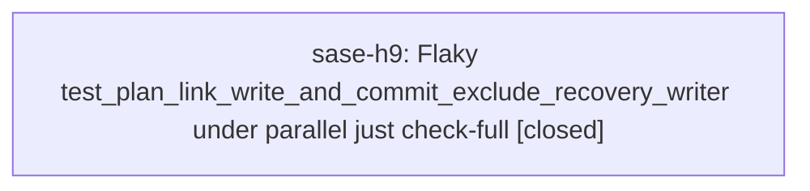

# Bead: sase-h9 — Flaky test\_plan\_link\_write\_and\_commit\_exclude\_recovery\_writer under parallel just check-full

[Bead Pages](../README.md) / sase-h9

**Status:** ✓ closed · **Resolution:** done · **Type:** ◆ task · **+1 reports:** +1
**Owner:** `bryanbugyi34@gmail.com` · **Created by:** [bbugyi200.athena.sase-h7.8](https://github.com/sase-org/sase--agents/blob/main/families/bbugyi200.athena.sase-h7.8.md) · **Assignee:** `sase-h9` · **Size:** xsmall
**Created:** 2026-08-07 19:29:53 EDT · **Closed:** 2026-08-08 11:57:57 EDT

## Description

tests/test_bead/test_cli_work_from_plan_concurrency.py::test_plan_link_write_and_commit_exclude_recovery_writer failed once during a 'just check-full' run (Failed: plan launch did not reach its link commit: None, a ThreadPoolExecutor race waiting up to 5s on link_ready_to_commit). Re-running the same test in isolation passed immediately (1 passed in 2.38s), so this is a timing-sensitive flake under host contention from the full parallel suite, not a real regression. Discovered incidentally while implementing sase-h7.8 (gate_inputs_remote) in workspace sase_15; unrelated to that change (mobile gate wire / notification_gates). Likely needs a more generous wait or a deterministic synchronization point instead of the fixed 5s timeout in the test.

## Notes

[2026-08-08T00:21:08Z · bryanbugyi34@gmail.com] Snoozed until 2026-08-10T20:21:07-04:00 (in 3d). Also wakes at 1 more +1. Reason: Deferred from triage.

[2026-08-08T14:33:26Z · vo] Reopened by +1 threshold: reached 1 +1s while snoozed until 2026-08-10T20:21:07-04:00.

[2026-08-08T15:02:16Z · bryanbugyi34@gmail.com] Snoozed until 2026-08-08T15:02:15-04:00 (in 4h). Reason: Deferred from triage.

[2026-08-08T15:57:57Z · sase-h9] Fixed by replacing hardcoded 5.0/10.0 second timeouts in test_plan_link_write_and_commit_exclude_recovery_writer (including the internal finish_link_commit.wait) with the shared _CONCURRENCY_TIMEOUT_SECONDS=10.0 constant already used elsewhere in the file for the same synchronization pattern, doubling the wait margin under contention. Verified: the target test passes in isolation (1 passed in 3.25s) and just check's full scoped run (27666 passed) shows no failures related to this test; the only 2 failures were pre-existing/unrelated bd/work_task xprompt content assertions, reproduced identically on master without this change via git stash.

## +1 Evidence

> **+1** by `vo` · 2026-08-08 10:33:26 EDT
>
> Independent recurrence during gate_required_input_focus verification on 2026-08-08: just check escalated to the full suite (core-identity-changed) and failed only tests/test_bead/test_cli_work_from_plan_concurrency.py::test_plan_link_write_and_commit_exclude_recovery_writer after 27,632 passed / 10 skipped; the exact test passed immediately in isolation (1 passed in 5.33s). This change touched ACE gate focus behavior only, so the recurrence corroborates the existing parallel/full-suite timing flake rather than this work.

## Lineage

## Agents

| Agent | Bead | Commits |
|---|---|---:|
| [bbugyi200.athena.sase-h9](https://github.com/sase-org/sase--agents/blob/main/agents/bbugyi200.athena.sase-h9/README.md) | [sase-h9](README.md) | 1 |

## Commits

| Repo | Commit | Subject | Bead | Committed |
|---|---|---|---|---|
| sase | [`e62959e`](https://github.com/sase-org/sase/commit/e62959e8865cb839988cf9d81dc97fe66f5daf36) | test: deflake concurrency waits in plan link-commit race test | [sase-h9](README.md) | 2026-08-08 11:59:06 EDT |
