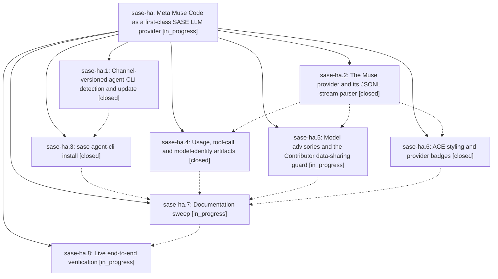

# Bead: sase-ha — Meta Muse Code as a first-class SASE LLM provider

[Bead Pages](../README.md) / sase-ha

**Status:** ◐ in_progress · **Type:** ▸ plan · **Tier:** epic
**Owner:** `bryanbugyi34@gmail.com` · **Created by:** [bbugyi200.athena.ve](https://github.com/sase-org/sase--agents/blob/main/agents/bbugyi200.athena.ve/README.md) · **Assignee:** `sase-ha.land`
**Created:** 2026-08-07 20:45:30 EDT
**Plan:** [202608/muse\_provider.md](https://github.com/sase-org/sase--plans/blob/main/202608/muse_provider.md)

## Description

SASE can run agents on Meta's Muse Code CLI as a native provider — selected by config, `%model:muse/...`, or `SASE_MUSE_PATH` — with reply, usage, and tool-call artifacts; correctly-rendered Muse-native skills; a data-sharing advisory that makes the Contributor model's training terms impossible to miss; and `sase agent-cli` install/update support that works for a channel-versioned, self-updating CLI.

## Phases

| Bead | Title | Status | Size | Created | Agents | Commits |
|---|---|---|---|---|---:|---:|
| [sase-ha.1](sase-ha.1.md) | Channel-versioned agent-CLI detection and update | ✓ closed | medium | 2026-08-07 | 1 | 1 |
| [sase-ha.2](sase-ha.2.md) | The Muse provider and its JSONL stream parser | ✓ closed | medium | 2026-08-07 | 1 | 1 |
| [sase-ha.3](sase-ha.3.md) | sase agent-cli install | ✓ closed | medium | 2026-08-07 | 1 | 1 |
| [sase-ha.4](sase-ha.4.md) | Usage, tool-call, and model-identity artifacts | ✓ closed | medium | 2026-08-07 | 1 | 1 |
| [sase-ha.5](sase-ha.5.md) | Model advisories and the Contributor data-sharing guard | ◐ in_progress | medium | 2026-08-07 | 1 | 0 |
| [sase-ha.6](sase-ha.6.md) | ACE styling and provider badges | ✓ closed | small | 2026-08-07 | 1 | 1 |
| [sase-ha.7](sase-ha.7.md) | Documentation sweep | ◐ in_progress | medium | 2026-08-07 | 1 | 0 |
| [sase-ha.8](sase-ha.8.md) | Live end-to-end verification | ◐ in_progress | small | 2026-08-07 | 1 | 0 |

## Lineage

## Agents

| Agent | Bead | Commits |
|---|---|---:|
| [bbugyi200.athena.sase-ha.1](https://github.com/sase-org/sase--agents/blob/main/agents/bbugyi200.athena.sase-ha.1/README.md) | [sase-ha.1](sase-ha.1.md) | 1 |
| [bbugyi200.athena.sase-ha.2](https://github.com/sase-org/sase--agents/blob/main/agents/bbugyi200.athena.sase-ha.2/README.md) | [sase-ha.2](sase-ha.2.md) | 1 |
| [bbugyi200.athena.sase-ha.3](https://github.com/sase-org/sase--agents/blob/main/agents/bbugyi200.athena.sase-ha.3/README.md) | [sase-ha.3](sase-ha.3.md) | 1 |
| [bbugyi200.athena.sase-ha.4](https://github.com/sase-org/sase--agents/blob/main/agents/bbugyi200.athena.sase-ha.4/README.md) | [sase-ha.4](sase-ha.4.md) | 1 |
| [bbugyi200.athena.sase-ha.5](https://github.com/sase-org/sase--agents/blob/main/agents/bbugyi200.athena.sase-ha.5/README.md) | [sase-ha.5](sase-ha.5.md) | 0 |
| [bbugyi200.athena.sase-ha.6](https://github.com/sase-org/sase--agents/blob/main/agents/bbugyi200.athena.sase-ha.6/README.md) | [sase-ha.6](sase-ha.6.md) | 1 |
| [bbugyi200.athena.sase-ha.7](https://github.com/sase-org/sase--agents/blob/main/agents/bbugyi200.athena.sase-ha.7/README.md) | [sase-ha.7](sase-ha.7.md) | 0 |
| [bbugyi200.athena.sase-ha.8](https://github.com/sase-org/sase--agents/blob/main/agents/bbugyi200.athena.sase-ha.8/README.md) | [sase-ha.8](sase-ha.8.md) | 0 |
| [bbugyi200.athena.sase-ha.land](https://github.com/sase-org/sase--agents/blob/main/agents/bbugyi200.athena.sase-ha.land/README.md) | [sase-ha](README.md) | 0 |

## Commits

| Repo | Commit | Subject | Bead | Committed |
|---|---|---|---|---|
| sase | [`47b9f00`](https://github.com/sase-org/sase/commit/47b9f0017075f3efd54f8d5098abf77dbd39a2a5) | feat(agent-clis): support channel-versioned agent CLIs | [sase-ha.1](sase-ha.1.md) | 2026-08-07 21:09:24 EDT |
| sase | [`44fa7ee`](https://github.com/sase-org/sase/commit/44fa7eee2445bc1b33742cd3ffef7f7a983110d0) | feat(llm-provider): add the Muse Code provider and its JSONL stream parser | [sase-ha.2](sase-ha.2.md) | 2026-08-07 21:23:25 EDT |
| sase | [`050c947`](https://github.com/sase-org/sase/commit/050c9477cea1e11b85df7d504b46a50db3bbdd67) | feat(llm-provider): parse Muse tool calls, usage, and model identity | [sase-ha.4](sase-ha.4.md) | 2026-08-07 21:44:51 EDT |
| sase | [`85d1261`](https://github.com/sase-org/sase/commit/85d12614e2ae2ab6acc5b4455bba095e91bdb297) | feat(agent-clis): add a confirmed, shell-free \`sase agent-cli install\` | [sase-ha.3](sase-ha.3.md) | 2026-08-07 21:56:50 EDT |
| sase | [`90b17d8`](https://github.com/sase-org/sase/commit/90b17d824596216df6f0cee97ec5a363f6cbd333) | feat(ace): give Muse a Meta-blue provider palette and badge | [sase-ha.6](sase-ha.6.md) | 2026-08-07 22:03:48 EDT |
