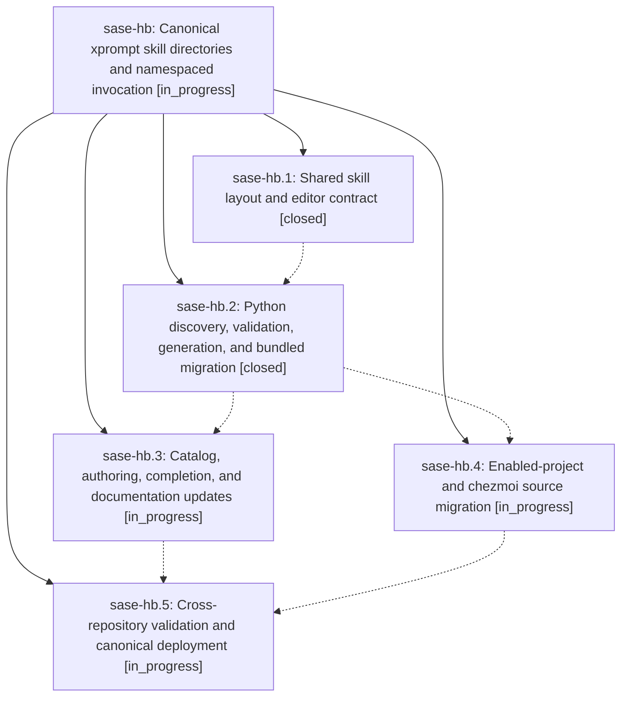

# Bead: sase-hb — Canonical xprompt skill directories and namespaced invocation

[Bead Pages](../README.md) / sase-hb

**Status:** ◐ in_progress · **Type:** ▸ plan · **Tier:** epic
**Owner:** `bryanbugyi34@gmail.com` · **Created by:** [bbugyi200.athena.vh](https://github.com/sase-org/sase--agents/blob/main/agents/bbugyi200.athena.vh/README.md) · **Assignee:** `sase-hb.land`
**Created:** 2026-08-07 22:51:10 EDT
**Plan:** [202608/xprompt\_skill\_directories.md](https://github.com/sase-org/sase--plans/blob/main/202608/xprompt_skill_directories.md)

## Description

Xprompt-backed agent skills are defined only in canonical sase/skills sources, remain invokable as agent skills with /<name>, and require a skills/ namespace whenever they are expanded as xprompts.

## Notes

[2026-08-08T04:24:56Z · sase-h7.13.land] DISCOVERED ISSUE: tests/test_content_layout.py::test_project_home_and_chezmoi_named_paths_are_canonical fails deterministically on master (20752def2) with 'assert 2 == 1'. This epic's phase sase-hb.1 bumped CONTENT_LAYOUT_SCHEMA_VERSION to 2 in sase-core (682d48f, 'feat(skills)!: define the canonical skill layout and editor contract', BREAKING CHANGE trailer names the bump explicitly), but this repo's Python-side assertion still pins schema_version == 1. Reproduced in isolation (not a parallel-run flake): '.venv/bin/python -m pytest tests/test_content_layout.py::test_project_home_and_chezmoi_named_paths_are_canonical -q -p no:randomly' -> 1 failed, and it is the ONLY failure in a full 'just check-full' on clean master (1 failed, 27555 passed, 10 skipped). It fails 'just check-full' for every agent until the assertion catches up with the Rust core. Found by sase-h7.13's land agent while verifying that epic's combined tree; unrelated to the gate-input epic's scope.

## Phases

| Bead | Title | Status | Size | Created | Agents | Commits |
|---|---|---|---|---|---:|---:|
| [sase-hb.1](sase-hb.1.md) | Shared skill layout and editor contract | ✓ closed | medium | 2026-08-07 | 1 | 1 |
| [sase-hb.2](sase-hb.2.md) | Python discovery, validation, generation, and bundled migration | ✓ closed | medium | 2026-08-07 | 1 | 1 |
| [sase-hb.3](sase-hb.3.md) | Catalog, authoring, completion, and documentation updates | ◐ in_progress | medium | 2026-08-07 | 1 | 0 |
| [sase-hb.4](sase-hb.4.md) | Enabled-project and chezmoi source migration | ◐ in_progress | small | 2026-08-07 | 1 | 0 |
| [sase-hb.5](sase-hb.5.md) | Cross-repository validation and canonical deployment | ◐ in_progress | small | 2026-08-07 | 1 | 0 |

## Lineage

## Agents

| Agent | Bead | Commits |
|---|---|---:|
| [bbugyi200.athena.sase-hb.1](https://github.com/sase-org/sase--agents/blob/main/agents/bbugyi200.athena.sase-hb.1/README.md) | [sase-hb.1](sase-hb.1.md) | 1 |
| [bbugyi200.athena.sase-hb.2](https://github.com/sase-org/sase--agents/blob/main/agents/bbugyi200.athena.sase-hb.2/README.md) | [sase-hb.2](sase-hb.2.md) | 1 |
| [bbugyi200.athena.sase-hb.3](https://github.com/sase-org/sase--agents/blob/main/agents/bbugyi200.athena.sase-hb.3/README.md) | [sase-hb.3](sase-hb.3.md) | 0 |
| [bbugyi200.athena.sase-hb.4](https://github.com/sase-org/sase--agents/blob/main/agents/bbugyi200.athena.sase-hb.4/README.md) | [sase-hb.4](sase-hb.4.md) | 0 |
| [bbugyi200.athena.sase-hb.5](https://github.com/sase-org/sase--agents/blob/main/agents/bbugyi200.athena.sase-hb.5/README.md) | [sase-hb.5](sase-hb.5.md) | 0 |
| [bbugyi200.athena.sase-hb.land](https://github.com/sase-org/sase--agents/blob/main/agents/bbugyi200.athena.sase-hb.land/README.md) | [sase-hb](README.md) | 0 |

## Commits

| Repo | Commit | Subject | Bead | Committed |
|---|---|---|---|---|
| sase-core | [`sase-core@682d48f`](https://github.com/sase-org/sase-core/commit/682d48fc789ac86233979e130d1cd2db92f524e3) | feat(skills)!: define the canonical skill layout and editor contract | [sase-hb.1](sase-hb.1.md) | 2026-08-07 23:20:02 EDT |
| sase | [`ab442ed`](https://github.com/sase-org/sase/commit/ab442ed247dbf2aec27ab89095852d1efb3a7216) | feat(skills)!: require skills to live in a dedicated skills/ directory | [sase-hb.2](sase-hb.2.md) | 2026-08-08 01:12:39 EDT |
