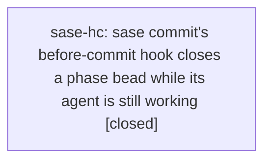

# Bead: sase-hc — sase commit's before-commit hook closes a phase bead while its agent is still working

[Bead Pages](../README.md) / sase-hc

**Status:** ✓ closed · **Resolution:** done · **Type:** ◆ task
**Owner:** `bryanbugyi34@gmail.com` · **Created by:** [bbugyi200.athena.sase-h7.13.land](https://github.com/sase-org/sase--agents/blob/main/agents/bbugyi200.athena.sase-h7.13.land/README.md) · **Assignee:** `sase-hc` · **Size:** medium
**Created:** 2026-08-08 00:26:31 EDT · **Closed:** 2026-08-08 00:46:43 EDT

## Description

Proposed by phase beads sase-h7.3 and sase-h7.13.5 (epic sase-h7) as PROPOSED FOLLOW-UP notes; verified independently by sase-h7.13's land agent against both bead note trails. Not caused by that epic -- the hook is generic commit machinery.

THE DEFECT: sase commit's before-commit hook (sase_git_fix) closes the workspace's assigned phase bead as soon as it sees a commit, without checking whether the agent has finished. The agent then keeps working against a closed bead, and any note it attaches afterwards lands on an already-closed record.

TWO CONFIRMED OCCURRENCES, two different repos, so it is not specific to one commit path:
1. sase-h7.3 (per its own note): committing to the linked sase-core repo closed sase-h7.3 while the primary repo's implementation was still in progress.
2. sase-h7.13.5 (per its own note): committing the plans sidecar (a 'status: done' plan-file edit) closed sase-h7.13.5 before that land phase could attach its verification note. That note had to be appended after the close.

IMPACT: the bead's close timestamp and close note stop describing the work. A land agent reviewing the epic sees a phase closed minutes before its real completion, with verification evidence appended after the fact, and cannot tell a premature close from a genuine one without reading every note. It also defeats the descendant-close guard's premise, since a bead can read as closed while its agent is mid-flight.

SCOPE: decide the correct trigger for the auto-close (agent completion, not first commit) and make the hook respect it for every repo a workspace can commit to -- primary, linked repos, and SDD sidecars. If closing on commit is deliberate for the primary repo, at minimum stop firing it for linked-repo and sidecar commits, which cannot signal that a phase's own deliverable is done.

## Notes

[2026-08-08T04:46:43Z · sase-hc] Removed the auto-close from sase commit's bead hook: handle_beads now only syncs the bead store and, when the assigned bead is still open, prints a warning telling the agent to run 'sase bead close' itself. This fixes both confirmed occurrences (linked-repo and SDD-sidecar commits closing a phase bead mid-flight) because no commit path closes a bead in any repo now. Status is read via 'sase bead show <id> --format json' (issue.status), and an unresolvable status stays quiet while still syncing. Updated the sase_git_commit skill's exit-code/idempotency wording. Verified: new tests in tests/test_commit_hooks_artifacts.py cover the in-progress reminder, the sidecar commit never invoking close, the already-closed silent path, and failed/unparseable/no-issue status resolution; 22 passed. Full 'just check' green (all lint gates + scoped test lane).

## Lineage

## Agents

| Agent | Bead | Commits |
|---|---|---:|
| [bbugyi200.athena.sase-hc](https://github.com/sase-org/sase--agents/blob/main/agents/bbugyi200.athena.sase-hc/README.md) | [sase-hc](README.md) | 1 |

## Commits

| Repo | Commit | Subject | Bead | Committed |
|---|---|---|---|---|
| sase | [`04e4a33`](https://github.com/sase-org/sase/commit/04e4a33b3a7e0e0e1c51596cdeca7ffbb4bfdfb8) | fix(commit): stop closing the assigned bead on commit | [sase-hc](README.md) | 2026-08-08 00:47:28 EDT |
