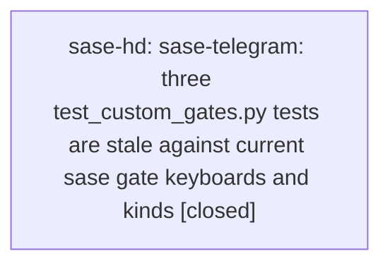

# Bead: sase-hd — sase-telegram: three test\_custom\_gates.py tests are stale against current sase gate keyboards and kinds

[Bead Pages](../README.md) / sase-hd

**Status:** ✓ closed · **Resolution:** done · **Type:** ◆ task
**Owner:** `bryanbugyi34@gmail.com` · **Created by:** [bbugyi200.athena.sase-h7.13.land](https://github.com/sase-org/sase--agents/blob/main/agents/bbugyi200.athena.sase-h7.13.land/README.md) · **Assignee:** `sase-hd` · **Size:** small
**Created:** 2026-08-08 00:26:54 EDT · **Closed:** 2026-08-08 00:41:25 EDT

## Description

Proposed by phase beads sase-h7.13.2 and sase-h7.13.5 (epic sase-h7.13) as PROPOSED FOLLOW-UP notes; re-verified by that epic's land agent. Not caused by sase-h7.13: its own deliverable there (adding the missing presentation.title to _custom_spec()) landed as sase-telegram b550ad2 and fixed 7 of the 10 failures. These 3 are what remain.

REPRODUCTION: in sase-telegram at HEAD 19167fb, with this repo's sase overlaid the way CI does (uv pip install --python .venv/bin/python --no-deps -e <sase workspace>), pytest reports 3 failed / 557 passed. All 3 also fail against released PyPI sase==0.16.0, so they are stale fixtures rather than a regression from unreleased work. ruff and mypy are clean.

THE THREE FAILURES AND THEIR ROOTS:
1. test_registry_declared_generic_forms_render_keyboards -- KeyError on 'bead_snooze'. registered_gate_kinds() now includes bead_snooze, a generic_form=True adapter that predates epic sase-h7 entirely and was never wired into that test's notifications dict.
2. test_task_triage_outbound_renders_tracks_attaches_and_launches -- expects a keyboard without the task_triage snooze option and per-option feedback buttons that already-closed phases sase-h7.2 (feedback-input) and sase-h7.11 (retire-smuggling) shipped.
3. test_launch_approval_uses_the_same_singleton_renderer -- expects a generic 'Send Feedback' button where sase now renders 'Reject with feedback'.

IMPACT: sase-telegram's suite cannot go green against current sase, so a real regression in that repo's gate rendering would be indistinguishable from this known-red baseline.

SCOPE: update sase-telegram's fixtures and expectations to match current sase gate behavior -- register bead_snooze in the generic-forms test, and refresh the two keyboard expectations. Work happens in the sase-telegram repo (open it with /sase_repo), not here.

## Notes

[2026-08-08T04:41:25Z · sase-hd] Fixed sase-telegram's tests/test_custom_gates.py to match current sase gate behavior: (1) test_registry_declared_generic_forms_render_keyboards now creates a bead_snooze gate via create_bead_snooze_gate and adds it to the notifications dict so all three generic_form kinds (custom, task_triage, bead_snooze) get exercised; (2) test_task_triage_outbound_renders_tracks_attaches_and_launches now expects the Close+Snooze singleton row and Snooze-with-feedback button (query 'launch OR close OR snooze', close required-feedback has no separate button, snooze/launch optional-feedback do), with updated callback_data c0/f0/c1/c2/f2; (3) test_launch_approval_uses_the_same_singleton_renderer now expects ['Approve','Reject'] + a separate 'Reject with feedback' row (not a combined 'Send Feedback' button), and drives the reject option's declared 'feedback' input field (mocks send_message, taps c1 then skips the field via i0k) since reject now carries a declared input rather than the old third-option pattern. Verified in sase-telegram repo (HEAD 19167fb) with this sase workspace overlaid via 'uv pip install --python .venv/bin/python --no-deps -e <workspace>' the way CI does: just check (ruff + mypy + full pytest) passes clean, 560/560 tests pass (557 previously-passing + 3 fixed), no regressions. Changes are uncommitted in the sase-telegram checkout per instructions not to commit.

[2026-08-08T04:43:00Z · sase-hd] Fixed three stale tests in sase-telegram/tests/test_custom_gates.py to match current sase gate behavior: added a bead_snooze gate to the generic-forms registry test, updated task-triage keyboard/callback-data assertions for the new snooze buttons, and updated the launch-approval test for the split approve/reject-with-feedback keyboard and feedback-input flow. Verified by overlaying this sase workspace onto sase-telegram (as CI does) and running just check: 560 tests pass, ruff and mypy clean.

## Lineage

## Agents

| Agent | Bead | Commits |
|---|---|---:|
| [bbugyi200.athena.sase-hd](https://github.com/sase-org/sase--agents/blob/main/agents/bbugyi200.athena.sase-hd/README.md) | [sase-hd](README.md) | 1 |

## Commits

| Repo | Commit | Subject | Bead | Committed |
|---|---|---|---|---|
| sase-telegram | [`sase-telegram@197d9f4`](https://github.com/sase-org/sase-telegram/commit/197d9f48958da0d5705c41ac372d0428148b1fff) | test: update test\_custom\_gates.py for current gate keyboards and kinds | [sase-hd](README.md) | 2026-08-08 00:44:01 EDT |
