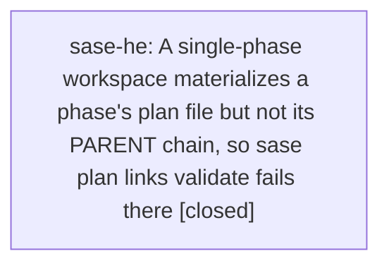

# Bead: sase-he — A single-phase workspace materializes a phase's plan file but not its PARENT chain, so sase plan links validate fails there

[Bead Pages](../README.md) / sase-he

**Status:** ✓ closed · **Resolution:** done · **Type:** ◆ task
**Owner:** `bryanbugyi34@gmail.com` · **Created by:** [bbugyi200.athena.sase-h7.13.land](https://github.com/sase-org/sase--agents/blob/main/agents/bbugyi200.athena.sase-h7.13.land/README.md) · **Assignee:** `sase-he` · **Size:** medium
**Created:** 2026-08-08 00:27:15 EDT · **Closed:** 2026-08-08 00:49:06 EDT

## Description

Named as out-of-scope follow-up work by the epic plan 202608/gate_inputs_landing.md (epic sase-h7.13), which assigned the filing to its land agent; root evidence is the DISCOVERED ISSUE note recorded on epic bead sase-h7 by agent v1.f1. Not caused by that epic -- the epic only exposed it.

THE DEFECT: a workspace materialized for one phase gets that phase's own plan file but not the plan files its PARENT header points at. sase plan links validate then fails repo-wide in that workspace on a link the workspace was never given the other half of, and sase plan links repair neither detects nor fixes the condition.

OBSERVED: in workspace sase_10, 'just check' failed at its 'sase validate' step with 'sase/repos/plans/202608/gate_inputs_core.md: PARENT target does not resolve to a plan file: 202608/gate_input_collection.md (parent-missing-target)'. gate_inputs_core.md (phase sase-h7.3) declared PARENT plans:202608/gate_input_collection.md, which was absent from the plans sidecar checkout (confirmed up to date at origin/main ac1b3cf8) and from everywhere under sase/repos/plans, even though sase-h7's own PLAN field pointed at that same path. The same failure was independently hit by sase-h8.2. It resolved only once the epic plan file was itself committed to the plans sidecar; nothing detected or repaired it in the meantime.

IMPACT: while it lasts, every agent in an affected workspace has a red 'just check' caused by a file they neither wrote nor can produce, and the documented repair command reports nothing wrong. Agents burn a diagnosis cycle each, and the recorded notes show at least three did.

SCOPE: either materialize the whole PARENT chain when a workspace materializes a plan file, or make sase plan links validate scope its parent-target check to what the current workspace was actually given -- and make sase plan links repair detect and fix the case either way.

## Notes

[2026-08-08T04:49:06Z · sase-he] Scoped the PARENT-target check to what the workspace was actually given, and taught repair to detect it. New src/sase/sdd/_link_parent.py runs one git-status probe against the plans checkout: a plan with local unpublished changes still errors with parent-missing-target (the case the current agent can fix), while an already-published plan whose parent has not landed yet degrades to a parent-unpublished warning; non-git plan trees stay strict. _link_validation.py now delegates to it, _link_repair.py scans PARENT headers so 'sase plan links repair' reports both codes instead of nothing, and docs/sdd.md documents the rule. Verified: new tests/sdd/test_link_parent_scope.py (6 cases: published-parent-pending warning, locally-changed error, both-published clean, non-git strict, both repair paths) plus the existing plan-links suites pass; full 'just check' green (fmt, ruff, mypy, keep-sorted, pyscripts, changelog, symvision, toobig, SASE validation, committed plans, scoped tests).

## Lineage

## Agents

| Agent | Bead | Commits |
|---|---|---:|
| [bbugyi200.athena.sase-he](https://github.com/sase-org/sase--agents/blob/main/agents/bbugyi200.athena.sase-he/README.md) | [sase-he](README.md) | 1 |

## Commits

| Repo | Commit | Subject | Bead | Committed |
|---|---|---|---|---|
| sase | [`6874d48`](https://github.com/sase-org/sase/commit/6874d484031e3db75e48b8aeb0e27c8b0e450d35) | fix(sdd): scope the plan PARENT check to what the workspace was given | [sase-he](README.md) | 2026-08-08 00:49:55 EDT |
