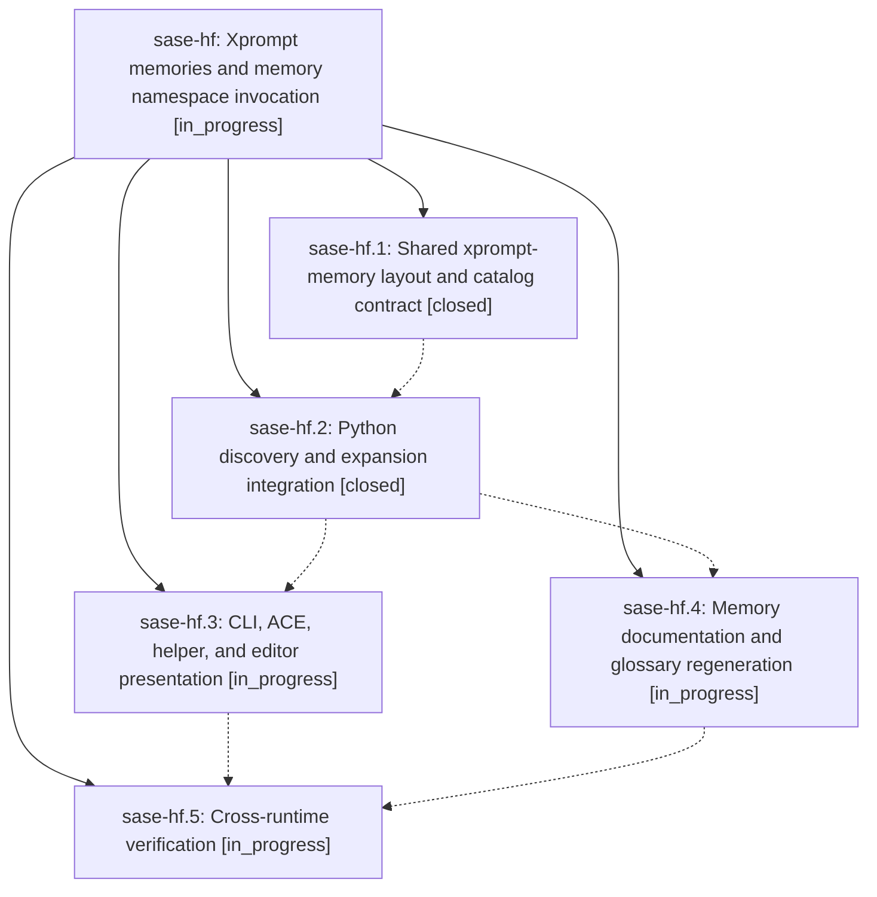

# Bead: sase-hf — Xprompt memories and memory namespace invocation

[Bead Pages](../README.md) / sase-hf

**Status:** ◐ in_progress · **Type:** ▸ plan · **Tier:** epic
**Owner:** `bryanbugyi34@gmail.com` · **Created by:** [bbugyi200.athena.vh.f3](https://github.com/sase-org/sase--agents/blob/main/agents/bbugyi200.athena.vh.f3/README.md) · **Assignee:** `sase-hf.land`
**Created:** 2026-08-08 08:49:43 EDT
**Plan:** [202608/xprompt\_memories.md](https://github.com/sase-org/sase--plans/blob/main/202608/xprompt_memories.md)

## Description

Valid SASE memory notes are exposed as an explicit xprompt-memory type under the required memory/ namespace, so the active context's glossary note expands with #memory/glossary while bare #glossary remains unresolved.

## Notes

[2026-08-08T13:58:06Z · sase-ha.land] DISCOVERED ISSUE: sase-hf.1's CONTENT_LAYOUT_SCHEMA_VERSION 2->3 bump is committed on sase-core master (cd52cb8, one commit past the v0.20.0 release 410498d) but this repo's Python test still pins the old value, so 'just check-full' now fails in every sase workspace. Reproduction (workspace sase_11, sase master 204537c97, clean tree, 2026-08-08): 'just check-full' -> all lint gates green, then '1 failed, 27601 passed, 10 skipped' with tests/test_content_layout.py::test_project_home_and_chezmoi_named_paths_are_canonical asserting 'layout.schema_version == 2' and getting 3. Cause is not local drift: Justfile's _core-overrides-arg deliberately writes .venv/sase-core-rs-overrides.txt and builds sase-core-rs from the linked sase-core checkout whenever Cargo.toml + cargo exist, so every workspace that ran 'just install' after cd52cb8 gets schema 3 while pyproject still pins sase-core-rs>=0.20.0,<0.21.0 (uv.lock resolves 0.20.0). The Python layout dataclass already carries the new memory/memory_readme LayoutPaths and all 27601 other tests pass, so only the exact-version assertion is stale. Fix belongs with sase-hf.2's Python adoption: release sase-core 0.21.0, raise the floor, and update tests/test_content_layout.py:25. Found by epic land agent sase-ha.land while running check-full over epic sase-ha's landing tree; unrelated to the Muse provider work.

## Phases

| Bead | Title | Status | Size | Created | Agents | Commits |
|---|---|---|---|---|---:|---:|
| [sase-hf.1](sase-hf.1.md) | Shared xprompt-memory layout and catalog contract | ✓ closed | medium | 2026-08-08 | 1 | 1 |
| [sase-hf.2](sase-hf.2.md) | Python discovery and expansion integration | ✓ closed | medium | 2026-08-08 | 1 | 1 |
| [sase-hf.3](sase-hf.3.md) | CLI, ACE, helper, and editor presentation | ◐ in_progress | medium | 2026-08-08 | 1 | 0 |
| [sase-hf.4](sase-hf.4.md) | Memory documentation and glossary regeneration | ◐ in_progress | small | 2026-08-08 | 1 | 0 |
| [sase-hf.5](sase-hf.5.md) | Cross-runtime verification | ◐ in_progress | small | 2026-08-08 | 1 | 0 |

## Lineage

## Agents

| Agent | Bead | Commits |
|---|---|---:|
| [bbugyi200.athena.sase-hf.1](https://github.com/sase-org/sase--agents/blob/main/agents/bbugyi200.athena.sase-hf.1/README.md) | [sase-hf.1](sase-hf.1.md) | 1 |
| [bbugyi200.athena.sase-hf.2](https://github.com/sase-org/sase--agents/blob/main/agents/bbugyi200.athena.sase-hf.2/README.md) | [sase-hf.2](sase-hf.2.md) | 1 |
| [bbugyi200.athena.sase-hf.3](https://github.com/sase-org/sase--agents/blob/main/agents/bbugyi200.athena.sase-hf.3/README.md) | [sase-hf.3](sase-hf.3.md) | 0 |
| [bbugyi200.athena.sase-hf.4](https://github.com/sase-org/sase--agents/blob/main/agents/bbugyi200.athena.sase-hf.4/README.md) | [sase-hf.4](sase-hf.4.md) | 0 |
| [bbugyi200.athena.sase-hf.5](https://github.com/sase-org/sase--agents/blob/main/agents/bbugyi200.athena.sase-hf.5/README.md) | [sase-hf.5](sase-hf.5.md) | 0 |
| [bbugyi200.athena.sase-hf.land](https://github.com/sase-org/sase--agents/blob/main/agents/bbugyi200.athena.sase-hf.land/README.md) | [sase-hf](README.md) | 0 |

## Commits

| Repo | Commit | Subject | Bead | Committed |
|---|---|---|---|---|
| sase-core | [`sase-core@cd52cb8`](https://github.com/sase-org/sase-core/commit/cd52cb825e044795160dda8eef77e5e9c84800c1) | feat(xprompt): load memory notes as invokable memory xprompts | [sase-hf.1](sase-hf.1.md) | 2026-08-08 09:20:33 EDT |
| sase | [`1c45d48`](https://github.com/sase-org/sase/commit/1c45d483f83e0a0f96dfa1558b5d661e8becd25d) | feat(xprompt): load memory notes as xprompts | [sase-hf.2](sase-hf.2.md) | 2026-08-08 10:11:47 EDT |
